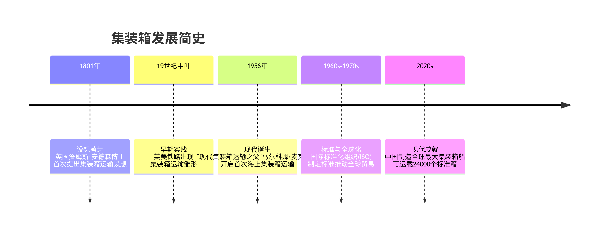
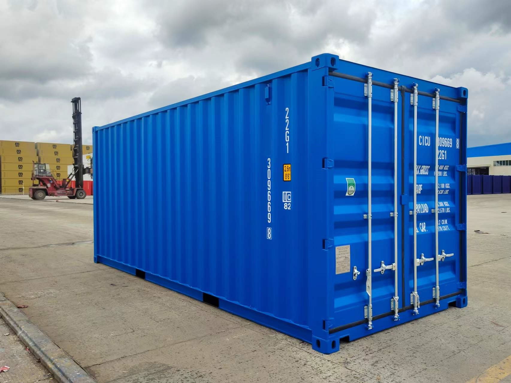
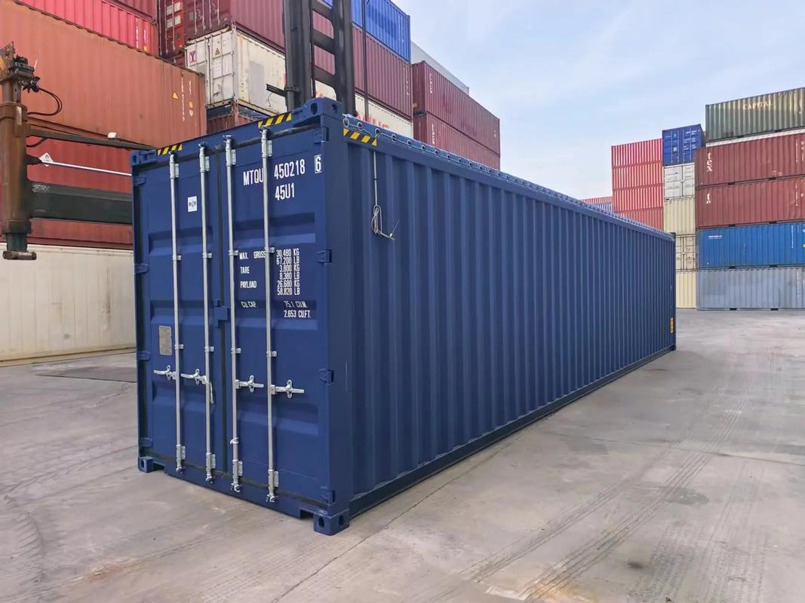
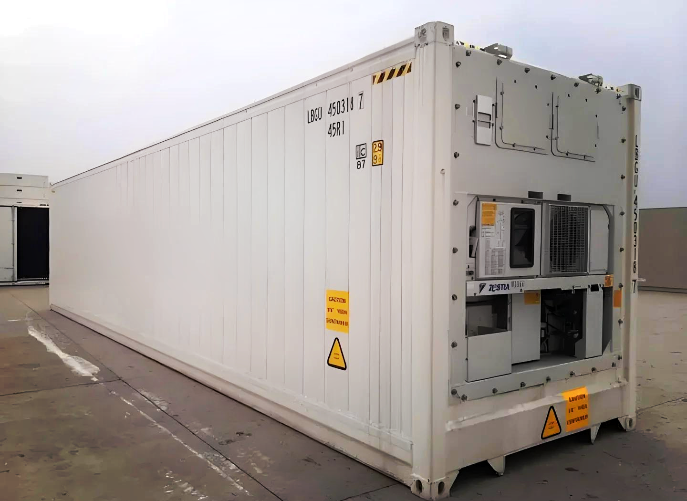
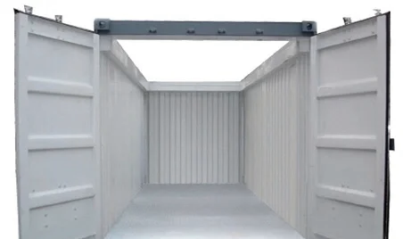
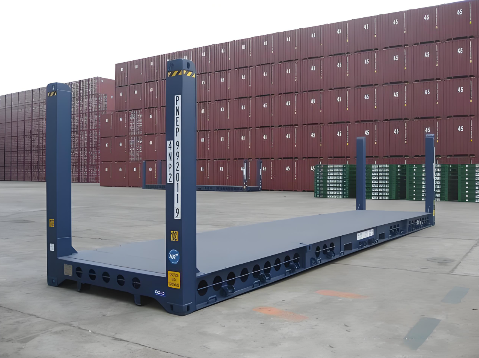
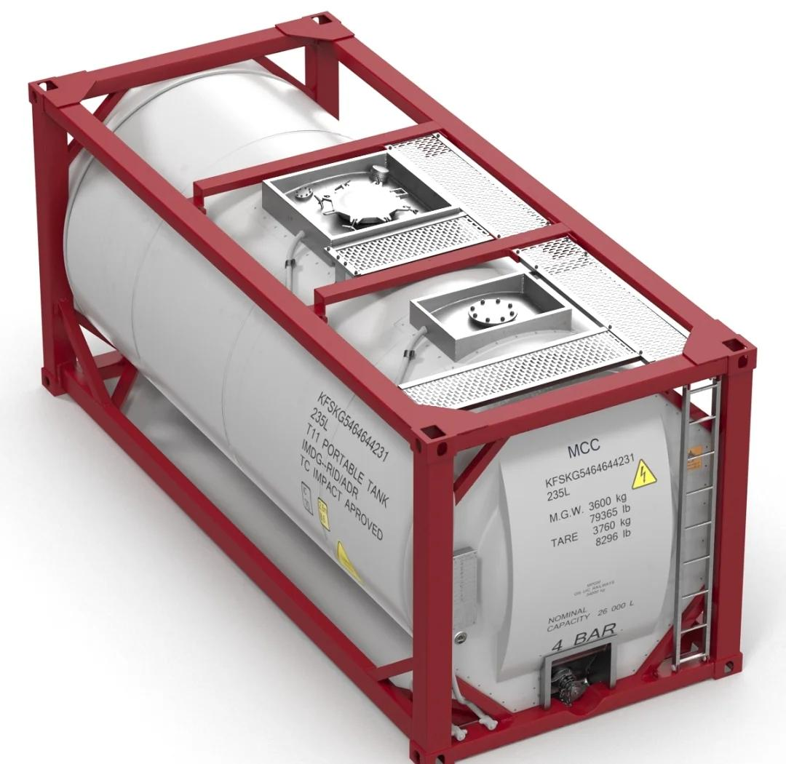
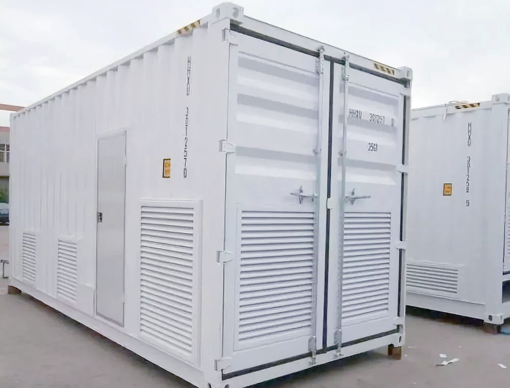

# 初识集装箱

## 集装箱起源

集装箱的起源和发展是从一个简单的设想，逐步演变为支撑现代全球贸易体系的基石。

### 发展初期

历史记录显示，早在1801年，英国的詹姆斯·安德森博士就率先提出了集装箱运输的设想 。
铁路带来的契机：19世纪，铁路的出现和发展为集装箱的初步应用提供了舞台。在1845年，英国铁路开始使用类似集装箱的“载货车厢互相交换”方式 。到了1853年，美国铁路企业也开始进行集装箱运输的尝试 。不过，这个时期的“集装箱”规格千差万别，就像不同品牌的手机有不同的充电接口，无法通用，因此难以大规模推广。

### 现代集装箱的诞生

现代集装箱的真正诞生，离不开一位美国企业家——马尔科姆·麦克莱恩。他被誉为“现代集装箱运输之父”，其贡献在于完成了从“想法”到“可行商业模式”的关键一跃, 事情经过如下：

1. 一个革命性的洞察
    在20世纪50年代，作为卡车运输公司老板的麦克莱恩深受公路拥堵之苦。他构思了一种全新的“海陆联运”模式：不再单独运输卡车的拖车，而是只将货物装满的“箱子”从卡车上卸下，直接装进特制的货船。这样做可以避开拥堵的公路，并极大提升船舶空间的利用率 。
2. 历史性的首航
    1956年4月26日，麦克莱恩收购的泛大西洋船公司改造了一艘旧油轮“理想X号”，在其甲板上装载了58个大型集装箱，从纽约驶往休斯顿 。这次首航取得了巨大成功，经测算，其装船成本仅为每吨15.8美分，而当时传统的人工装船成本高达每吨5.83美元，成本降至原来的约1/36。这用事实证明了集装箱巨大的经济价值。
3. 成功的关键:标准化
    “理想X号”的成功证明了集装箱的潜力，但要让集装箱真正走向全球，还必须解决另一个关键问题：标准化。如果每个公司、每个国家使用的箱子大小、形状、吊装装置都不同，就无法实现高效联运。后经过多年的讨论和发展，国际标准化组织于1960年代确立了国际通用的集装箱标准，其中最核心的就是20英尺和40英尺的规格。这意味着全世界的港口、船舶、卡车和火车都可以为同样规格的箱子设计配套设施。同时催动了全球网络的成型，标准化的确立催生了专用的集装箱港口、船舶、起重机以及成熟的管理系统，最终形成了今天我们看到的、高效衔接海陆空的全球集装箱多式联运网络。

## 集装箱的分类

国际标准化组织（ISO）于1960年代推动建立了集装箱的国际标准，统一了20英尺、40英尺等标准箱的外部尺寸和角件结构后，随着运输货物的物理特性越来越丰富（体积、形状、温度敏感性、物理状态），更多专业化的集装箱被设计出来，常见的集装箱分类如下：

| 集装箱类型 | 核心功能与设计特点 | 出现背景与解决的关键问题 |
| :--- | :--- | :--- |
| **干货集装箱 (Dry Container)** | 标准密封箱体，用于运输无需温控的**普通干杂货**。 | 应对**绝大多数**成件杂货的运输需求，是标准化运输的**基石**，实现高效、低成本的门到门运输。 |
| **冷藏集装箱 (Reefer Container)** | 自带制冷系统，可在**-28°C 至 +26°C** 区间精确控温。 | 满足**生鲜食品、医药化工品**等对温度敏感货物的长途运输需求，打破运输距离和时间限制。 |
| **开顶集装箱 (Open Top Container)** | **无刚性箱顶**（通常用防水帆布覆盖），可从**顶部吊装**货物。 | 解决**超高、重大件货物**（如大型机械、玻璃板）无法通过标准箱门装卸的难题。 |
| **框架集装箱 (Flat Rack Container)** | **无箱顶和侧壁**，甚至可**折叠端壁**，货物可从**侧面及上方**装卸。 | 应对**超重、超宽、形状不规则**的重大件货物（如重型机械、大型管道）的运输需求，实现“裸装”运输。 |
| **罐式集装箱 (Tank Container)** | 在金属框架内固定**液罐**，专用于运输**液体、气体或粉末状**散货。 | 安全、高效地运输**化学品、油品、食品液体**等散装流体货物，减少包装浪费和泄漏风险。 |
| **其他专用集装箱** | 如**通风集装箱**（侧壁有通风孔，适于果蔬）、**牲畜集装箱**（金属网侧壁，适于活动物）、**汽车集装箱**（多层框架，专运车辆）等。 | 满足特定品类货物（如**新鲜果蔬、活动物、车辆**）对通风、喂养、空间利用等特殊物理条件的需求。 |

- 干货集装箱

20尺干货集装箱

40尺干货集装箱

- 冷藏集装箱

- 开顶集装箱

- 框架集装箱

- 罐式集装箱

- 通风集装箱

