# 初识港口

港口是国际贸易的核心载体，全球约80%的货物贸易通过海运完成，港口作为枢纽节点，直接控制着物流、商流、资金流和信息流的全球配置。例如上海洋山港四期全自动化码头，通过5G远程操控和智能调度系统，实现全年无休的高效运转，其集装箱吞吐量连续多年位居全球第一，撑长三角经济圈与全球214个国家地区的贸易网络。这种连通性使港口成为保障全球产业链韧性的关键。

## 港口功能与三代发展模式

港口功能经历了显著的演进过程，这一过程可分为三个明显阶段：

* 第一代港口（1950年代-1980年代）
  主要功能局限于海运货物的装卸、转运和仓储，扮演着简单的"运输中心"角色。这一时期，港口活动主要集中在货物中转，对区域经济带动作用有限。
* 第二代港口（1980年代-2000年代）
  在传统装卸功能基础上，增加了工业和服务功能，发展成为"运输中心+服务中心"。港口开始提供货物增值服务，逐步与临港产业融合，成为资源配置的重要平台。
* 第三代港口（2000年代至今）
  已演进为国际物流中心，功能涵盖全方位物流服务。现代港口不仅处理有形商品，还整合技术、资本和信息集散功能，成为全球供应链的核心环节。如鹿特丹港实行"比自由港还自由"的政策，发展成为港城一体化的国际城市，拥有约3500家国际贸易公司，形成了完整的临港产业带。

## 港口港区码头功能分层关系

理解港口、港区和码头的功能分层关系，是掌握现代物流运作的基础。港口、港区和码头的关系如图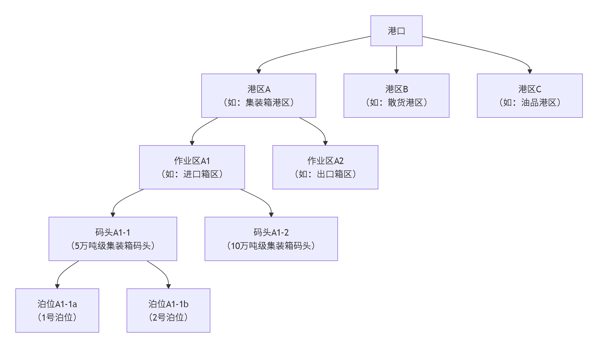

### **港口 (Port)：宏观的战略枢纽**

港口是层级中的**顶层概念**，是一个包含广阔水域和陆域、功能综合的运输枢纽。它通常以一个城市或特定地理区域命名，例如上海港、天津港。一个港口就像一座功能齐全的“港口城市”，其内部不仅包括多个港区，还涵盖了航道、锚地、办公区、配套商业设施乃至金融、保险等综合服务功能。港口是水陆交通的连接点，承担着货物装卸、储存中转、贸易和综合服务等核心功能，其规模可以非常庞大，内部不同港区间距离可达几十公里。

以天津港为例，港口港区的示意图如下: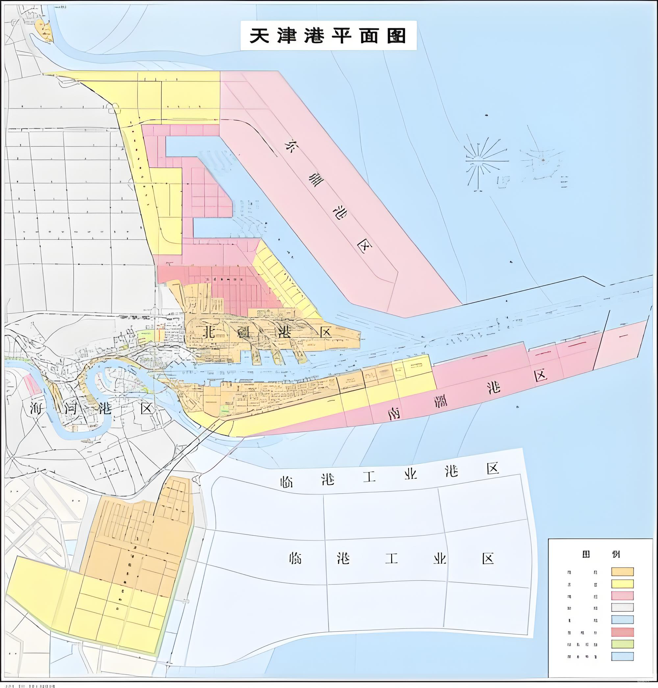

### **港区 (Port Area)：中观的功能分区**

由于港口范围巨大，为了便于管理和高效运营，会将其划分为若干个**港区**。划分依据通常是地理位置相邻或功能相近。例如，青岛港就划分为老港区、黄岛港区、前湾港区等六个港区；广州港则分为内港港区、黄埔港区等四大港区。每个港区承担着相对专一的职能，如集装箱港区、散货港区或油品港区，这样可以实现资源的优化配置和专业化管理。

### **码头 (Terminal/Wharf)：微观的作业平台**

码头是港口和港区内，直接供船舶安全停靠、进行货物装卸和旅客上下的**水工建筑物**。它是实现物流转换的**核心操作界面**。码头按用途可分为集装箱码头、油码头、散货码头等。一个码头通常有明确的运营主体，其功能相对专一，但一个码头可以同时停靠多艘船舶进行作业。

### **泊位 (Berth)：基础的作业单元**

泊位是层级中最基础的单元，指码头上供**一艘船舶**停靠的特定位置。泊位的长度根据所能停靠船舶的吨位大小而设计，小的只有几米，大的可达几百米。泊位的数量、等级（如万吨级泊位）是衡量一个港口或码头吞吐能力的重要标志。合理的泊位设计是保障船舶安全、提高装卸效率的基础。
其中码头泊位平面图如：
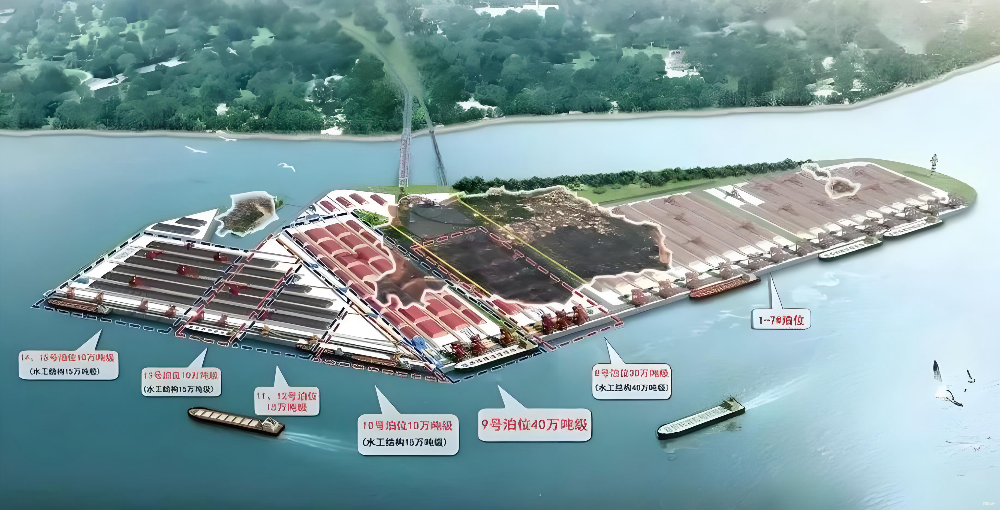

## **核心区别总结**

| 维度 | **港口 (Port)** | **港区 (Port Area)** | **码头 (Terminal/Wharf)** |
| :--- | :--- | :--- | :--- |
| **功能定位** | **综合战略枢纽**，功能全面 | **专业化功能分区**，职能相对集中 | **具体作业平台**，功能专一 |
| **空间范围** | 最大，涵盖广阔的水域和陆域 | 较大，是港口的一部分 | 较小，是港区的一部分 |
| **运营管理** | **统一规划**，协调多个港区 | **分区管理**，实现专业化运营 | **具体作业**，通常有明确的运营主体 |

### 海侧设施

* 锚地
锚地是指供船舶在水上抛锚以便安全停泊、避风防台、等待检验引航、从事水上过驳、编解船队及其他作业的水域。应选择水深适宜、水底平坦、锚抓力好、有足够面积且风、浪、流较小、远离礁石、浅滩便于定位的水域作为锚地。
* 航道
航道是指在江、河、湖、海等水域中，为船舶航行所规定或设置的船舶航行通道。航道设置航行标志，以保证船舶安全航行。
锚地和航道如下图所示:
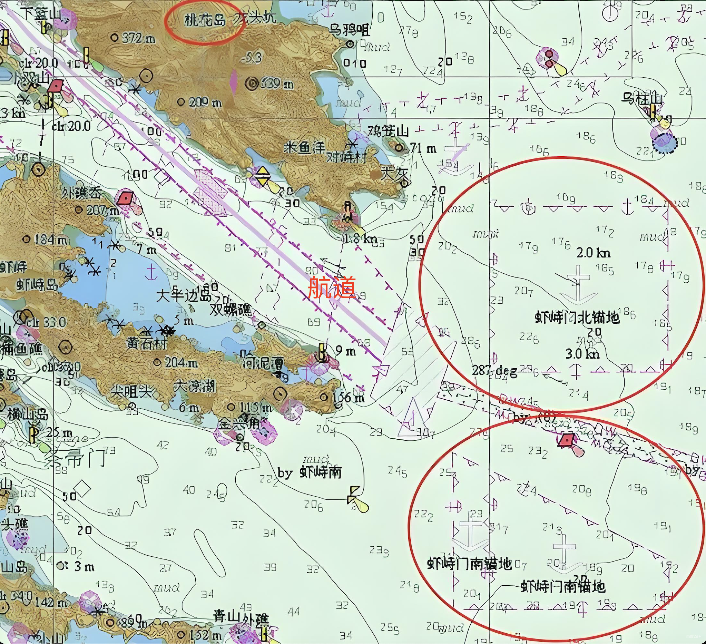

* 缆桩
缆桩是固定在码头或船舶甲板上的坚固桩柱，其核心价值在于提供一个可靠的力量支点。
* 缆绳
缆绳是船舶与码头之间的柔性连接件，其主要价值在于利用材料特性来保障系泊安全。
缆桩缆绳如下图所示：
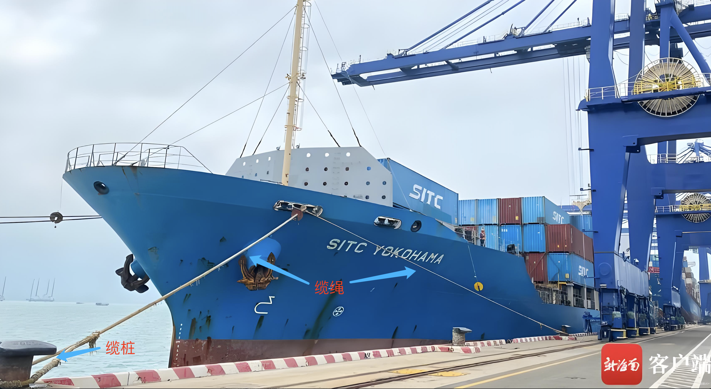

* 航线
装箱港口航线是集装箱船舶在两个或多个港口间，按照预定的船期进行定期航行和货物运输的固定路线。它构成了全球贸易网络的核心骨架。
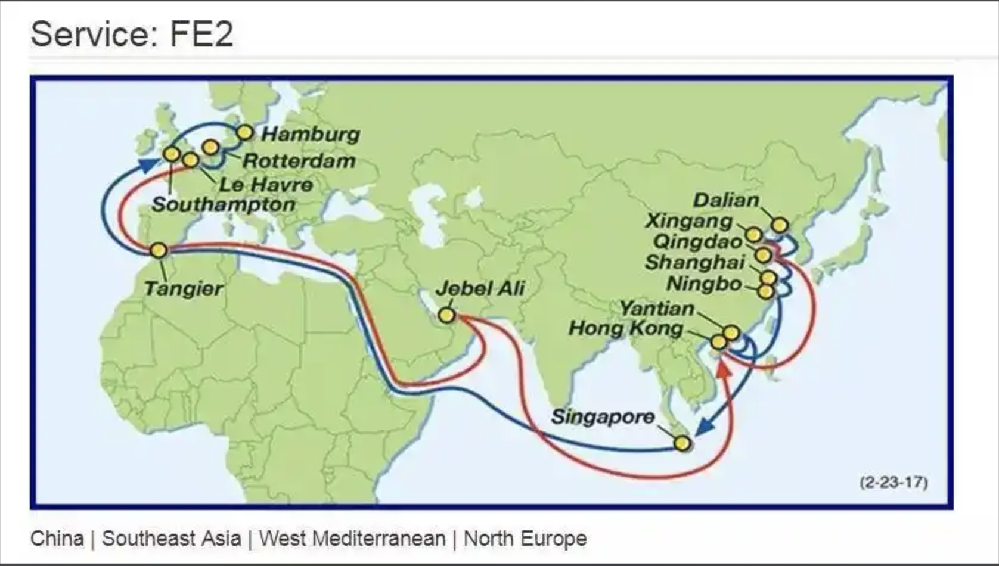

### 陆侧设施

* 闸口（Gate）
  这是集装箱码头的出入口，也是划分集装箱码头与其他部门责任的地方。所有进出集装箱码头的集装箱均在门房进行检查，办理交接手续并制作有关单据。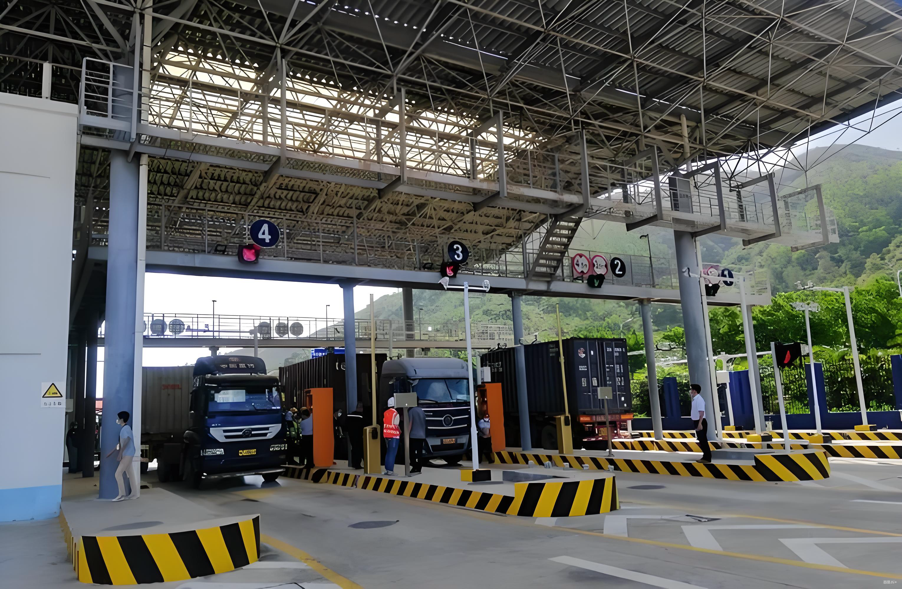
* 集装箱货运站（Container Freight Station，CFS）
CFS是一个专门用于集装箱装卸和分拨的场所。在CFS内部，货物可以进行集中装卸、拆箱、分拨、暂存和配送等操作。CFS通常位于港口或货运枢纽附近，与海运、陆运和空运相连，可以提供全方位的物流服务。配备拆装箱及场地堆码用的小型装卸机械及有关设备。
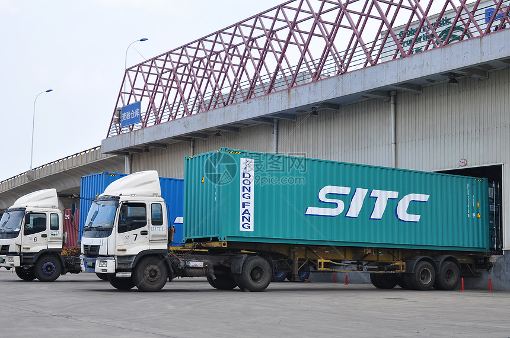
* 维修车间（Maintenance Shop）
这是对集装箱及其专用机械进行检查、修理和保养的场所。维修车间的规模应根据集装箱的损坏率、修理的期限、码头内使用的车辆和装卸机械的种类、数量及检修内容等确定。维修车间应配备维修设备。
* 集装箱清洗场（Container Washing Station）
主要任务是对集装箱污物进行清扫、冲洗，一般设在后方并配有多种清洗设施。
* 码头办公楼（Terminal Building）
集装箱码头办公大楼是集装箱码头行政、业务管理的大本营，已基本上实现了电子化管理，最终达到管理的自动化。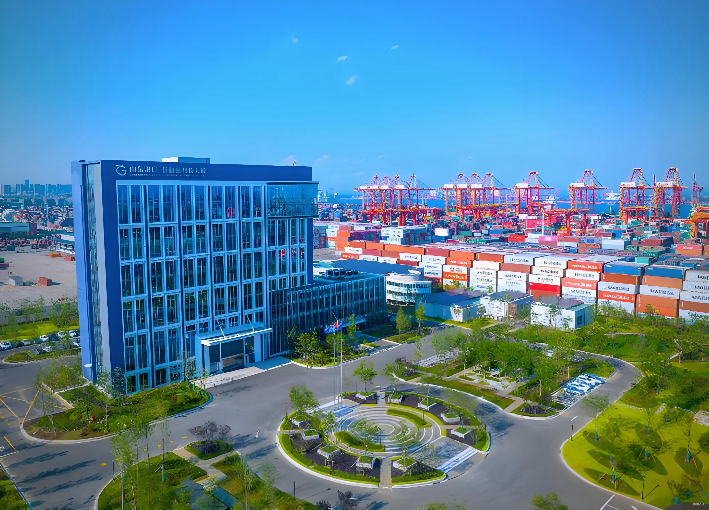
* 集装箱堆场（Container Yard，CY）
是指进行集装箱交接、保管重箱和安全检查的场所，有的
还包括存放底盘车的场地。堆场面积的大小必须适应集装箱吞吐量的要求，应根据船型的装载能力及到港的船舶密度、装卸工艺系统，集装箱在堆场上的排列形式等计算、分析确定。集装箱在堆场上的排列形式一般有“纵横排列法”（即将集装箱按纵向或横向排列，此法应用较多），“人字形排列法”（即集装箱在堆场放成“人”字形，适用于底盘车装卸作业方式）。
普通箱堆场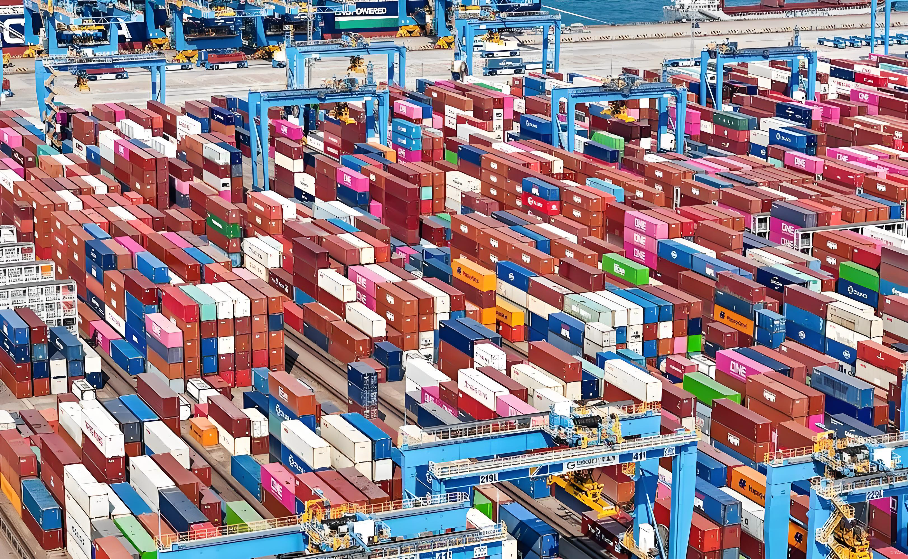
冷藏箱堆场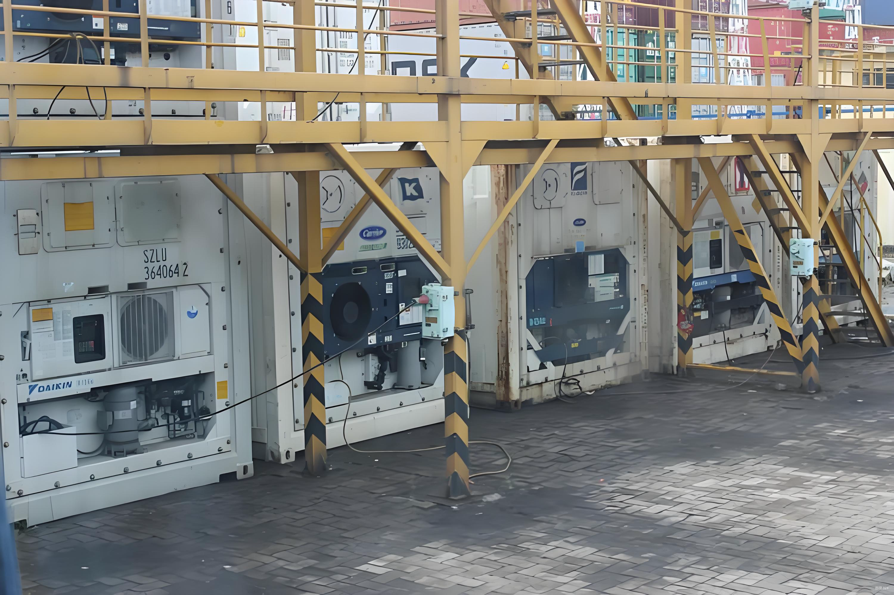
