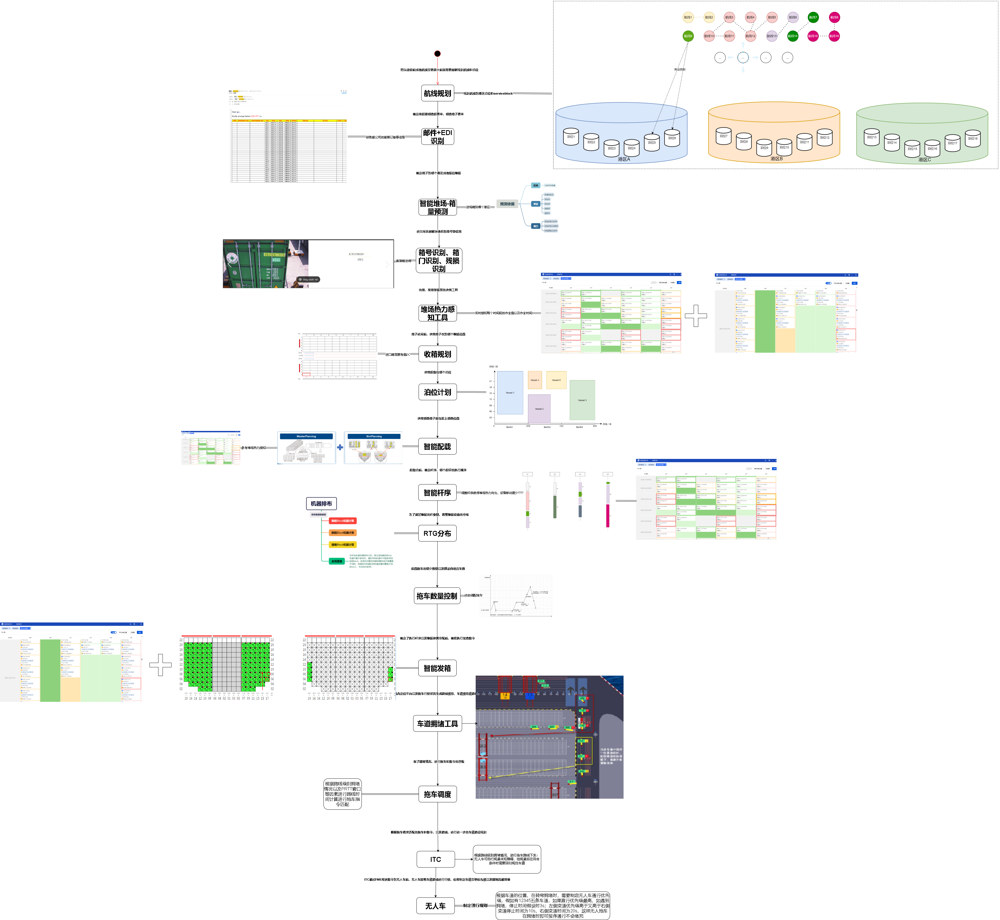
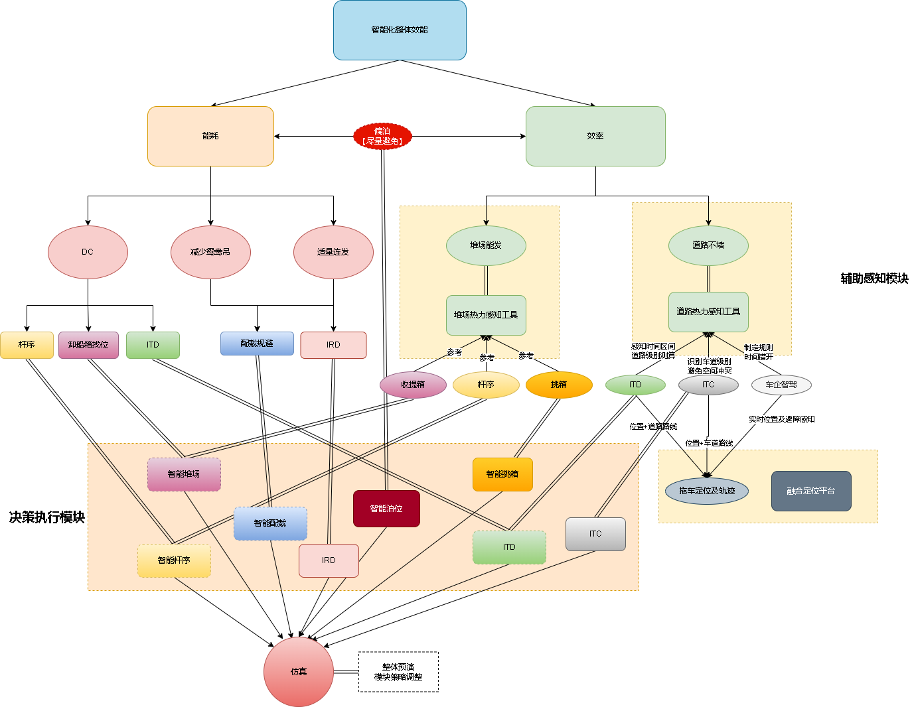
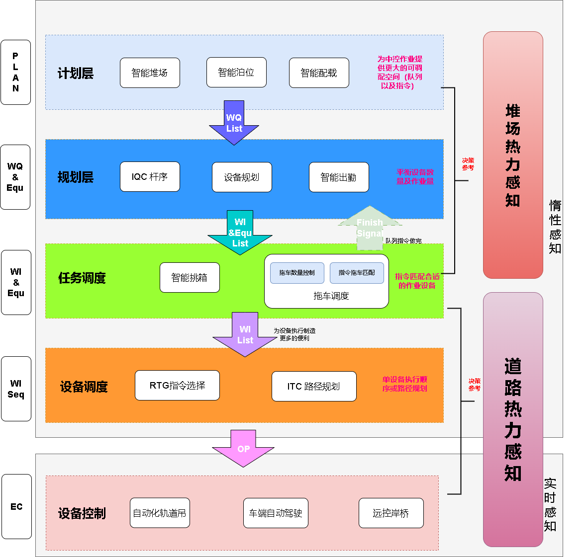
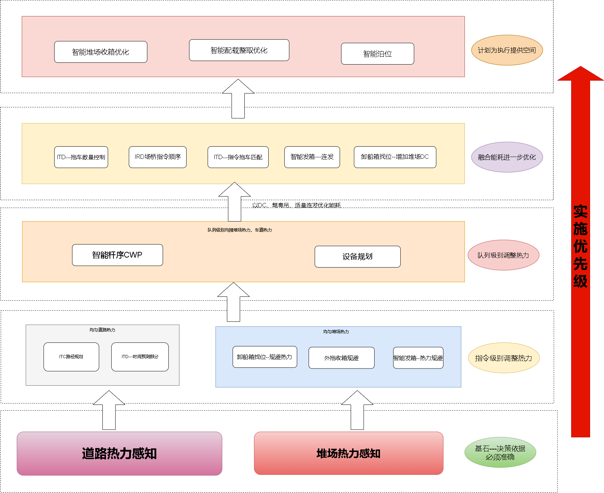

# 基础架构

## 从业务角度串联智能化

为了梳理整体的智能化基础架构，首先需要从业务角度串联智能化， 将业务流程和场景串联起来， 然后再从业务流程和场景的角度梳理智能化基础架构。整体的流程图如下：

1. **航线规划**
    给船公司的船制定计划泊位，并根据计划泊位为航线制定对应的Service Block用于航线出口箱的规划。
2. **邮件-EDI识别**
    对邮件识别以及EDI识别进行智能化处理，将信息提取录入系统。
3. **智能堆场-箱量预测**
    码头会定期预测箱量的堆存，包括特种箱等箱型，在堆存量饱和的情况引导箱子运往其他港区或者堆存至港区外的堆场，同时可以使港口各个港区的堆存箱量相对均衡。
4. **箱号识别、残损识别、箱门识别**
    箱子在进闸的时候需要对箱子进行识别，识别箱子的箱号后匹配子单号，箱门朝向、残损情况，从而完成办单收箱进场。
5. **堆场热力感知**
    感知堆场的繁忙程度，以往人工需要靠人工计算或者经验判断，所以需要采用智能化的方式对堆场热力进行感知，从而为各个模块提供决策依据。
6. **收箱规划**
    为进闸集装箱堆场找位。
7. **泊位计划**
    为临近船期制定泊位计划以及初步资源分配以满足船的靠离泊时间。
8. **智能配载**
    为堆场箱配载到船上，既要满足船上要求也要满足堆场取箱的便利性。
9.  **智能杆序**
    输出每条杆对应作业贝的作业顺序，保障堆场热力平衡以及船上的稳性。
10. **IRD智能规划**
    根据堆场热力，规划场桥的位置，并提前部署场桥。
11. **智能发箱**
    确定船贝中每个箱的作业顺序，尽可能适装整取。
12. **拖车数量控制**
    动态控制拖车数量，以适应作业量的变化。
13. **拖车调度**
    匹配拖车与指令的关系，实现距离短、耗时低的拖车作业。
14. **路径规划**
    车道级别的路径规划，使得无人车在车道内有序行驶，避免车道内拥堵。
15. **拖车控制**
    拖车控制，包括拖车速度、方向、转弯等，在保证安全的前提下，自主避障，协调拖车间的通行顺序。

## 按照业务目标进行流程拆解

在业务流程以及业务场景梳理的基础上， 我们需要按照业务目标进行流程拆解， 寻求模块之间的联系以及对整体目标的贡献。下来围绕着能耗和效率对整体目标进行拆解，整体过程如下图所示：

## 基础架构

有了上面两部分的分析，我们就可以开始梳理基础架构了，整体架构围绕着三个主线堆场能发、道路不堵、能耗低三个主线进行协同，串联各个模块，梳理出模块间的依赖关系以及层级关系，下层为上层提供的能力，上层为下层提供的调整空间，使得业务模块之间边界清晰，结果可评价。

### 基础框架核心点

#### 业务效果层面

1. 事前-感知模块
    整体作业可感知，明确以目标为导向。在事前可以决策哪些杆先做、哪些杆后做、每条船的停靠时间点往前往后推的影响、每条杆的效率对整体的影响。
2. 事中-执行模块
    执行过程中参考感知模块进行调度，在保障全场热力平衡的情况下，尽可能减低能耗保障作业效率。粒度按层级一层一层的执行：
    - 哪些船可以靠、何时靠
    - 每条船用多少杆
    - 每条杆执行哪些贝以及贝的顺序
    - 每个贝的指令执行顺序
    - 每个设备内的指令执行顺序
    - 每个条指令的执行路径
  
3. 事后-复盘调整策略
    作业完成后，可基于仿真模块，采用控制变量的方式，对作业策略进行调整，以达到最优的作业策略。

#### 架构层面

1. 解耦
    模块间为核心主线服务，各个模块分工明确，按目标排期落地。
2. 协作
    打破当前各个模块独立的情况，将码头整体的智能化模块【操作+车企+运维】进行协同，以达到整体的智能化目标。

## 基于现有系统的改造及实施

根据现有系统的现状，如何使架构往基础架构进行改造，这里的实施改造过程必须要考虑到现有系统的稳定性，以及对现有系统的冲击，因此优先补充几个基础的感知模块，后基于感知模块逐层优化各个模块的能力。

