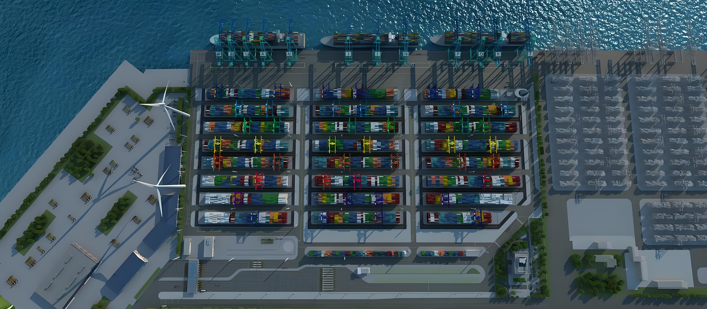
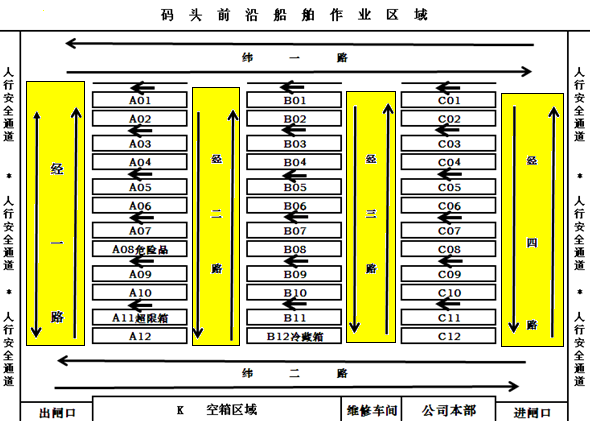
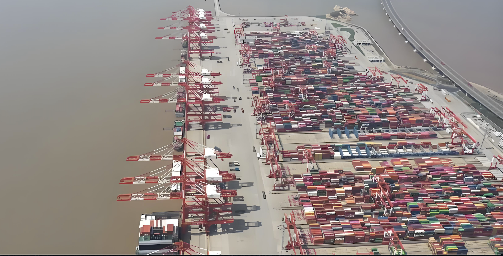
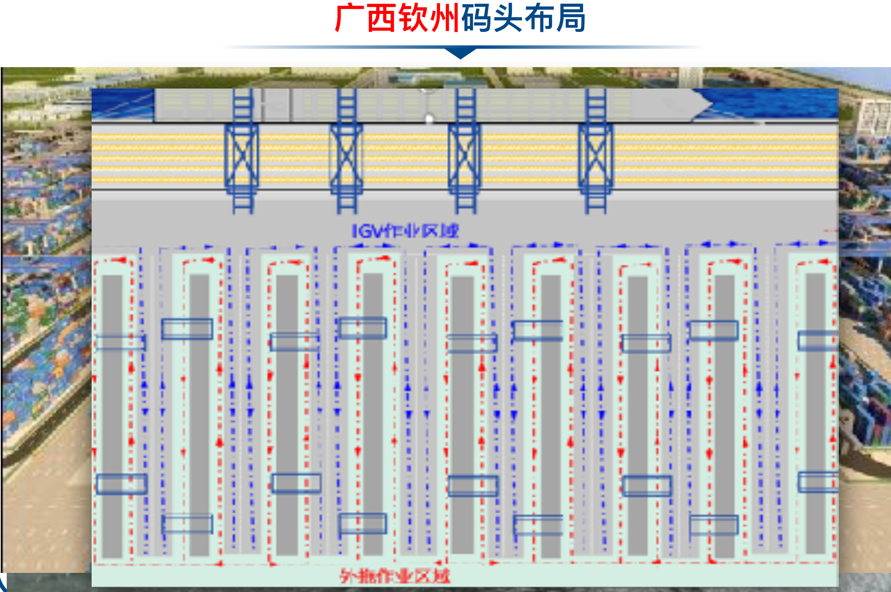
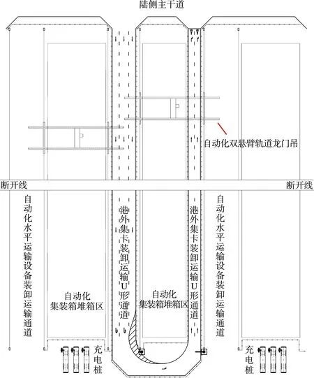
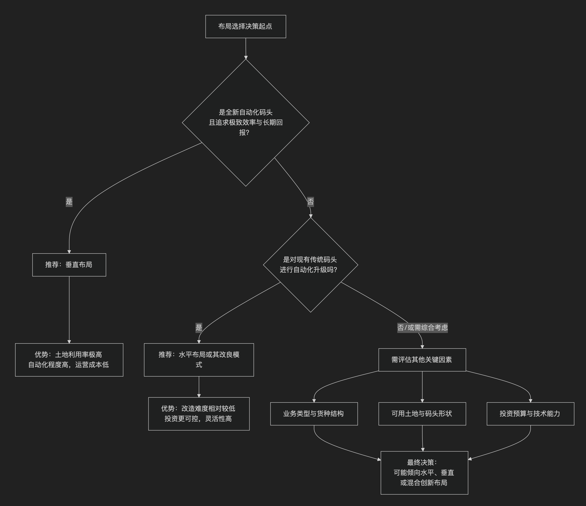

# 码头堆场布局

在集装箱码头的规划设计中，堆场布局始终围绕一个核心的效率悖论展开：是选择水平布局的灵活性与较低初始投资，还是追求垂直布局的土地极致利用与自动化高效益？这一根本抉择，深刻影响着码头的作业流程、技术路径与发展天花板。而近年来，诸如U型布局等创新模式的涌现，正为破解这一经典难题提供了新的思路，推动着码头设计理念的持续演进，下来我们来详细了解下码头堆场的布局内容。

## 水平布局

码头水平布局堆场是指堆场的主要作业设备（如轨道吊或轮胎吊）的运行轨道或轨迹平行于码头岸线方向，集装箱的堆放方向也平行于岸线。这种布局形式在传统人工集装箱码头中较为常见。

### 优缺点

* 优点：
	- 灵活性强：内集卡和外集卡作业位置多，可以灵活调整作业流程，适应不同的作业需求。
    - 作业效率高：由于作业位置多，可以同时进行多个作业任务，提高整体作业效率。
    - 适应性强：适用于多种集疏运方式，能够灵活应对不同的物流需求。
* 缺点：
	- 交通拥堵：由于内集卡和外集卡在堆场内频繁穿梭，容易导致交通拥堵，影响作业效率。
	- 自动化程度低：相比垂直布局，水平布局的自动化程度较低，需要更多的人工干预。

### 拖车运输如何配合

* 内集卡和外集卡的协同作业：
    - 内集卡：负责将集装箱从码头前沿运输到堆场，或从堆场运输到码头前沿。内集卡可以在堆场内灵活穿梭，进行装卸作业。
	- 外集卡：负责将集装箱从堆场运输到港口外的其他地点，或从其他地点运输到堆场。外集卡可以在堆场的指定区域进行装卸作业，避免与内集卡的冲突。
* 优化交通流线：
  - 设置专用通道：在堆场内设置内集卡和外集卡的专用通道，减少交通拥堵。
  - 智能调度系统：使用智能调度系统，实时监控集卡的位置和作业状态，合理安排作业任务，提高作业效率。
  - 提高作业效率：
    - 多点装卸：在堆场内设置多个装卸点，内集卡和外集卡可以同时在多个点进行装卸作业，减少等待时间。
	- 优化路径规划：通过智能算法优化集卡的行驶路径，减少不必要的行驶距离，提高作业效率。
* 适用范围
  - 水水中转比例较高：适用于水水中转比例较高的全自动化集装箱码头和以实现堆场自动化为目标但对自动化程度要求不高的半自动化集装箱码头。
  - 灵活性要求高：适用于需要较高灵活性的码头，因为内集卡和外集卡作业位置多，可以灵活调整作业流程。

### 垂直布局行业样例

天津港集装箱码头 

厦门港海沧码头堆场布局 

## 垂直布局

码头垂直布局堆场是指堆场的主要作业设备（如轨道吊或轮胎吊）的运行轨道或轨迹垂直于码头岸线方向，集装箱的堆放方向也垂直于岸线。这种布局形式在自动化集装箱码头中较为常见，通常采用端装卸方式。

### 优缺点

* 优点：
  - 缩短设备行程：垂直布局能够缩短设备的行程，减少港内拥堵，提高装卸效率。
  - 自动化程度高：这种布局形式有利于实现全自动化，自动化区和非自动化区界面简单清晰，港外集卡和自动化水平运输设备行驶的距离较短。
  - 装卸点分布均匀：装卸点分布均匀，避免了集中装卸点的拥堵，提高了堆场的作业效率。
  - 能耗低：采用低速自动化轨道吊，不再需要利用高速轨道吊进行集装箱在堆场区的对称接力作业，解决了高速轨道吊能耗居高不下的突出问题。
  - 拓展性好：U形布局拓展性好，不受每条堆场只能配置2台低速轨道吊的限制，可根据实际装卸作业需求适时增加。
* 缺点：
  - 作业位置少：相比水平布局，垂直布局的作业位置较少，灵活性稍差。
  - 初始投资高：自动化设备的初始投资较高，建设和维护成本也相对较高。

### 拖车运输如何配合

* 内集卡和外集卡的协同作业：
    - 内集卡：在垂直布局的堆场中，内集卡的行驶路径相对简单，主要在海侧交互区和堆场之间进行作业。内集卡可以在堆场的多个装卸点进行装卸作业，减少等待时间。
    - 外集卡：外集卡主要在陆侧交互区和堆场之间进行作业，避免与内集卡的冲突。外集卡可以在堆场的多个装卸点进行装卸作业，提高作业效率。
* 优化交通流线：
    - 设置专用通道：在堆场内设置内集卡和外集卡的专用通道，减少交通拥堵。
    - 智能调度系统：使用智能调度系统，实时监控集卡的位置和作业状态，合理安排作业任务，提高作业效率。
* 提高作业效率 
    - 多点装卸：在堆场内设置多个装卸点，内集卡和外集卡可以同时在多个点进行装卸作业，减少等待时间。
    - 优化路径规划：通过智能算法优化集卡的行驶路径，减少不必要的行驶距离，提高作业效率。

### 适用范围

* 自动化程度高的码头：适用于自动化集装箱码头，特别是配备自动导引车（AGV）的自动化系统堆场。这种布局形式能够缩短设备的行程，有效减少港内拥堵，提高装卸效率。
* 中转比例较低的码头：适用于水水中转比例较低的全自动化集装箱码头和以实现堆场自动化为目标的半自动化集装箱码头。

### 垂直布局行业样例

洋山四期：

### 垂直布局创新-U型布局

U型布局的核心优势在于其独特的"侧面装卸"模式。与传统垂直布局的"端部作业"相比，U型布局将堆场布置成U形，集装箱卡车和智能引导运输车(IGV)都可以进入通道，在通道边实现多点装卸作业。而广西北部湾钦州自动化集装箱码头是U型布局的成功实践者，其核心机制包括：

* ​优化物理动线是基础​：U型布局通过将投入点和取出点设置在相近位置，从根本上缩短了物料的核心移动路径。这种“短途闭环”设计是提升效率的物理基础。​
* 增加作业点提升并行性​：允许集卡和AGV进入堆场通道并在侧边进行装卸，相当于增加了大量作业窗口，使多个流程可以并行不悖，极大减少了设备在起重机末端的排队等待时间。
* ​实现专业化分工降低能耗​：U型布局天然支持“车轨分离”，让水平运输设备（如AGV）和垂直装卸设备（如轨道吊）在各自最优的路径上工作，​减少了相互干扰和无效移动，从而显著降低整体系统能耗。

其成效包括：

* ​外集卡提箱效率​：从进闸到提箱出闸仅需约15分钟。​
* 人力配置​：42台轨道吊仅需约5人在后台远程操控，现场人员数量比传统码头减少达81%。
* ​设备创新​：配备了全球转弯半径最小的IGV（智能导引车），实现了在U型通道内的高效灵活运转。
* 能耗控制​：设备单箱耗电量比传统自动化码头降低了45%。

广西钦州集装箱码头U型布局如下：

## 整体对比

| 比较维度 | **水平布局** | **垂直布局** |
| :--- | :--- | :--- |
| **空间关系** | 堆场与码头岸线**平行**布置 | 堆场与码头岸线**垂直**布置 |
| **空间与土地效率** | 水平运输距离较长，**土地利用率相对较低**。 | 结构紧凑，能有效**缩短水平运输距离**，土地利用率高。 |
| **作业流程** | 流程相对简单，内外集卡可进入堆场作业，灵活性强。 | 流程清晰，通常实现**车轨分离**（如AGV在固定通道运行），外集卡不进入堆场核心区，安全性高。 |
| **自动化适应性** | 传统模式下灵活，全自动化改造时路径规划复杂，易发生冲突。 | **天然适合全自动化**，路径规整，易于系统调度和控制，是新建自动化码头的首选。 |
| **典型设备** | 轮胎吊、混合使用内/外集卡。 | 自动化轨道吊、AGV/IGV（智能导引车）。 |
| **投资与成本** | 初期**投资相对较低**，技术门槛更易接受。 | 初期**投资巨大**（自动化设备、高架轨道系统），但长期运营成本可能更低。 |
| **灵活性与可靠性** | **高**，设备可替代性强，某台设备故障对整体作业影响较小。 | 相对较低，系统性强，关键路径设备故障可能影响整个箱区作业。 |

### 布局选择考量

* ​基础条件与定位​
  - 决策始于对项目性质的判断，若是新建大型专业化码头，且目标为打造高效的全自动化枢纽，​垂直布局通常是优选。
  - 若是对现有传统码头进行自动化升级，或码头地形、业务模式特殊（如江海联运占比高），​水平布局或其改良模式的可行性和经济性往往更突出。
* ​核心目标权衡​
​
  - 追求极致效率与长期自动化​选择垂直布局。它为实现无人化、高效率运营提供了最优的物理基础。
  - 看重投资回报与运营灵活性​：​水平布局可能更合适。它的初始投资相对较低，且能更好地适应业务量的波动和多样化的作业需求。
​
* 技术与管理能力​
  - 垂直布局高度依赖先进的智能调度系统和高水平的技术维护团队。
  - 水平布局的自动化系统同样复杂，且对解决人机混行、路径冲突的算法要求极高。

决策思路图:
