# 港口设备

港口作业设备种类繁多，针对不同的货物和作业环节，都有其专门的“主力军”。主要涵盖岸边作业设备、水平运输设备、堆场作业设备三个部分。

## 岸边作业设备

不同类型的码头岸边作业设备类型不一样，主要有：岸边集装箱起重机（岸桥）、门座式起重机（门机）、桥式抓斗卸船机

### 岸边集装箱起重机（岸桥）

案桥主要出现在集装箱码头，在集装箱船与码头前沿之间装卸集装箱。其优点是效率极高，是专业化集装箱码头的主力。缺点是投资巨大，仅适用于集装箱作业，灵活性低。按照不同维度可以进行不同分类，具体如下表格：

| 分类维度 | 主要类型 | 核心特点与区别 |
| :--- | :--- | :--- |
| **按小车结构** | **绳索牵引小车式** | 起升与运行机构均固定在桥架上，通过钢丝绳牵引小车。**优点**：小车自重最轻。 **缺点**：钢丝绳长，磨损大，维修工作量大。 |
| | **半绳索牵引小车式** | 起升机构固定，运行机构安装在小车上。**优点**：控制直接，维修量少，**应用最广**。 |
| | **自行式小车** | 起升与运行机构均安装在小车上。**优点**：钢丝绳用量最少。 **缺点**：小车自重最大，需拖缆供电，成本高。 |
| **按门架形式** | **H型门架** | 两侧门框为平行支腿结构。**优点**：制造简单，成本较低。 **缺点**：横向稳定性稍弱。 |
| | **A型门架** | 两侧门框呈“A”字形斜撑结构。**优点**：横向稳定性更好，抗风能力强，适用于大型高速岸桥。 |
| **按起吊数量** | **单箱式** | 一次作业吊运1个集装箱。是**最基础、最常见**的型式。 |
| | **双箱式** | 一次作业可同时吊运2个20英尺集装箱。**优点**：**作业效率显著提升**。 |
| **按臂架俯仰能力** | **俯仰式** | 前伸臂（海侧臂架）可以仰起，便于船舶靠离码头。**绝大多数岸桥采用此设计**。 |
| | **非俯仰式（固定式）** | 结构简单，成本低，但要求码头水域和航道足够宽，应用较少。 |
| **按照小车数量** | **单小车式** | 单线接力：仅有一部小车，在船侧与陆侧之间往复运行，完成整个作业循环。**应用最广** |
| | **双小车式** | 协同作业：两部小车（通常称“主小车”和“门架小车”）可同时或接续工作，如一部负责船侧装卸，另一部负责陆侧交接。**优点**：1. 作业效率高，理论上单机效率可比传统岸桥提升50%以上，有效解决效率瓶颈。2. 天生适合自动化。两部小车可实现无人操控，对箱作业可远程操作，易于与AGV（自动导引车）等自动化运输设备集成。|
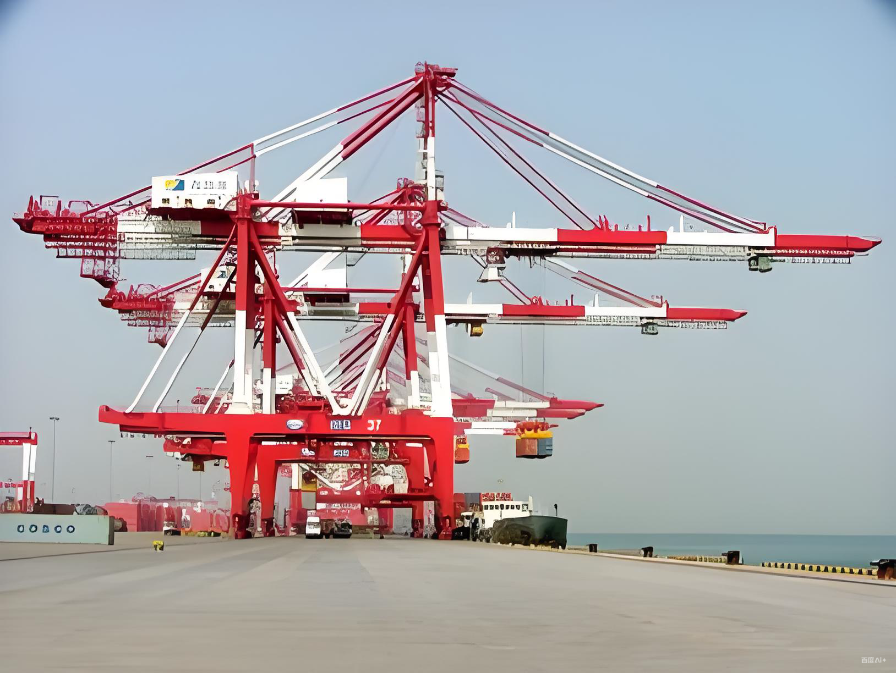
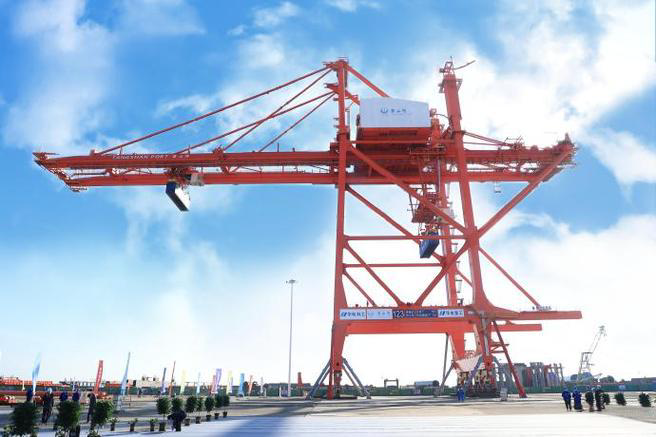

### 门座式起重机（门机）

门座式起重机（简称门机）是港口、船厂、大型水电工程等领域不可或缺的重型装备,可配抓斗或吊钩，装卸件杂货和散货.

* 优点：通用性强，可360度回转，覆盖范围大。
* 缺点：效率相对较低，能耗较高。

| 特性维度 | 主要类别 / 核心特点 |
| :--- | :--- |
| **主要应用场景** | 港口、码头、船厂、大型水电站等 |
| **核心组成部分** | 起升机构、回转机构、变幅机构、运行机构这四大机构 |
| **按用途分类** | 装卸型（港口杂货/散货）、造船型（船体拼接）、建筑安装型（大坝工程） |
| **按结构分类** | 全门座与半门座；四连杆组合臂架与单臂架；转柱式、定柱式、转盘式与大轴承式 |
| **核心优势** | 工作幅度大、起升高度高、作业效率高、下方可通行车辆、占用场地面积小 |
| **主要局限** | 自重庞大、轮压大、对轨道基础和电力供应要求高、造价与维护成本高 |

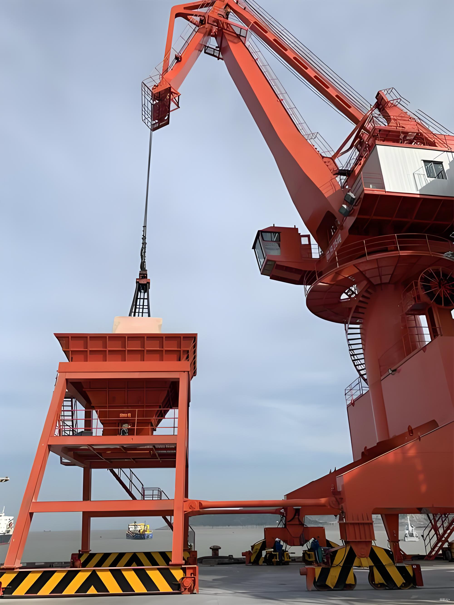

### 桥式抓斗卸船

桥式抓斗卸船机是港口码头用于大宗散货卸船作业的核心设备，主要用于煤炭、矿石、粮食等散料的装卸。它通过抓斗从船舱抓取物料，经料斗输送到后方堆场，具有效率高、适应性强的特点，缺点：功能单一，仅适用于散货。

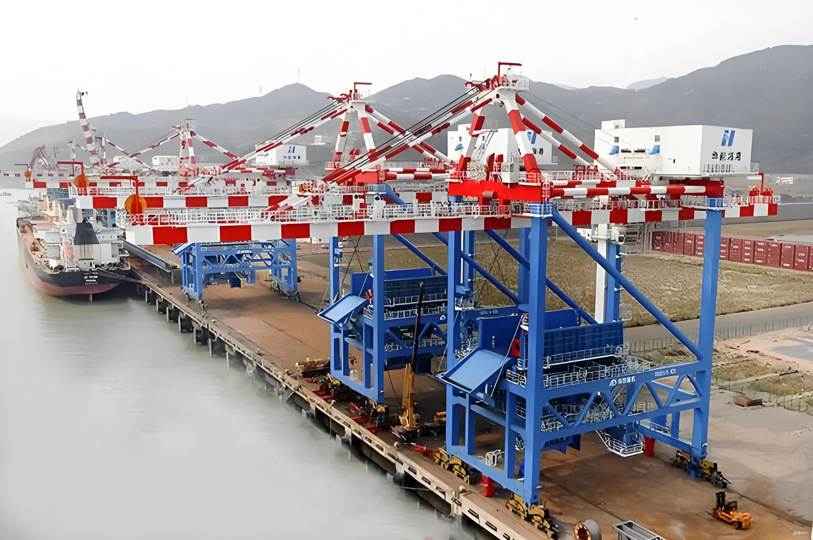

## 水平运输设备

码头水平运输设备主要包括集装箱卡车（集卡）、自动导引车（AGV）、智慧型引导运输车（IGV）、无人驾驶卡车、叉车/正面吊、集装箱跨运车等移动运输设备，用于集装箱岸边到堆场之间的双向运输。

### 集装箱卡车

集装箱卡车是专门用于载运标准集装箱的专用运输车辆，它是现代多式联运和港口物流体系中的关键一环。
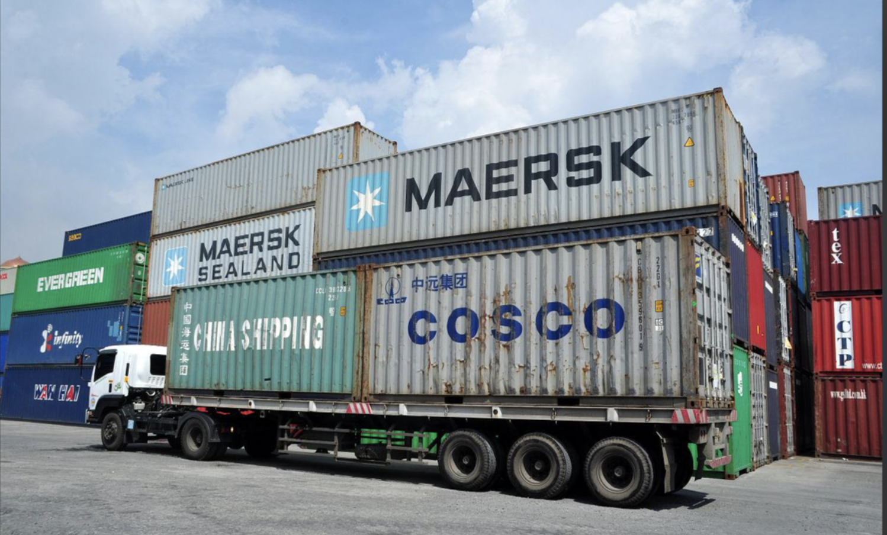

### 自动导引车（AGV）

自动导引车（AGV）是装备有导引装置，能沿预设路径行驶的无人驾驶运输车，是以依赖外部预设标记，如激光反射板、磁条、二维码等标识进行导航，路径相对固定，变更需改造物理环境（如重贴磁条），成本较高，需要配备复杂的中控系统进行集中任务调度和交通管理。

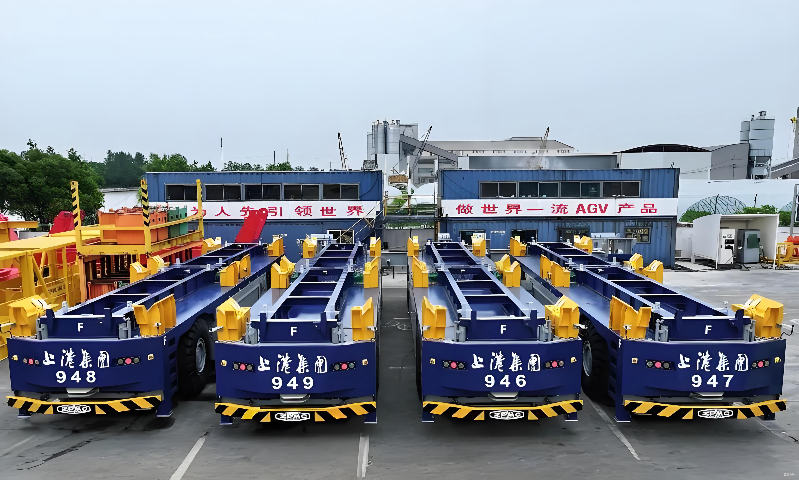

### 智慧型引导运输车（IGV）

IGV是​AGV的技术升级形态，柔性化与智能化程度更高,不依赖或极少依赖固定标记，采用SLAM（即时定位与地图构建）等技术，实现自然导航​。路径高度灵活，可通过软件随时更改地图和路线，适应动态复杂环境,更具分布式智能，单车智能更高，系统协同更灵活。

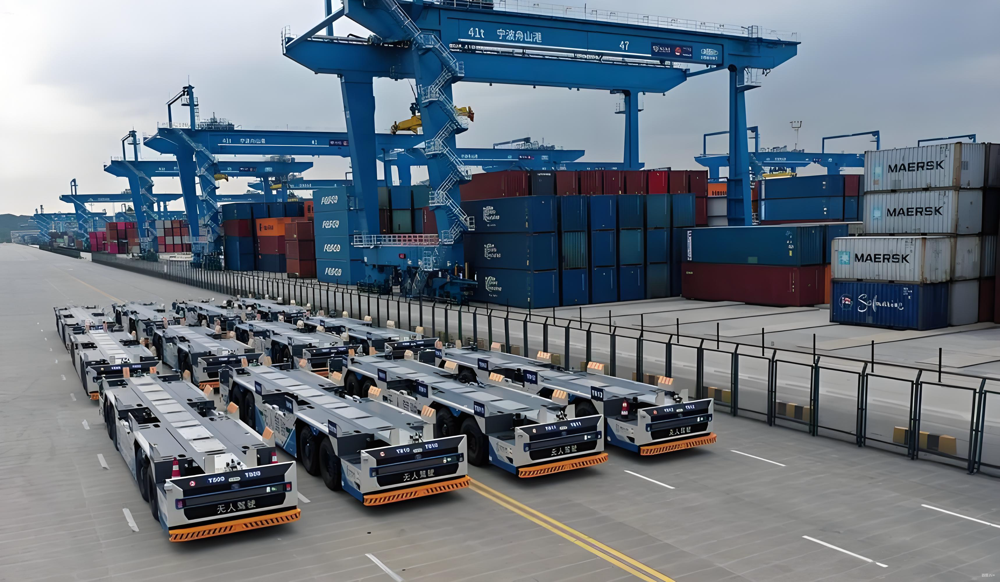

### 无人驾驶卡车

无人驾驶卡车是为了让传统集卡具备“自动驾驶”的能力，需要为其加装一系列先进的硬件设备，如激光雷达、摄像头、超声波传感器等，并配备中控系统，实现自动避障、自动定位、自动跟随等功能。

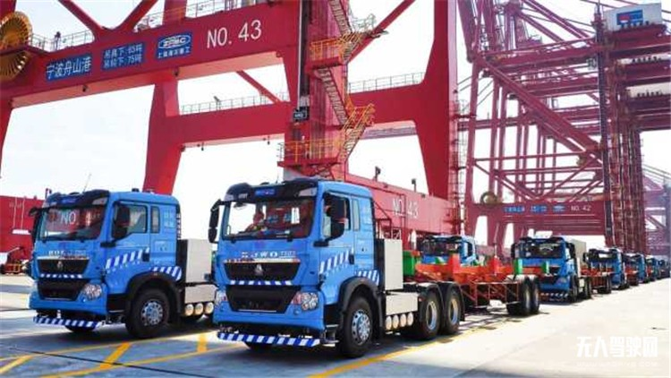

### 叉车

叉车是通用型搬运工具，适用于仓储、车间等内部短途运输和堆垛。

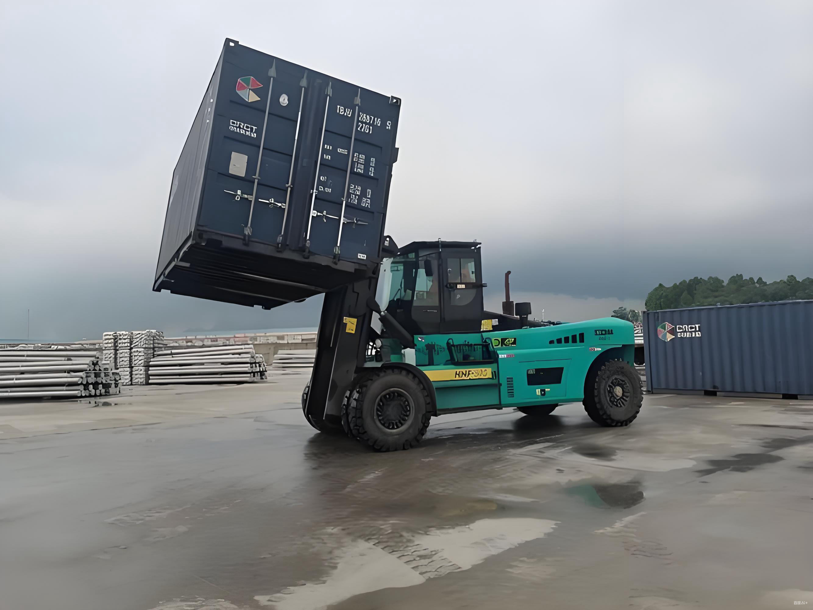

### 正面吊

集装箱正面掉是专业化集装箱装卸设备，专为20英尺和40英尺国际集装箱设计 ，专注于集装箱的堆叠、移动和装卸，可进行跨箱作业，兼具一定的水平运输功能。

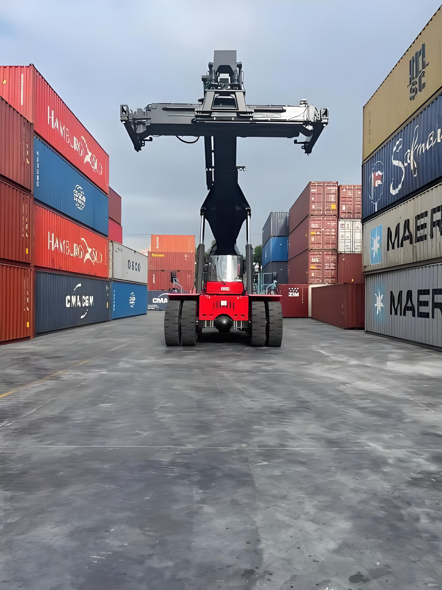

### 跨运车

集装箱跨运车是一种在港口、铁路场站等物流枢纽中用于短距离搬运、堆码集装箱的专用起重设备。它因其高效、灵活的特点，成为现代化集装箱码头水平运输和堆场作业的关键装备之一。

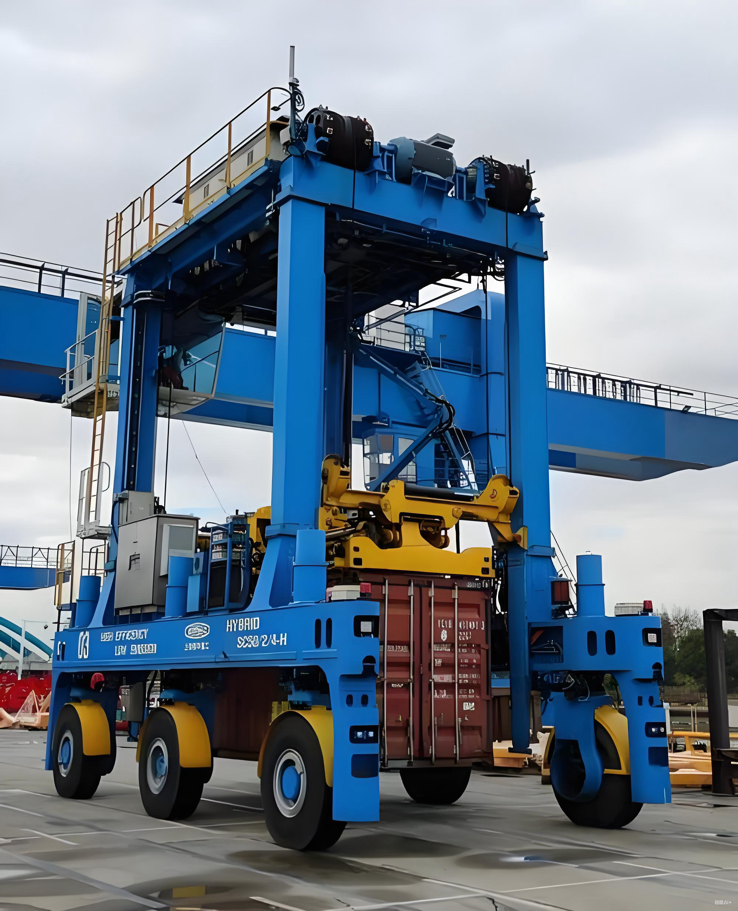

## 堆场作业设备

​堆场作业设备主要涵盖轨道式龙门吊（RMG）、​轮胎式龙门吊（RTG）以及​集装箱空箱堆高机​。

### 轨道式龙门吊RMG

轨道式龙门吊由金属门形框架，由主梁、支腿、运行小车、起升机构等组成，沿地面固定轨道运行,在自动化码头中广泛应用，​定位精准、电力驱动、节能环保。其最大限制是只能沿固定轨道运行，缺乏灵活性，箱区之间的设备难以互相支援。

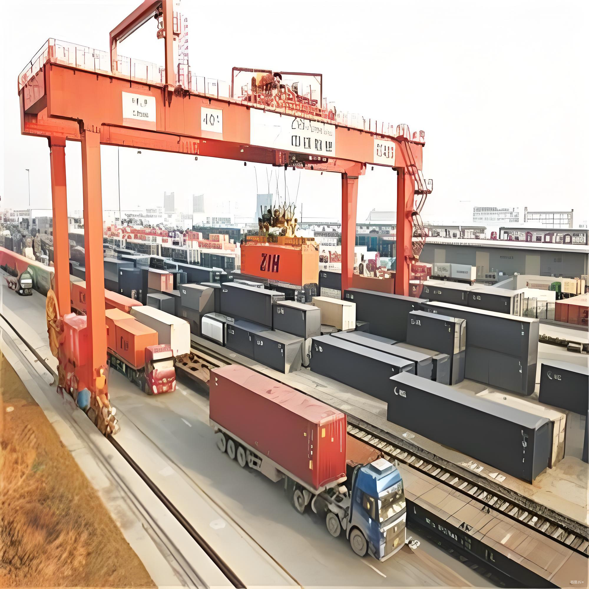

### 轮胎式龙门吊RTG

轮胎式龙门吊由金属门形框架、运行小车、起重机构等组成，配备轮胎底盘，实现灵活移动，机动性极佳，转场方便快速，无需固定轨道，对场地适应性强。
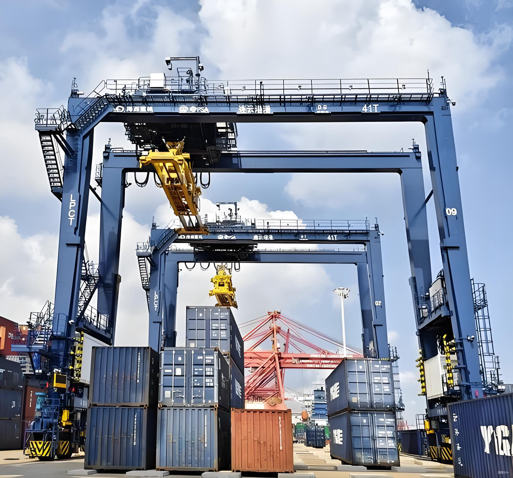

## 设备间的协作关系

一个高效的港口如同一支交响乐团，各种设备各司其职，紧密配合。其协作流程可概括为下图，它展示了货物从船舶到堆场的主要路径及核心设备在其中扮演的角色。简单来说，​岸边装卸设备是负责从船上“搬上搬下”的大力士；水平运输设备是负责“跑来跑去”的搬运工，连接岸边的堆场；而堆场作业设备则是负责“分类码放”的仓库管理员，它们共同构成了港口物流的骨架。

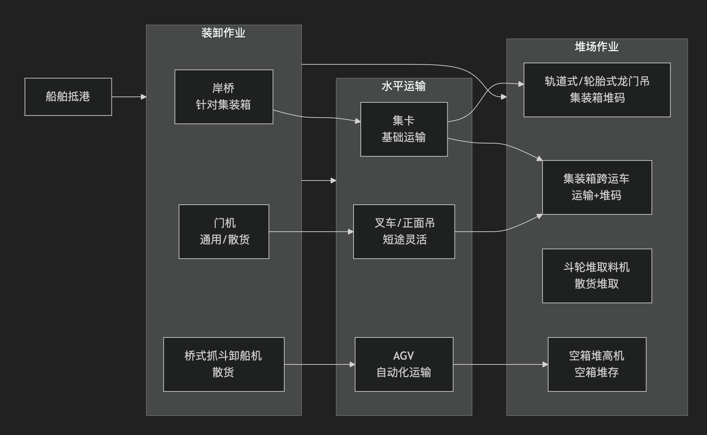
