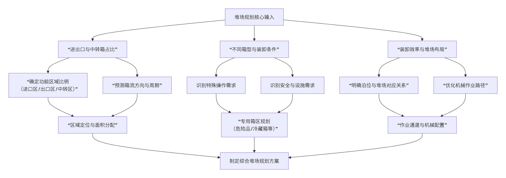
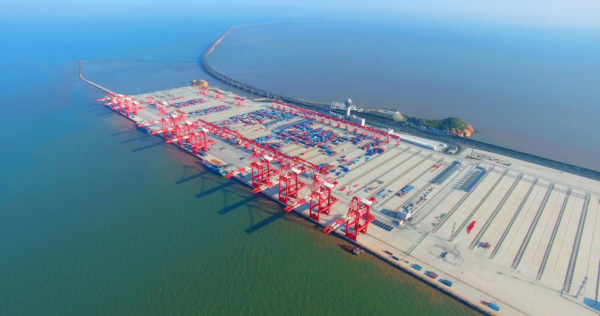
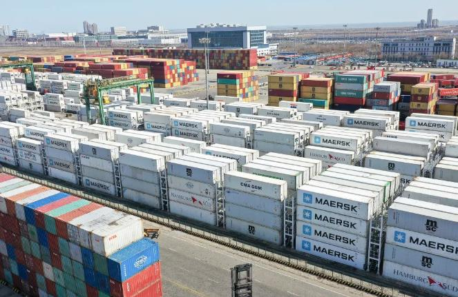
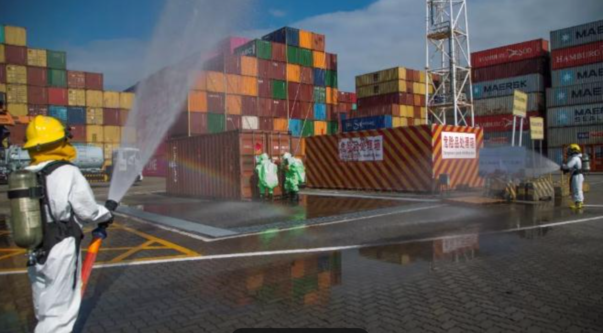
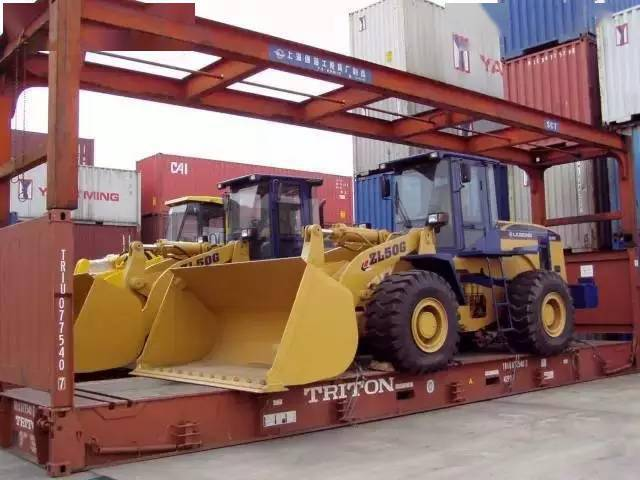
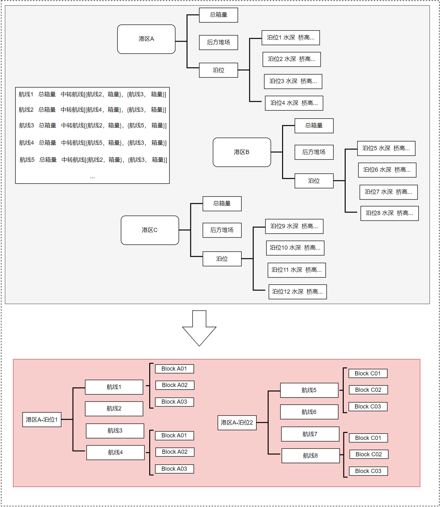
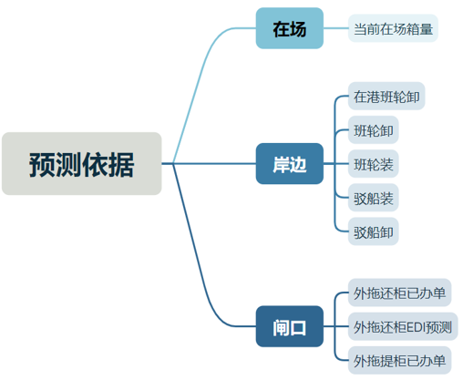

# 堆场业务

码头堆场是港口物流的核心枢纽，其规划的科学性直接影响到船舶在港时间、装卸效率和运营成本。一个高效的堆场规划以及管理方式需要综合考虑业务类型、货物属性和设备能力等多个维度。 下面我们从堆场的空间布局规划以及管理来分析堆场的业务流程。

## 堆场规划

堆场规划主要考虑进出口与中转箱的占比、不同箱型的管理和装卸条件、船舶靠泊的装卸效率、堆场的空间利用率、堆场的安全性等都是影响堆场规划的关键因素。整体关系图如：

### 业务类型占比对堆场布局的影响

堆场布局的核心是根据业务类型的占比来划分区域，以便更好地满足不同业务的需求。

* **出口业务主导型布局**

当出口重箱占比超过70%时，堆场布局会呈现“扇形放射”特点。出口箱区占据最靠近泊位的“扇骨”位置，按目的港和航线分区，以减少装船时的移动距离。空箱回收区则被推至远离闸口的“扇缘”，避免与重箱车流交叉，上海洋山港四期即采用此模式，单箱水平运输距离缩短 12 %。

* **进口业务主导型布局**
当进口箱占比超过30%时，布局更像“梳形纵深”。进口箱区沿闸口方向纵向延伸，梳齿状通道让拖车“直进直出”，减少倒车。冷藏、危险品等特殊箱则被安排在梳齿末端，靠近专用设施，降低安全隔离带面积，宁波舟山港梅山港区通过梳形布局，将进口提箱平均等待时间压缩 2 分钟。 

* **中转业务主导型布局**
当中转箱量激增时，堆场布局更像一个“十字枢纽”。堆场被划分为多个功能区，靠近泊位的是中转箱区，用于存放即将转运的集装箱；远离泊位的是周转箱区，存放待出口或待进口的集装箱。这种布局确保了中转箱的快速流转，同时不影响其他业务；青岛港前湾港区 2024 年中转箱量同比增长 18 %，为此新增 2 条铁路装卸线，形成明显的十字枢纽。

### 不同箱型和装卸条件对堆场布局的影响

由于集装箱并非千篇一律，其类型、尺寸和装卸要求差异巨大。堆场规划必须为这些特殊箱型设置专属区域，如为需要差点的冷藏箱设置冷藏箱箱区 ( Reefer )【靠近电源、避免翻箱】、针对于易燃易爆有毒等危险品设置危险品箱区 ( Hazardous )、为超限、开顶箱等特种箱设置特种箱区 ( Special )等。

* **冷藏箱区**
  码头的冷藏箱区是处理对温度有严格要求的货物（如生鲜、药品等）的核心区域。其规划与管理需遵循一系列严格的安全、技术和操作限制条件，以确保货物质量、作业安全和高效运转。其规划要点包括：
  1. 该区域通常设置在靠近码头前沿的专用位置，配备充足的电源插座和电缆，确保冷藏箱在堆存期间能够持续供电。
  2. 其中冷藏箱区的地面必须平整且能承受集装箱的压力，同时具备良好的排水、消防、照明和监控通讯设备。
  3. 为避免翻箱作业，冷藏箱区的设计会预留出足够的作业空间，便于龙门吊直接进行装卸操作。
  

* **危险品箱区**
    危险品集装箱（危品箱）因其爆炸、易燃、毒害、腐蚀、放射性等特性，在码头堆场的作业和管理上有着极为严格的规定。码头为此专门设置了危险品箱区，并对其进行严格的管理和监控。其规划要点包括：
    1. 危险品箱区必须与其他区域保持安全距离，并配备防火、防爆、防泄漏等专用设施。
    2. 根据国家标准，该区域实行严格的分区管理制度，不同性质的危险品（如爆炸品、易燃液体、腐蚀品）必须分置于不同的隔离区内，以最大限度降低风险。
    
* **特种箱箱区**
    特种箱区主要是为了满足超限、开顶、框架等特殊箱型的装卸和存储的需求。其规划要点包括特种箱区需要预留出额外的作业空间，以容纳超尺寸货物。同时，该区域的地面承载能力、龙门吊的起重能力和作业路径的转弯半径都需满足特殊要求。例如，框架箱装卸时需要两侧至少6米的作业空间，而开顶箱则需要配备能够处理顶部帆布的专用设备。
    

### 堆场泊位协同对堆场布局的影响

装卸效率是衡量码头竞争力的核心指标。堆场与泊位的协同规划，是实现“快进快出”的关键。理想情况下，一个泊位应对应其专属的后方堆场区域。这样能为该泊位服务的船舶提供专用的集港和卸船场地，避免不同船舶作业线之间的相互干扰 
。规划时，必须确保该泊位的进出口箱、中转箱等各类箱型的堆存区域与之高效衔接。例如，出口箱应集中存放在靠近该泊位的堆场区域，以缩短装船距离；而进口箱则可以集中存放在稍远的通用堆场，待清关后统一调配。这种协同规划能有效避免不同泊位作业之间的干扰，提升整体作业效率。

* **出口箱**

    出口箱在进场时就需按“卸货港”和“吨级”进行分组，并提前规划好目标存储区域。装船时，这些集装箱应集中在靠近相应泊位的堆场，以减少龙门吊的水平移动距离，提高效率。此外，预配计划的箱型和船舶类型对堆存方式影响也是很大，可以根据实际情况进行调整，以满足不同船舶的需求。

* **进口箱**

    进口箱在卸船后尽量靠近后方闸口，便于外拖取箱，同时为内拖在堆场侧形成DC提供便利条件，一般进口箱在卸船后通常采用“集中混堆”的方式堆放，即按尺寸分类但不区分具体航线。这样可以加速卸船作业，因为不需要为每个集装箱寻找特定位置。待清关后，再根据提箱预约进行二次调度。 

* **中转箱**

    中转箱的堆放必须考虑其后续的二程船安排。卸船时，应按二程船的航线和航次在堆场内有序堆放，为后续的中转装船作业创造便捷条件。 

## 堆场管理

码头堆场管理是港口运营的“心脏”，其高效运转直接影响着全球贸易的物流效率。为了实现这一目标，现代码头普遍围绕航线规划、箱量预测、堆场找位、堆场整理、外拖提空五大核心内容展开精细化管理，以确保集装箱的安全、高效流转。

### 航线规划

航线规划是堆场管理的起点，它决定了集装箱在码头的“居住区”。其核心目标是通过科学的分区和堆放，减少后续装船的移动距离以及作业时的翻箱率，提升整体效率。对于集装箱码头而言，在作业执行之前，一个关键任务是将计划在本港停靠的航线列表合理分配到各个港区的特定泊位，并为每条航线分配适宜的ServiceBlock。这一过程即构成了航线规划的核心。ServiceBlock是堆场管理中的一个重要属性，它为堆场中的收提箱提供指导，明确了收提箱的存放区域，从而显著提高了收提箱作业的效率。因此，航线规划的核心目标是在确保每个码头的港区负载保持在正常工作范围内的同时，尽可能减少船舶在BITT业务所涉及的集装箱数量。

#### 航线规划的核心要素

* **停靠泊位**

由于码头的泊位水深等条件不一样，所以船舶在泊位停靠时，需要根据泊位水深等条件进行调整，以确保船舶安全停靠。此外还需要考虑该航线的箱量以及中转航线的分布，在箱量堆存能力满足该港口港区的作业能力以及中转航线集中在该港区的情况下，给出一个商业泊位【商务合同也有可能会约定】，将船公司的航线分配到泊位。

* **ServiceBlock**

在泊位分配完成后，需要根据泊位和航线分配ServiceBlock，ServiceBlock是堆场管理中的一个重要属性，它为堆场中的收提箱提供指导，明确了收提箱的存放区域，从而显著提高了收提箱作业的效率。

具体示意图如下：

### 箱量预测

为了更好地完成堆场规划以及制订堆场计划，堆场计划员需要对码头未来的作业情况进行预测，主要包括两部分预测：每日滚动预测未来7天的堆场堆存率、针对单航线收箱计划预测各箱型进箱量。

* **每日滚动预测未来7天堆场堆存率**
    预测堆场堆存率本质上就是预测堆场进箱量、出箱量再结合当前在场量进行评估。 堆场的集装箱进出有两个关口，分
别是岸边和闸口。 在统计岸边和闸口的进出量时，涉及到各类型的信息，如下图所示。

    在这些数据里面，部分可以通过现有的作业计划获取，如在港班轮卸；部分只能通过历史数据做预测，如班轮装。通过统计与预测以上数据，即可获得码头未来空箱、重箱、特种箱在堆场的堆存率。但是一般来说，前三天的预测数据比较具备参考意义。此外，在统计堆存率的分母即堆场堆存能力时，应使用场地设备来评估该场地空重堆存能力，不能通过已堆存的空重箱来评估。

* **收箱预测单一航线各箱型进箱量**

    预测单一航线各箱型的进箱量主要是为了给制定收箱计划提供数量参考。预测方式只能通过历史数据取均值做统计，一般会去掉极值后再取平均值。最后获得该航线各箱型历史有效平均箱量、以及这条航线的箱在靠泊前几日的进箱量分布还有该航线平均分杆数和每贝应收箱数。

### 堆场找位

堆场找位即堆场收箱计划，是堆场业务的核心内容，其策略普遍遵循“进为出（in for out）”的基本原则。高质量的收箱计划能够大幅度提高收发箱作业的效率，但是由于不同的码头具备不同的业务特性，因此收箱策略理论上并没有最好的，只有最合适码头业务特性的。行业内，当前大多数集装箱码头制订堆场计划普遍存在两种模式：两阶段模式和无计划模式。
* **两阶段模式**，也叫定位组模式，是目前绝大多数集装箱码头所采用的模式。在该模式下，计划员首先需要提前根据自身码头的业务特性制订合适、灵活的堆场策略，也就是制订箱属性分组。当集装箱进入堆场，计算机程序再根据制订好的箱属性分组以及分组对应的位置范围，进行具体箱位自动决策。
* **无计划模式**，也叫智能收箱，目前仅少数码头采用。在该模式下无须计划员提前制订箱属性分组，选位决策将在集装箱闸口进场或卸船落车时直接由计算机实时进行计算完成。无计划模式的优势在于能够实时进行动态决策，其决策不局限于人工经验。

### 堆场整理

集装箱收箱时或进入堆场后，会受多种因素影响导致收箱场位混乱、不同属性箱互压等现象。堆场计划必须提前对相关场位进行堆理，一般通过移箱、原贝位翻倒的方式，使用其恢复为有序合理的状态，从而提升发箱时的作业效率。堆场整理的原则是优先翻倒，减少移箱；一次到位，避免多次、重复作业。堆场整理是项比较灵活的工作，没有非常严格的时间限制，但是大体上可以分为以下五个时间节点：
* **引航员上船前72小时**
* **引航员上船24小时**
* **截关**
* **配载计划生成后**
* **日常扫场整理**

堆场整理的目的有很多，通过梳理可以大致分为以下几类:

* **配载计划前的船前整理**
* **配载计划后的堆场整理**
* **造位（清空贝）**
* **空重转换**
* **防台**
* **防阵风**

### 外拖提空

外拖提空是指堆场内的进口空箱、回空空箱需要通过闸口由外拖提走。空箱外放外拖的策略对堆场的良性循环、船公司集装箱的均衡利用至关重要，堆场计划需要提前做好提空计划的安排。外拖提空可以分为定箱号提空和不定箱号提空。不定箱号提空是指在外拖入闸时刻，计划员或系统根据当下堆场堆存情况、设备运行情况，动态决策出最合适的空箱进行提空作业。
其中外拖提空的作业原则包括：
* **先进先出（First In First Out）**
* **动态调整发箱场位，避免发箱拥堵、确保堆场作业顺畅**
* **及时跟进场内长期未放行的空箱，避免长期滞留、影响集装箱周转**
* **外拖避让内拖**
* **积极配合GHS、CTL作业，确保优质的外拖服务**

