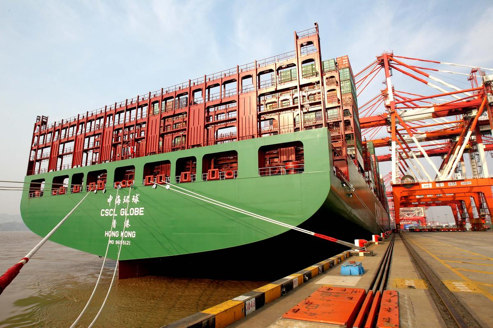
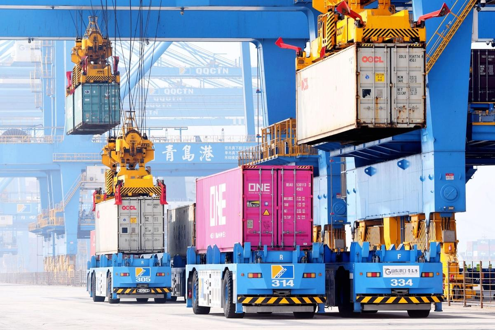

# 岸边业务

港口码头岸边业务作为现代物流体系的核心枢纽，是连接船舶与陆路运输的关键节点，其运作效率直接决定了整个港口的通航能力与服务水平。在这一区域，从巨型船舶的平稳靠离，到集装箱的高效装卸，每一个环节都依赖于精密协同的设备、工具与人员，共同保障作业流程的安全、高效与连续。岸边业务不仅包括技术密集的船舶靠离泊服务、自动化程度日益提升的装卸作业，也涵盖规范严格的船舶安全检查与现场监管理货等配套流程。

## 船舶靠离泊服务

从船舶抵港到离泊的完整生命周期，包含16个关键节点和4类核心服务。每个环节都有明确的时间窗口和操作标准。

### 船舶靠泊标准流程

#### 阶段一：抵港准备（ETA前24-48小时）

* **ETA预报**：船舶向港口提交预计到达时间。
* **泊位分配**：港口调度根据船期表生成昼夜作业计划。
* **拖轮预派**：按船舶吨位计算所需拖轮数量（DWT×0.08KW经验公式）。

#### 阶段二：进港操纵（距泊位2海里内）

|距离泊位|	标准余速|	操作要点|
|---|---|---|
|2海里	|4节	|拖轮到位待命|
|1海里	|2节	|调整船身与泊位平行|
|1船长	|<1节	|拖轮顶推控制靠拢速度<5cm/s|

### 系泊作业关键节点

#### 标准系泊配置

* 超大型船舶（VLCC）典型配置20根缆绳

* 首缆顺序：
  1. 倒缆
  2. 横缆 
  3. 首缆 
  4. 尾缆

* 系缆安全检查：
    SWL负荷验证 + 角度测量

### 离泊作业标准程序

* **解缆准备**：确认所有货物作业完成，获得离泊许可
* **拖轮配置**：通常3艘拖轮（艏1艉2），风大流急时增至5艘
* **离泊操纵**：选择开流时段，拖轮45°顶推缓慢外移

### 移泊服务

船舶移泊，是指在获得港口主管机关批准后，将已靠泊的船舶从一个泊位移动至另一个泊位，或在原泊位内移动超过规定距离的作业。这一过程是港口生产调度和安全管理的关键环节，旨在优化泊位利用、完成装卸作业或应对突发情况。

#### 移泊作业关键步骤

* **作业申请与计划制定**
船方或代理提交申请，港口生产调度制定详细移泊计划。
  1. 申请与批准
  船舶所有人或其代理需向港口主管机关（如海事管理机构、引航机构）提交移泊申请，说明移泊原因、计划时间、路线及船舶信息。主管机关审核后批准，必要时发布航行通告。 
  2. 制定移泊计划
  港口经营人（码头公司）的生产调度部门根据作业需求、泊位状态和船期表，制定详细的移泊计划，包括目标泊位、拖轮配备方案、引航员安排及具体操作时间。 

* **引航与拖轮准备**
申请引航，调度拖轮到位，确保安全操作。
  1. 引航申请与执行
      外国籍船舶、核动力船舶、载运放射性物质船舶及10万总吨以上的油轮等，在港内移泊时必须申请引航服务。引航员将负责整个移泊过程的航行安全和操作指挥。 
  2. 拖轮调度与配备
   拖轮公司根据申请和计划，调度足够数量和功率的拖轮。拖轮配备需遵循《港口收费计费办法》中的标准，并在法定节假日或夜间（20:00-次日6:00）作业时，加收45%-90%的附加费。 

* **系解缆与拖带操作**
  1. **解缆**： 在引航员或船长的指令下，码头系解缆工开始解缆作业。通常先解首缆，再解尾缆，最后解开其他缆绳，确保船舶能平稳离开原泊位。 
  2. **拖带**： 拖轮与船舶连接后，开始拖带作业。引航员通过通讯设备与拖轮和船长保持密切沟通，实时调整拖轮的推力和角度，控制船舶的移动方向和速度。 
  3. **潮汐利用**： 操作通常会选择在有利的潮汐时段进行，以充分利用自然水流的力量，减少能耗并提高安全性。 

* **新泊位靠泊与系泊**
    船舶抵达新泊位，完成系泊，作业正式结束。
#### 移泊的常见原因
船舶需要移泊的原因多种多样，主要包括：

* **装卸作业需求**： 例如，半集装箱船在普通码头完成杂货装卸后，需移至集装箱专用码头继续作业。
* **船期与泊位协调**： 当出口货物未准备好，或原泊位已有其他安排时，船舶可能需要移至锚地或浮筒等待。
* **优化泊位利用**： 港口通过移泊来调整船舶位置，提高泊位周转率和整体作业效率。

## 装卸船服务

集装箱码头装卸船作业主要涉及核心设备和角色分工：

|设备/角色|	职责|	效率指标|
|---|---|---|
|集装箱起重机（岸桥）|	船←→岸垂直装卸|	30-40箱/小时|
|拖车/AGV|	岸←→堆场水平运输	|北斗定位±5mm|
|理货员	|核对箱号、指挥顺序|	实时数据录入|

集装箱码头装卸船服务主要作业准备、装卸作业、作业结束三大阶段：

### 作业准备

这是确保作业安全高效进行的基础，主要涵盖**信息确认**、**计划制定**和**设备检查**。

* **信息确认与计划制定**
在船舶抵港前，港口需与船方、代理及口岸单位紧密沟通，获取并确认船舶详细信息、货物清单、预计到港时间（ETA）等。调度计划员据此编制详细的靠泊、装卸及离泊计划，并发布作业信息。 
* **设备检查与试运转**
值班经理需组织对参与作业的设备（如岸桥、堆料机）进行检查和试运转，确保其处于良好状态。同时，需检查泊位设施（护舷板、系缆桩）及码头面作业秩序。 
* **船舶靠泊与联检**
船舶抵港后，由专业人员进行带缆作业。靠泊完成后，需进行海关、边检等联合检查。外贸船舶的联检时间需严格控制，通常在开始登轮检查后的**2小时内**完成。 

### 装卸作业

集装箱码头装卸船作业主要包括卸船作业和装船作业两大流程。

* **卸船作业流程**：
1. **作业准备**：船舶靠泊后，码头操作人员根据船图制定卸船计划，安排岸边集装箱起重机（岸桥）就位
2. **卸船操作**：岸桥将集装箱从船上吊起，放置在码头前沿的集卡上，由集卡运往堆场指定位置
3. **箱体验收**：船边交接员核对箱号、检查箱体状况和铅封完整性，发现异常及时记录
4. **结束工作**：完成卸船后，与船方办理交接手续，编制卸船小结
* **装船作业流程**：
1. **装船准备**：根据船公司提供的装货清单，制作船舶预配图，得到船方确认
2. **集港作业**：集卡将出口重箱从堆场运至码头前沿，船边交接员核对箱号
3. **装船操作**：岸桥将集装箱吊装至船上指定位置，按配载图顺序装船
4. **系固作业**：装船后使用扭锁、桥锁等系固设备固定集装箱

### 作业结束

作业结束后，需要进行一系列收尾工作，为下一次作业做好准备。

* **船舶末尺与交接**
清舱作业接近尾声时，需进行末尺计量，确认最终货物数量。之后，由交接员与船方或代理进行货物单证的交接。 
* **设备清理与场地恢复**
作业结束后，需对卸船机、堆料机等设备进行清理和维护。同时，清理码头面的积煤、杂物，关闭电源，确保作业现场整洁有序。 
* **船舶离泊准备**
提前1小时通知相关设备移至安全位置。外委承包商安排解缆工到位，召开离泊工前会，布置任务和安全注意事项，为船舶离泊做好准备。 

## 创新模式-直装直卸

直装直提模式将传统"先堆存后作业"颠覆为"车船直连"的零等待模式，进口提箱时间从1-2天压缩至1.5小时 ，出口集港周期从5天缩短至2天内。

### 船边直提（进口）

以提前申报为基础，船舶抵港后无需查验的货物可直接从船边装车提离，免除码头堆存环节。

船边直提核心要点：

* **提前申报**：船舶抵港前通过"单一窗口"办结报关及税费手续
* **预约提箱**：码头平台缴费预约，生成直提预约号
* **进度追踪**：微信推送卸船进度，精准调度车辆
* **船边作业**：车辆按调度引导实施船边装箱
* **闸口放行**：校验海关放行信息后离港

### 抵港直装（出口）

突破"截关前5天集港"限制，实现"工厂装箱→船舶直装"的零堆存模式。

抵港直装核心要点：
* **双申请**：同步向码头和船公司发起直装申请
* **延期还柜**：申请船舶截关前2-3小时还柜
* **提前申报**：货物到闸前完成报关
* **计划制定**：码头根据舱单纳入配载计划
* **运抵触发**：闸口发送运抵报告触发海关指令
* **直装离港**：放行货物直接吊装至船舶
