# 业务梳理及总结

在了解码头的基础知识以后，本节将采用由整体到局部的分析方法，逐步深入地拆解码头基础业务。本节将按照多港区业务、单港区业务、单船期业务以及岗位业务与联系的逻辑顺序，逐层展开对码头业务的详细阐述。通过这种系统性的分析，将能够清晰地理解码头业务的全貌，从宏观的多港区管理到微观的岗位协作，全面把握集装箱码头的运营细节。

## 多港区业务

港口业务主要包括进口、出口、中转等三大流程，而三大流程可以根据用户群体的不同需求进行细分，主要涉及海关、船代货代、外拖公司、船控中心以及码头运营等关键参与者，整体关系如图：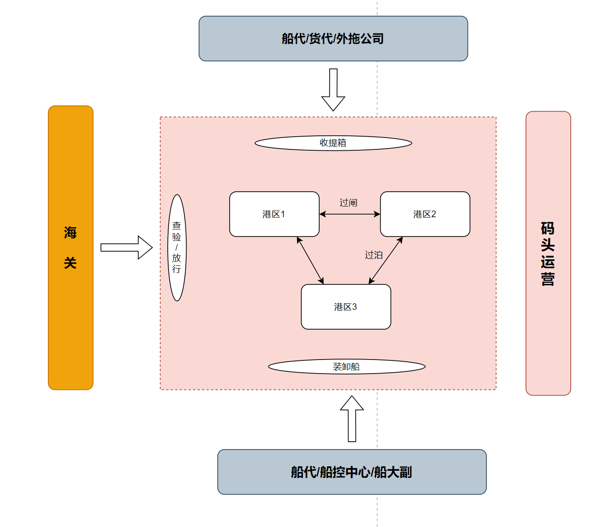

关键参与者各自的职责如下：

1. **船代**、**货代**、**外拖公司**
   * 针对于船代而言，其核心在于为船舶在港期间的全周期事务提供协调与代理服务。
   * 针对于货代而言，其核心是为货主提供贯穿货物运输全流程的代理和解决方案服务。
   * 针对于外拖公司而言，其核心在于通过陆路运输，将集装箱在港口、堆场、工厂和客户之间进行物理搬运。
站在港口为主体的角度，这三方参与者主要为港口收提箱业务提供服务，包括一系列的预录入、办单、预约、提箱、清关、结算等环节。

2. **海关**则承担着监管职责，保障国门安全、维护贸易秩序、促进合法贸易便利化；主要负责对进出口货物进行查验，并在符合规定后予以放
行，保障国家安全和税收利益。站在港口为主体的角度，海关主要负责对进出口货物的查验和放行，保障货物的安全和合法性。

3. **船大副**、**船控中心**、**船代**则专注于船舶的装卸作业，协调货物的上船和下船流程，确保船舶的高效运转。

4. **码头运营**则涉及整个码头的日常管理和服务，包括货物存储、安全监控以及与各参与方的协调沟通。通过明确各方职责，可以优化
流程，提高效率，确保码头业务的顺畅运行。

以上，我们通过从多港区的视角进行用例梳理，旨在识别参与者、描述交互，并明确系统边界，进而实现功能拆解和子系统划分。这一方法有助于全面理解系统的整体架构。具体操作如下：
1. **识别参与者**：用例图中的参与者（Actor）代表与系统交互的用户或其他系统。这一过程有助于识别系统的所有用户角色和外部系统。以码头操作系统（TOS）为例，宏观的参与者包括海关、船代货代外拖公司、船控中心以及码头运营部门。
2. **描述交互**：用例图通过参与者和用例之间的关联，详细描述了用户与系统之间的交互，从而帮助理解用户如何使用系统。以TOS为例，主要交互能力包括收提箱、查验放行、装卸船等操作。完成多港区用例的清晰划分后，系统将进一步进行功能拆分和业务聚焦，为后续的业务流程分析奠定基础。

## 单港区业务

在宏观的认知了多港区的业务以后，我们专注于单一港区的业务流程，系统可以将港区划分为四个核心部分：闸口、堆场、岸边以及作业控制和设备控制。这样的划分有助于提高港区的运营效率和安全性。整体业务视图: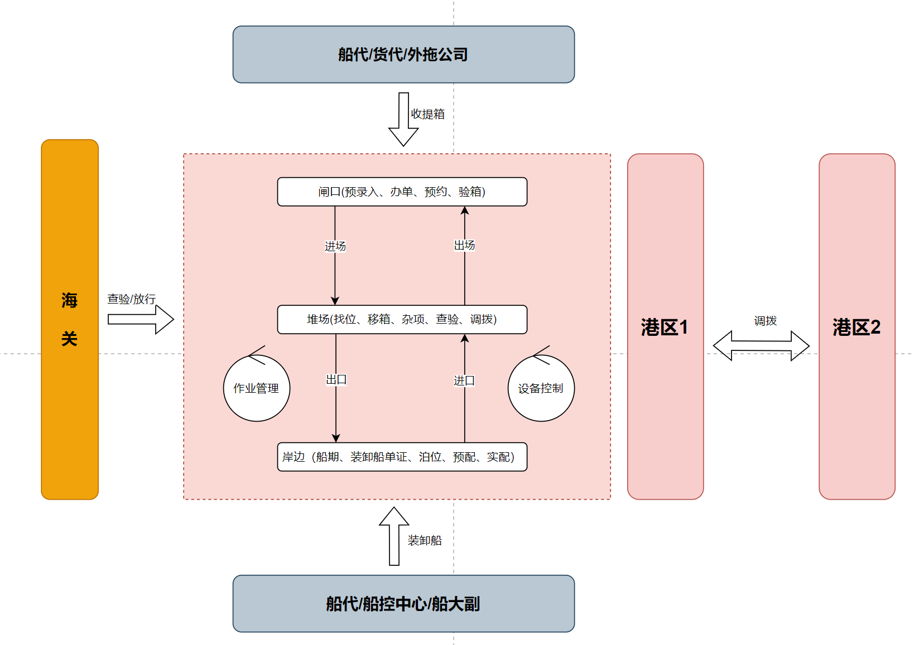

闸口作为集装箱进出港区的关键节点，其业务流程包括预录入、办单、预约、验箱、铅封管理、反偷渡、收箱控制、退提以及出闸管理等。这些业务流程的设计和执行，旨在确保集装箱流动的顺畅和合规性，从而维护港区的正常运作，如盐田港的自动闸口。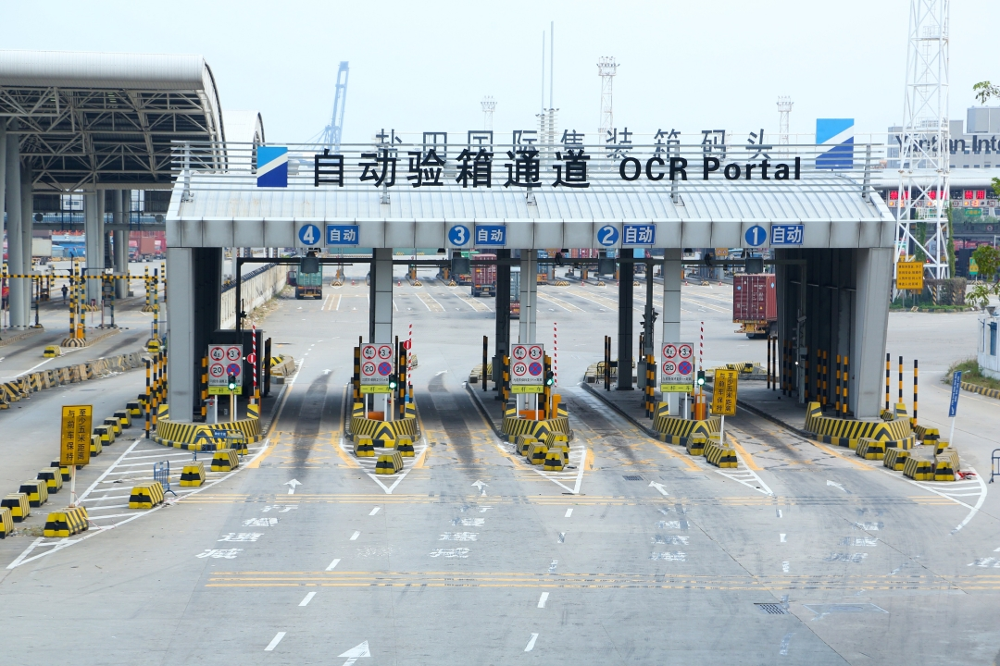

堆场则关注集装箱在港区内的存储和移动。它包括不定箱号提空箱、找位、场内移箱、杂项、查验、调拨等业务。这些流程的优化，旨在确保集装箱堆存的合理性，同时提升整体作业的效率和生产力，如广州港码头堆场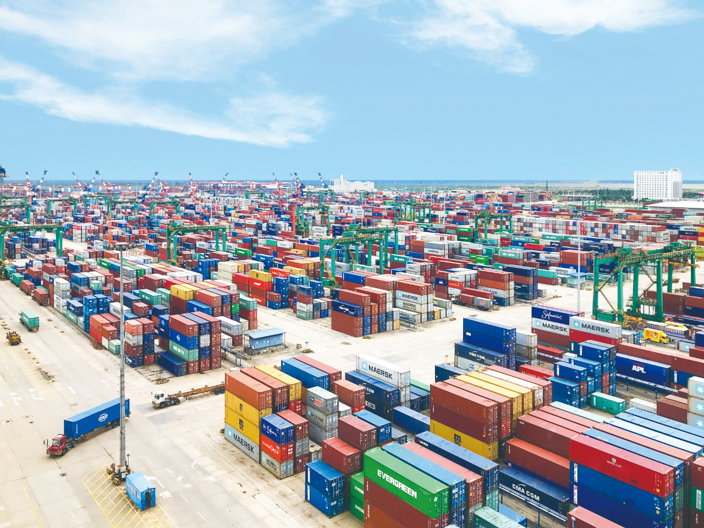

岸边存在栏桩、岸线、泊位等基础设施涉及船期管理、泊位计划、装卸计划等关键流程。这些流程的管理对于确保船舶靠泊的合理性和安全性至关重要，它们直接影响到港区的运营效率和船舶的安全，如大连港岸边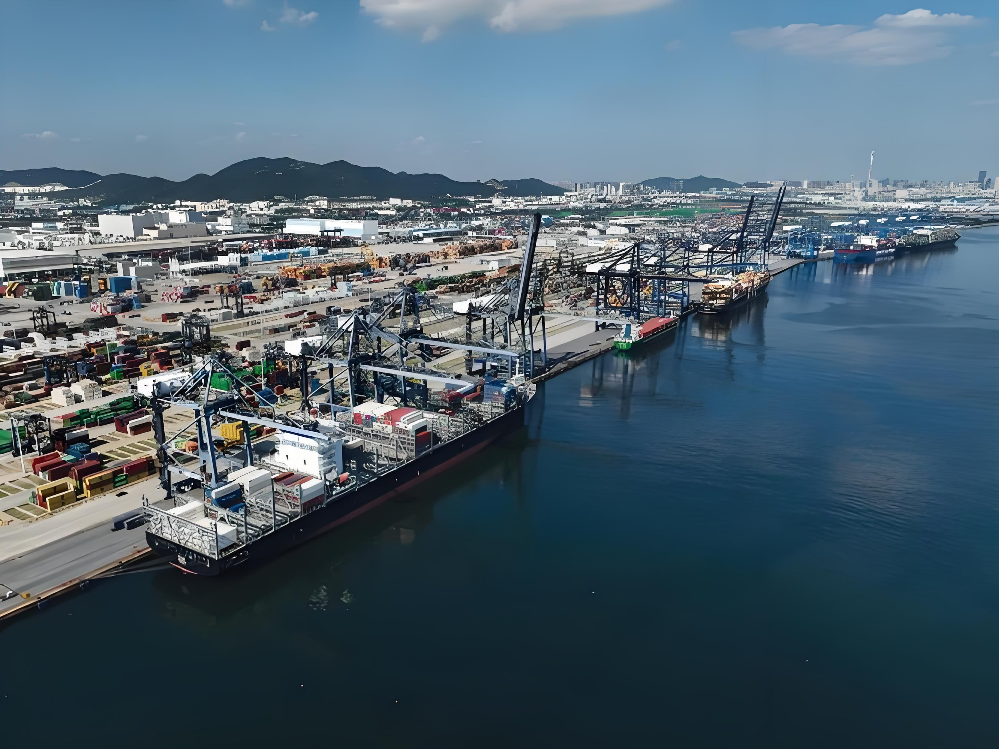

而作业控制和设备控制是确保业务实施可靠性和装卸合理性的关键环节。它们涉及到对作业流程的监控和对装卸设备的管理，确保作业的高效执行和设备的稳定运行，如图：
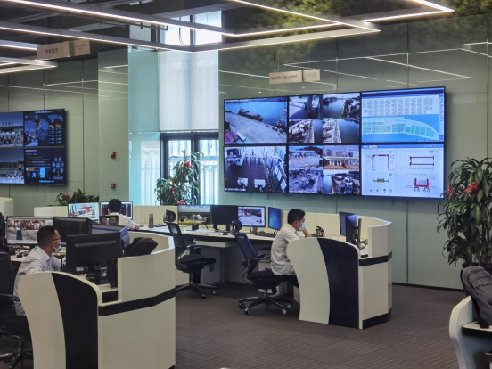

通过对这四个部分的业务流程进行精细化管理和持续优化，可以大幅提升港区的运营效率，降低成本，增强竞争力。同时，这也有助于提高港区对突发事件的响应能力，确保在面对挑战时能够迅速调整和适应。总的来说，这种以单港区为焦点的业务优化策略，能够为港区带来更加稳定和高效的运营环境。

## 单船期业务

在单港区业务拆解以后我们对集装箱码头每个区域会进行哪些业务操作有了一个大体的认识，接下来为了能够更加深入了解业务并串联业务操作，我们将分析一个完整船期的作业流程，集装箱码头某一水船的作业流程如下：
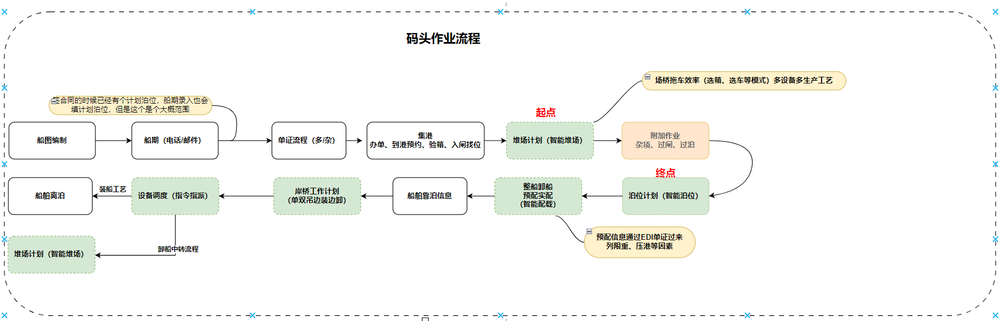

1. 作业流程的起点是船图编制，这涉及到在系统中维护航线船舶的船结构信息，船舶计划员需要在将班轮的结构录入到系统中，这里船公司会提供船结构示意图，包括贝图等。
2. 基于已维护的船结构信息，系统建立一条新船的记录，为后续操作打下基础。
3. 根据这条船的情况，船公司通过edi或者邮件通知港口未来一段时间船期信息，继而单证作业人员会在系统制定并维护船期，确保船期与航线周期相匹配。
4. 船期维护完成后，系统进入单证操作阶段，为集港操作做准备，针对于装船箱船公司代理会给码头发送舱单，舱单中会有booking no，并且注明哪些箱号，后续由外拖通过设备交接单进行单车次的箱子入港。针对于卸船箱，船公司会在上一港结束后发送Biplie报文告诉码头有哪些箱子要卸船。
5. 在集港操作中，外拖拿设备交接单，通过走办单、预约、验箱、进闸等流程后到达码头堆场，到达码头堆场后，系统将执行堆场计划收箱，确保集装箱按时到达堆场。
6. 集装箱到达后，根据需要可能针对集装箱进行附加作业，如查验、以及码头调拨等。
7. 随着船只即将到来，泊位计划员在系统中开始制定泊位靠泊计划，优先考虑航线规划中的商业泊位，以确保靠泊的合理性和安全性。
8. 在靠泊前，船舶计划员将在系统中制定详细的装卸船计划，并在靠泊前后维护靠泊信息，确保所有数据实时更新。
9. 最后，作业控制负责实施杆序确认和设备规划，实现指令调度，完成作业。在此过程中，还涉及到智能堆场为卸船和中转流程进行堆场找位，确保集装箱的合理存放和流转。
通过这一连贯的流程，系统可以确保单水船期的作业既高效又有序，每个环节都为下一个环节的顺利进行提供支持，从而实现整个作业流程的顺畅和高效。
其中班轮结构如图
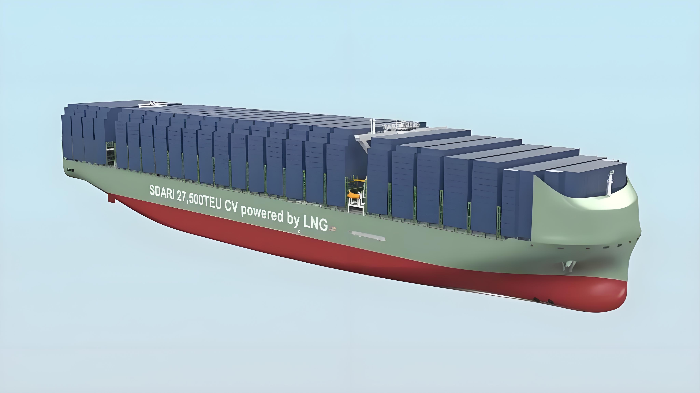
船贝图如图
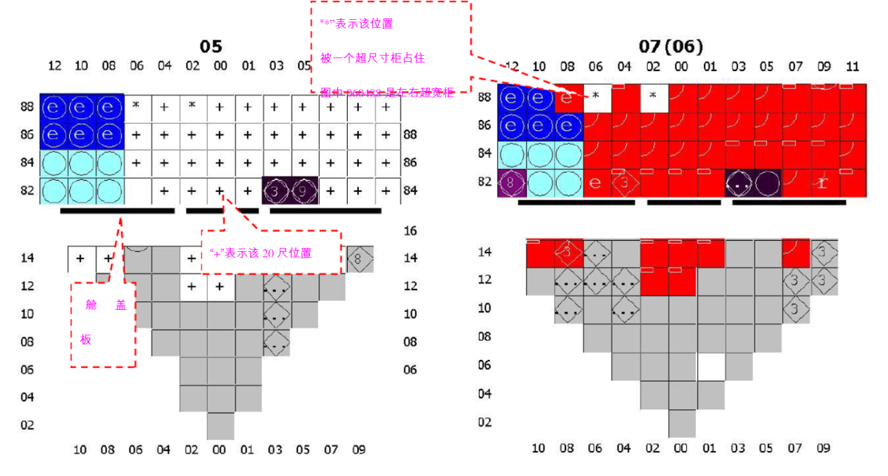
舱单如图
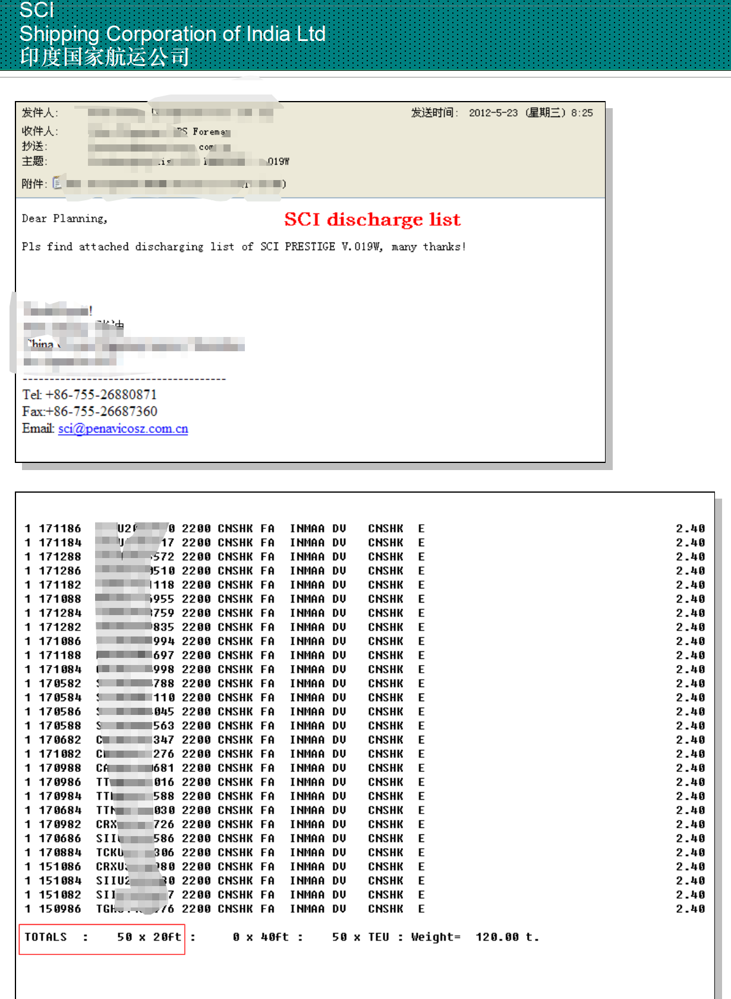
设备交接单
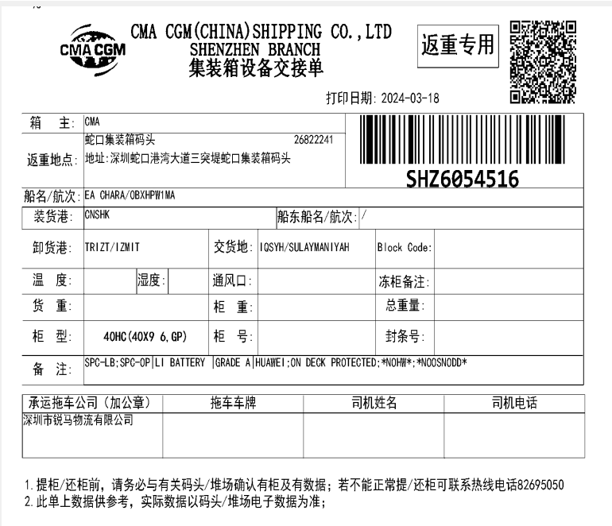
海关查验现场
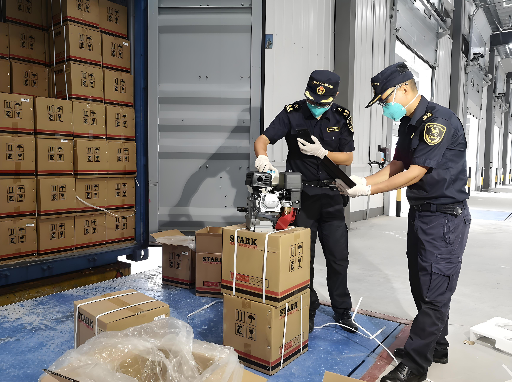

## 岗位业务与联系

在码头集装箱（班轮）流程中，除去单证、驳船、现场等岗位外核心操作岗位包括堆场计划、泊位计划、船舶计划和作业控制等。这些岗位共同构成了业务流程的核心，每个岗位都承担着特定的职责和作业内容。以下是对这些岗位及其相互联系的梳理，以及对自动化过程中可能遇到的困难和解决方案的概述。通过对这些岗位的职责和作业内容进行梳理，系统可以明确它们之间的协作关系，构建起整体业务流程的框架。通过对码头集装箱班轮流程中各操作岗位的职责和作业内容进行细致梳理，并针对自动化过程中的困难点提出解决方案，系统可以优化整个业务流程，提高码头作业的自动化水平和整体效率。

### 堆场计划

堆场计划岗位在码头集装箱班轮流程中扮演着至关重要的角色，它通过精细的规划和管理来确保作业流程的顺畅和效率。其核心职能在于综合考虑码头的多种因素，包括空间和时间的最优分配，以实现堆场空间利用的最大化。其核心工作内容可以划分为五个主要部分，每部分都对确保码头运营的高效性和流畅性至关重要。

* **航线规划**
首先堆场计划岗位与泊位计划岗位紧密合作，共同进行航线规划。这一合作的首要目的是制定一个既满足客户需求又能最小化调拨箱量的航线规划方案。通过这种合作，可以确保航线规划不仅符合市场和客户的具体需求，还能在运营层面实现资源的最优配置，从而提高整体的客户满意度。航线规划是码头箱量分布以及航线分布的第一个关键步骤，它为后续的码头运营和管理奠定了基础。通过精心设计的航线规划，可以有效减少不必要的箱体移动，降低运营成本，同时提升码头的作业效率和竞争力。这一过程不仅涉及对现有航线的优化，还包括对新航线的开发和评估，以适应不断变化的市场环境和客户需求。通过持续的航线规划和调整，码头能够更好地应对各种挑战，确保长期的可持续发展。

* **堆场预测**
其次，堆场预测是堆场计划岗位的一项核心任务。船期的延误或提前会导致堆场堆存量的波动，可能使堆场超出其堆存上限。因此，准确预测未来的堆场堆存量对于堆场计划员至关重要。这一工作不仅确保堆场运营的稳定性，还能保障集装箱流转的顺畅，从而有效避免拥堵并提高堆场利用率。

* **收箱规划**
第三，收箱规划是堆场计划岗位的核心工作之一，主要包括出口箱和卸船中转箱的定位，以及卸船进口箱的定位。这一规划步骤对后续的装卸船效率和设备调度至关重要，确保集装箱能够及时准确地存放至指定位置，从而直接影响装卸船作业的顺利进行。

* **堆场整理**
接下来，堆场整理是堆场计划岗位的第四项工作内容。其核心目标是提高装船作业的效率，通过合理规划堆场空间，确保装船作业能够快速、有序地进行。

* **不定箱号提空箱**
最后，不定箱号提空箱是堆场计划岗位的第五项任务。这项工作涉及到在没有具体箱号的情况下提取空箱，对于维持堆场的空箱流转和满足客户提箱需求具有重要作用，核心考虑因素有作业冲突以及堆存时长。

通过对堆场计划岗位的这五项核心工作内容的清晰划分和逻辑梳理，可以更有效地管理和优化码头的集装箱堆存和流转，从而提升整个码头作业的效率和服务质量，整体如图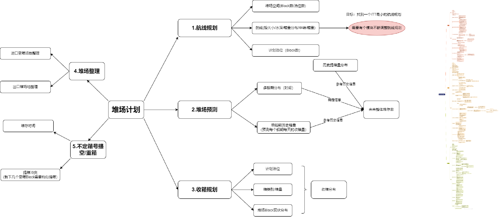

### 泊位计划

泊位作为集装箱码头的核心作业资源，其规划的合理性直接关系到码头作业的效率和船舶在港时间的长短。优化泊位计划对于增强码头的吞吐能力和提升服务水平具有决定性影响。在日常运营中，与海事局、引航站等口岸单位，以及拖轮公司、船舶代理和船公司保持密切沟通至关重要。这样的沟通协作确保了船舶通航的安全，并有效协调了船舶在港的各项事宜，从而保障了码头作业的顺畅进行和服务质量的持续提升。

* **作业核心**

泊位计划工作的核心在于综合考量多个关键因素，以制定出既高效又满足多方需求的泊位安排。这包括根据客户的商务重要性、航道水深等客观条件，以及现场可用资源的实际情况。目标是实现资源的最优分配，确保装卸作业的均衡性，并满足客户对于船舶靠泊和离泊的具体要求。通过这样的综合排泊策略，旨在提升码头作业的整体效率和服务质量。

整体作业流程如下图：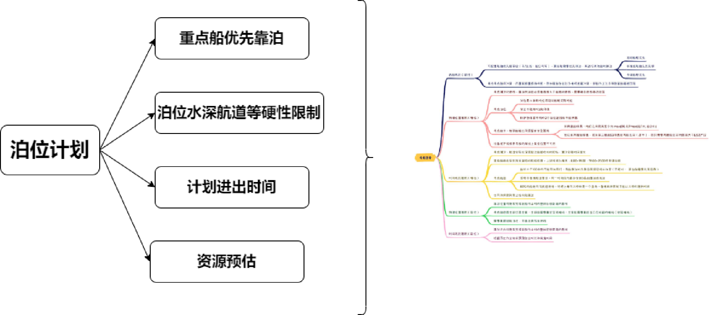

### 船舶计划

船舶计划岗位在码头作业中扮演着核心角色，负责根据船公司的装卸需求和码头生产系统，制定出既安全又合理的装卸箱作业指令。这一岗位的工作重点在于与船东预配中心和船方紧密合作，共同确保卸船和装船计划的精确制定与确认，以保障货物的合理积载和船舶的安全适航。同时，船舶计划岗位还需确定装卸作业的顺序，为船舶控制和作业岗位提供必要的作业指令和单证，确保装卸作业信息的准确性。此外，该岗位还需及时应对作业过程中的异常情况，以确保作业的顺畅进行和船舶的按时离泊。在作业内容上，船舶计划岗位还需负责QC杆序的制定和配载工作，其中配载时需考虑解决堆场冲突、满足船方配载要求以及适应QC作业习惯等关键因素。
整体如图:
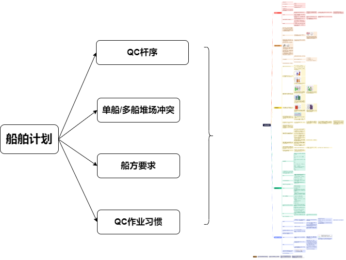

### 作业控制

作业控制，通常称为中控，是码头作业的核心，扮演着神经中枢的角色。它负责将计划部门（包括SPL、BPL、YPL、BA）下达的每一条船和每个集装箱的移动指令，通过生产系统和对讲机传达给现场作业机械。同时，中控利用码头生产系统、CCTV监控、GPS定位和VRPS（车辆调度系统）等辅助工具，监控每个作业指令的执行情况，实时获取每个作业单元（POW）的效率数据。

作为成本控制的中心，中控通过合理分配和调度码头内的人力和机械资源，实现资源配置的最优化和效益的最大化。这不仅提高了作业效率，还确保了为客户提供高效、便捷的集装箱装卸服务。通过这种精细化管理，中控确保了码头运营的流畅性和成本效益，增强了码头的竞争力。作业控制包括作业规划和作业实施两个主要环节。在作业规划阶段，工作重点在于根据作业量灵活调整作业顺序（杆序），并合理规划堆场设备的使用，以优化作业流程和提高效率。而在作业实施阶段，控制工作则更加细致和动态，涉及到以下几个方面：
1. 拖车数量控制：确保作业速度快的岸桥有足够的拖车资源，而作业速度慢的岸桥则相应减少拖车数量，以保持作业的平衡。
2. 智能挑箱：通过智能挑箱系统，确保船上的货物能够适宜装载，同时堆场中的集装箱能够及时发出，提高装卸效率。
3. 拖车指令匹配：通过精确的拖车指令匹配，保证拖车效能最大化，同时确保岸桥作业的连续性，减少等待时间。
4. 拖车控制：通过有效的拖车控制措施，减少拖车行驶过程中的拥堵，确保码头交通流畅，提高整体作业效率。

通过这两个阶段的紧密协作和精细管理，作业控制能够确保码头作业的高效执行，同时减少资源浪费和时间延误，作业控制关系图如图：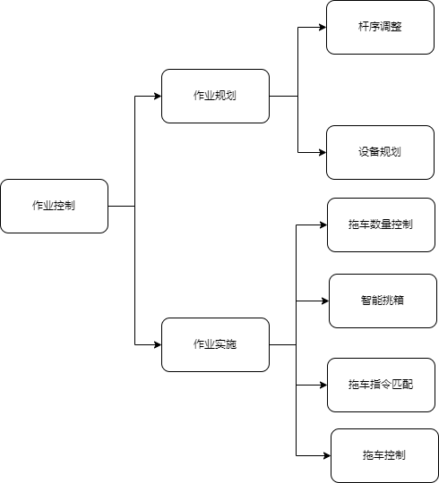。

### 岗位整体架构

经过之前的分析，相信大家对于集装箱码头主要几个核心岗位的日常作业内容以及相关逻辑已经有了一个初步的认识。核心关系图如图：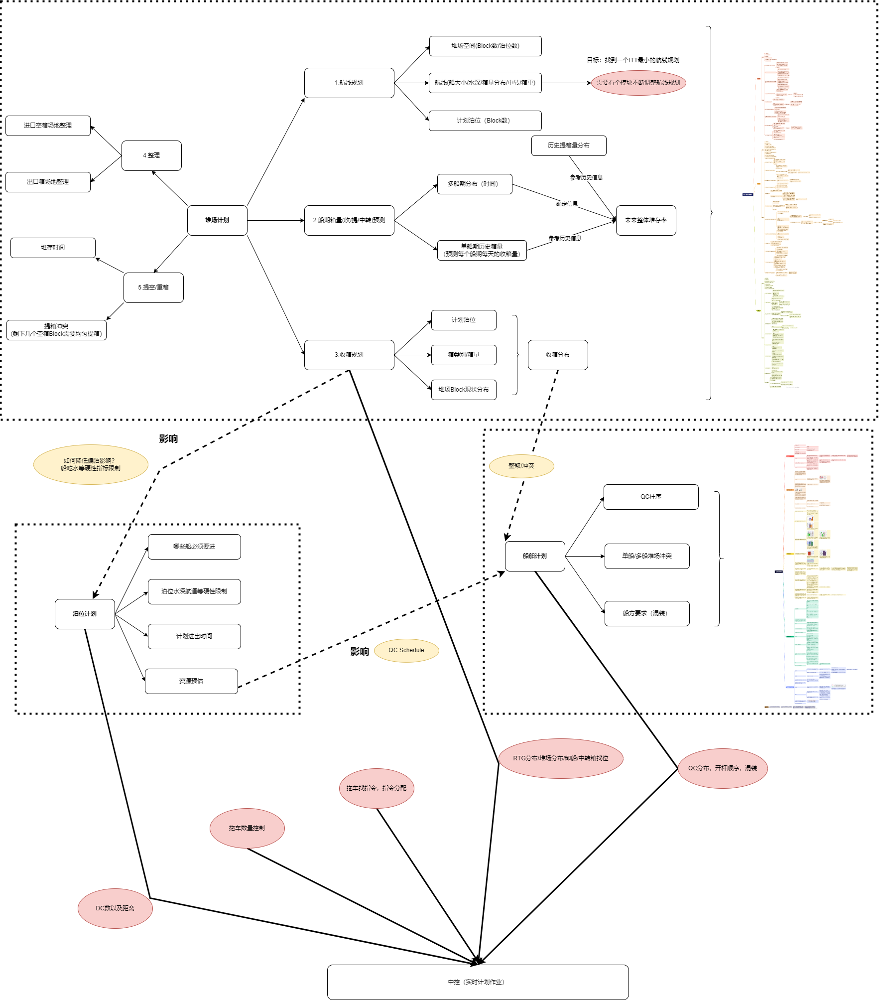

## 设备与业务的联系

在讲述了岗位的角度的业务梳理以后，我们将从设备的角度来梳理码头业务。设备的角度可以帮助我们更全面地理解码头业务，从而更好地优化和改进系统。下来我们从设备资源分配、单箱装船流程、单箱卸船流程、DualCycle几个角度来梳理设备与业务的联系。

### 设备资源分配

在港口集装箱装船作业中，设备协同调度是一个动态优化的核心流程。该流程始于泊位计划确认，并依次展开以下关键环节：

* **岸桥预分配与动态调整**：计划岗位首先会基于船舶尺度和预装箱量，为船期预先分配岸桥数量。待船舶实际靠泊后，中央控制室将根据现场的实时状况（如船舶实际船时效率、天气、优先级等），对投入作业的岸桥数量及其在各船贝（舱位）间的作业顺序进行动态调整与优化，以确保整体作业效率最大化。
* **堆场场桥联动响应**：中央控制室随后会根据确认的装船箱量、箱位分布以及最终的船贝作业序列，向堆场侧下达精确的作业指令。这包括为特定装船任务分配场桥的数量与具体位置，确保堆场内的集装箱能够按照装船顺序被及时提取并运出。
* **水平运输资源精准匹配**：最终，系统以每台岸桥为独立的“工作点”，根据其作业节奏和堆场距离，为其动态分配与调度内拖车（集卡）的数量，形成一条从堆场到船边无缝衔接、持续流动的作业线，从而保障岸桥能够连续高效地进行装船作业。

流程图如：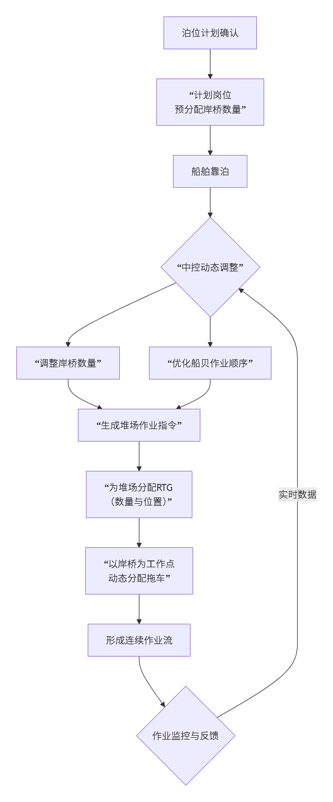

### 单箱装船流程

港口单箱装船流程的设备协同是一个高度智能化的闭环系统，通过中控系统、RTG（轮胎门式起重机）、拖车和岸桥的精准配合，实现从堆场到船舶的无缝衔接。作业流程如下：

1. **中控指令激活**
船舶靠泊后，中控系统根据配载船图激活装船指令。系统通过TOS（码头操作系统）将作业任务分解为具体的设备指令，包括堆场取箱位置、拖车调度、岸桥作业序列等关键参数。中控采用"刚性约束校验+柔性惩罚优化"的双层架构，在满足船舶稳性、箱位配载等刚性约束的同时，选择指令进行激活。

2. **拖车路径规划与执行**
拖车接收到作业指令后，系统基于高精地图进行全局路径规划。对于无人驾驶拖车，系统采用改进的A*算法或Dijkstra算法，结合实时交通信息、设备状态和作业优先级，生成最优行驶路径。拖车通过激光雷达、毫米波雷达等传感器实时感知环境，实现厘米级定位精度（误差≤2厘米），确保安全行驶至目标堆场。

3. **RTG堆场取箱**
拖车到达堆场后，RTG通过集卡的作业号识别目标集装箱。RTG配备AI视觉识别系统，可自动识别箱号、箱损、铅封状态等信息，识别准确率达99.5%。吊具通过激光扫描和视觉定位，实现±15mm的精准对位，将集装箱吊装至拖车。RTG与拖车之间通过无线通信实现协同作业，避免碰撞风险。

4. **拖车运输至岸边**
拖车将集装箱运输至码头前沿，系统通过车路协同技术实时监控车辆位置和速度。在交叉路口等关键节点，系统采用"避免交叉路口碰撞"的动态引导算法，基于车辆当前车速、位置与交叉路口中心点的距离，分析碰撞隐患并提前下发减速或停车指令，确保安全通行。

5. **岸桥装船作业**
拖车到达岸桥作业区域后，岸桥通过AI视觉系统识别集装箱信息，并与船图进行自动核对。岸桥司机或远程操控系统根据船图显示的装船位置，通过高频指挥精准吊装。装船过程中，系统实时监测船舶稳性、吃水差等参数，确保作业安全。装船完成后，理货员通过手持终端确认箱号，系统自动更新作业状态。

流程图如: 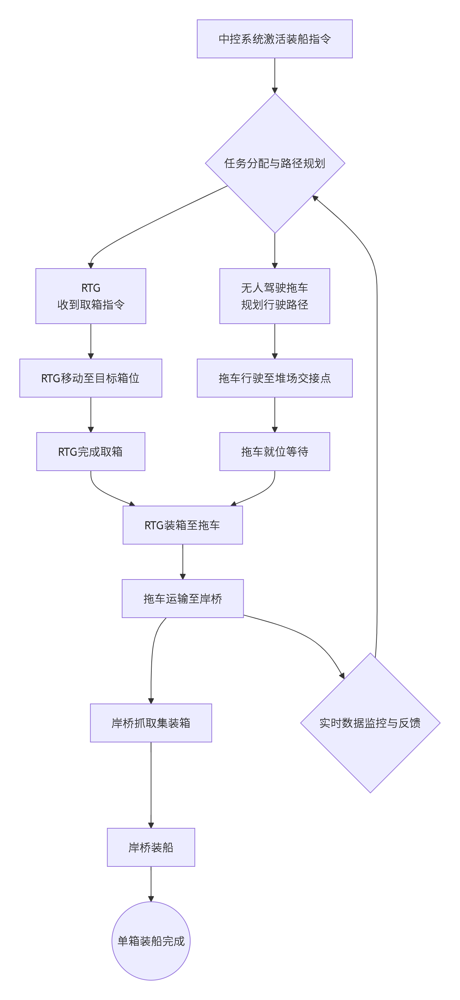

### 单箱卸船流程

集装箱单箱卸船流程的设备协同是港口集装箱作业的核心环节，通过中控系统、RTG（轮胎门式起重机）、拖车和岸桥的精准配合，实现从船舶到堆场的无缝衔接。作业流程如下：

1. **指令发出与场位规划**：船舶靠泊后，码头的“智慧大脑”——中控系统（通常是TOS码头操作系统和ECS设备控制系统的结合）会根据预配的船图等信息，激活卸船指令。几乎同时，堆场计划系统会为即将卸下的这个集装箱计算并分配一个在堆场中的最佳位置（场位）。这个决策过程会考虑集装箱的尺寸、类型、目的地、预留的提箱时间等多种因素，目标是减少后续作业中的翻箱次数，并提升堆场空间利用率。

2. **拖车路径规划及运输**： 拖车接收到作业指令后,移动至岸边位置等待吊箱，而对于无人驾驶拖车,系统采用改进的A*算法或Dijkstra算法,结合实时交通信息、设备状态和作业优先级,生成最优行驶路径。拖车通过激光雷达、毫米波雷达等传感器实时感知环境,确保安全行驶至目标堆场。

3. **岸边装卸与水平运输**：岸桥（岸边集装箱起重机）收到中控系统发送的具体指令后，操作员或自动化系统会控制吊具，从船上指定的贝位抓取集装箱，然后平稳地放置到已在岸边等待的内集卡（拖车）​ 上。

4. **堆场进场与精准落位**：载着集装箱的内集卡根据系统指令，行驶至堆场的指定目标贝位。在那里，RTG（轮胎式龙门吊）​ 早已就位。它从内集卡上吊起集装箱，并最终精准地放入事先规划好的堆场箱位中，完成单箱卸船的最后一步。

流程图如：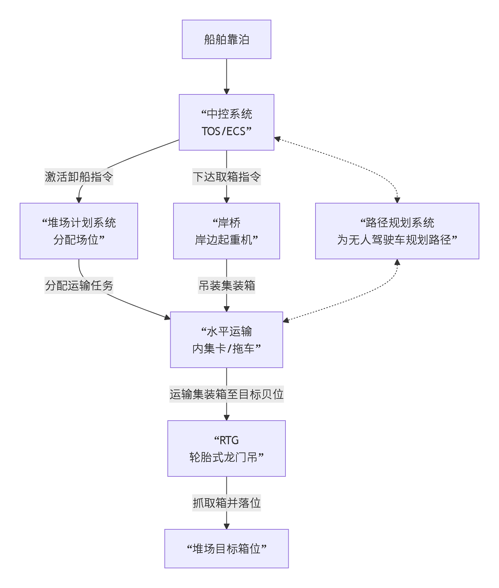

### DualCycle
站在整体的角度，如果岸边和堆场形成闭环的作业流程，单循环完成装船+卸船的双重任务，即如果拖车在岸边装船以后在原地或者沿着岸边位置装载卸船箱，那么就形成了一个岸边的DualCycle，即岸边双循环，在岸边降低了拖车的移动距离，空载率低；同时卸船箱放置到顺车道的装船箱的后方堆场，那么就形成了堆场的DualCycle，在堆场降低了拖车的移动距离，空载率低。

流程图:

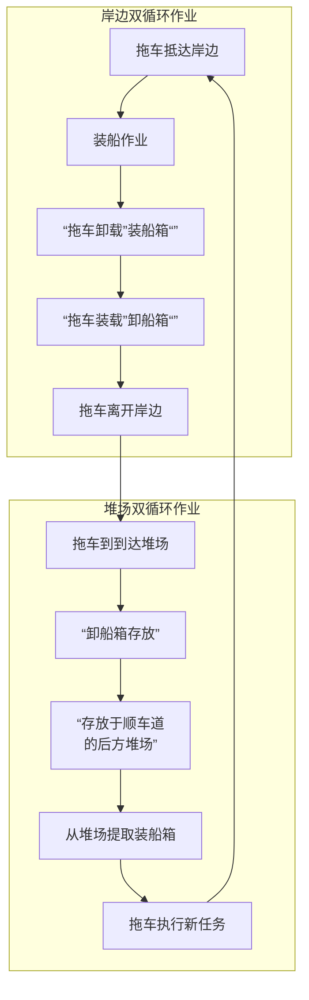
```mermaid
flowchart TD
   subgraph 岸边双循环作业
      A[拖车抵达岸边] --> C[装船作业]
      C --> E[“拖车卸载”装船箱“”]
      E --> F[“拖车装载”卸船箱“”]
      F --> G[拖车离开岸边]
   end
   subgraph 堆场双循环作业
      G[拖车离开岸边] --> Z[拖车到到达堆场]
      Z --> I[“卸船箱存放”]
      I --> K[“存放于顺车道<br>的后方堆场”]
      K --> L[从堆场提取装船箱]
      L --> M[拖车执行新任务]
      M --> A
   end
```
