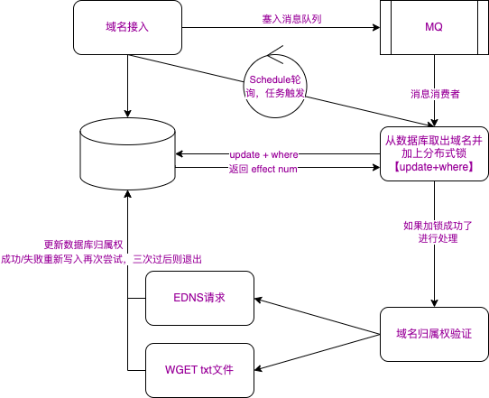

# 域名所有权认证

## 认证方式

### ​DNS记录验证​

* ​CNAME记录​
​原理​：将指定子域名（如 verify.example.com）解析到服务商提供的专用域名（如 zz.baidu.com），证明用户拥有该域名的DNS管理权。
​适用场景​：百度站长平台验证、CDN/WAF服务接入。
​操作步骤​：
在服务商平台获取CNAME目标地址（如 zz.baidu.com）。
登录域名解析控制台（如DNSPod），添加CNAME记录：主机记录填写服务商提供的子域名前缀（如 n17dQvn02B），记录值填写目标地址。
* ​TXT记录​
​原理​：在DNS中添加特定文本字符串（如CA机构提供的密钥），供服务商查询验证。
​适用场景​：SSL证书申请（Let's Encrypt）、邮件安全协议（SPF/DKIM）、Google搜索控制台验证。
​操作要点​：
主机记录：根域名填 @，子域名填前缀（如 www）。
记录值：需完整复制服务商提供的文本（含引号或等号）。

### ​文件验证​

​原理​：将验证文件（如 fileauth.txt）上传至网站根目录的指定路径（如 /.well-known/pki-validation/），服务商通过访问该文件验证域名控制权。
​适用场景​：SSL证书申请（阿里云、腾讯云）、部分站长平台验证。
​注意事项​：
文件路径需严格匹配，且禁止设置跳转（如301重定向会导致失败）。
Windows服务器可能无法创建隐藏目录（如 .well-known），建议改用DNS验证。

## 落地实现

整体流程

 
