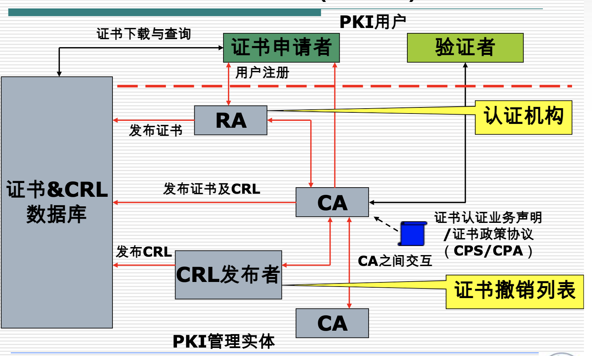
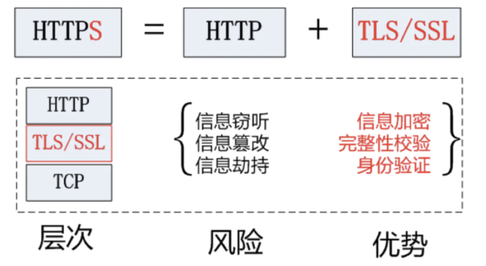
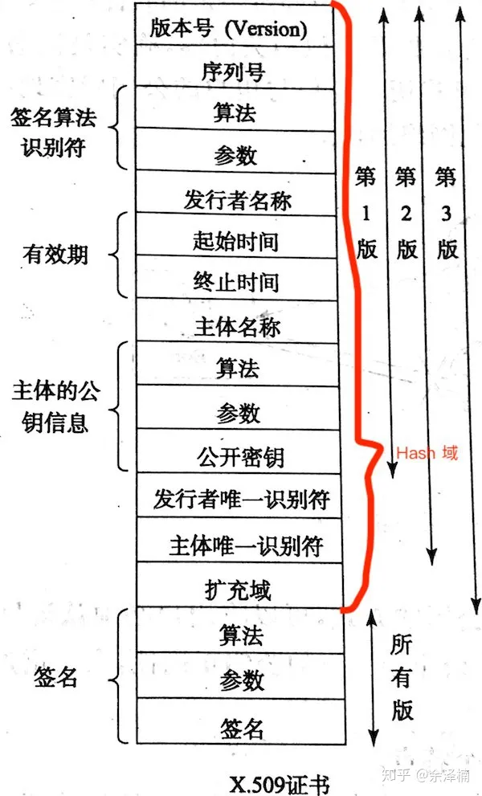
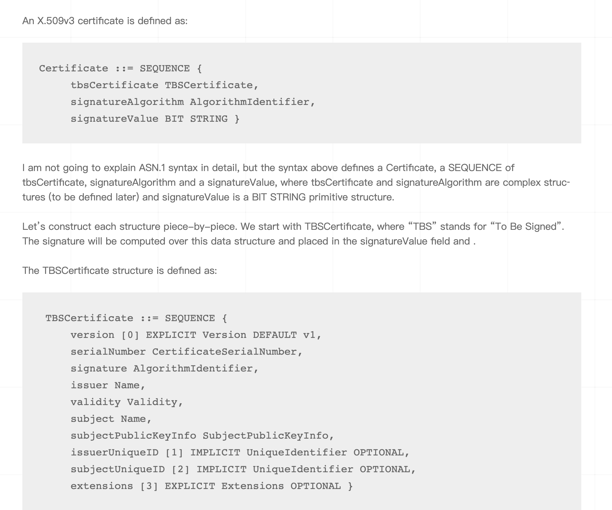
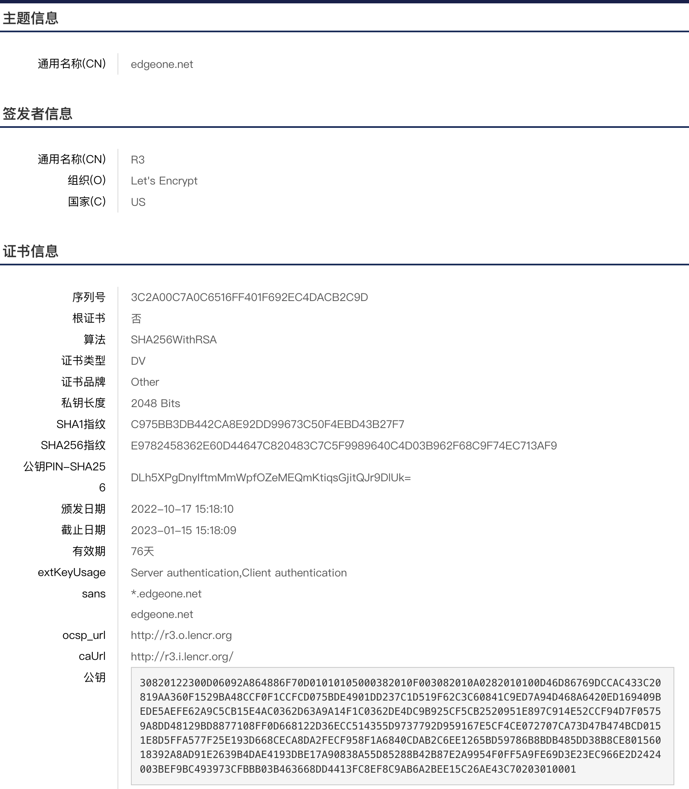
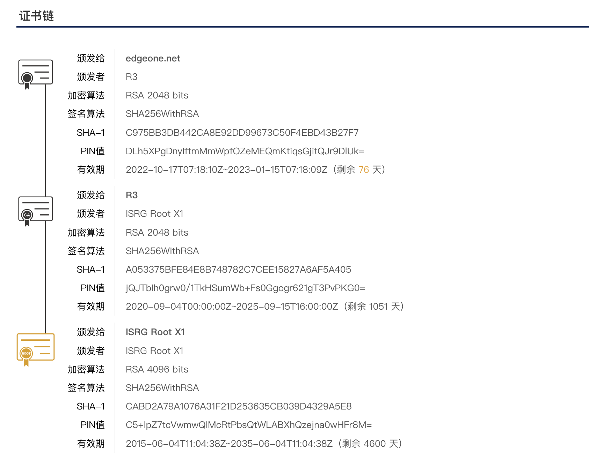
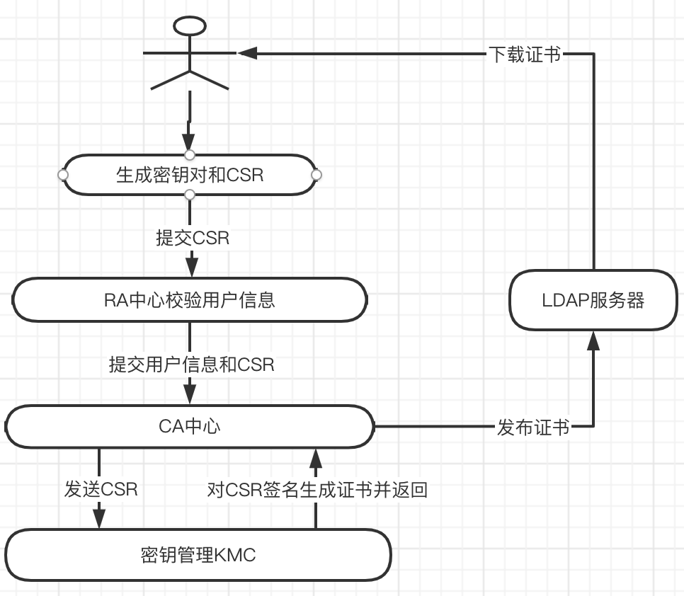
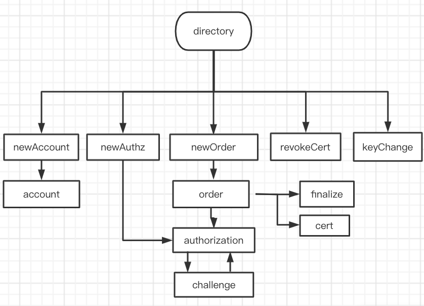
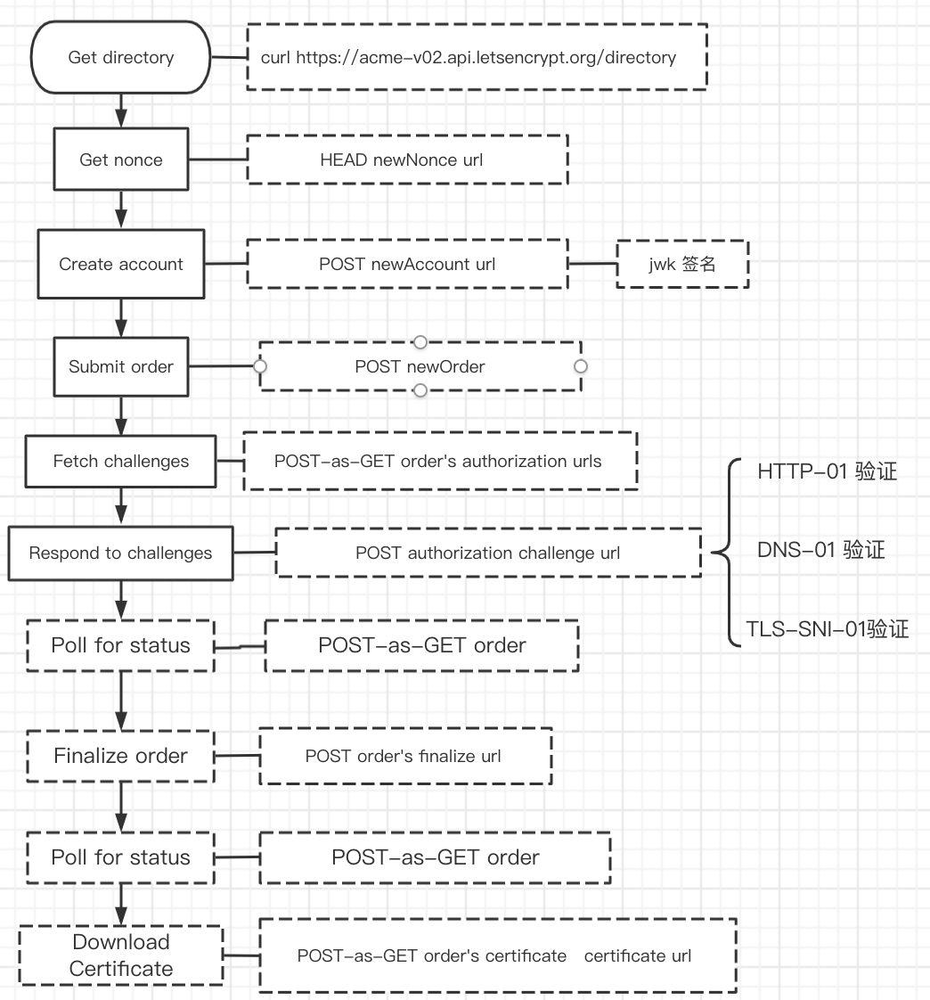
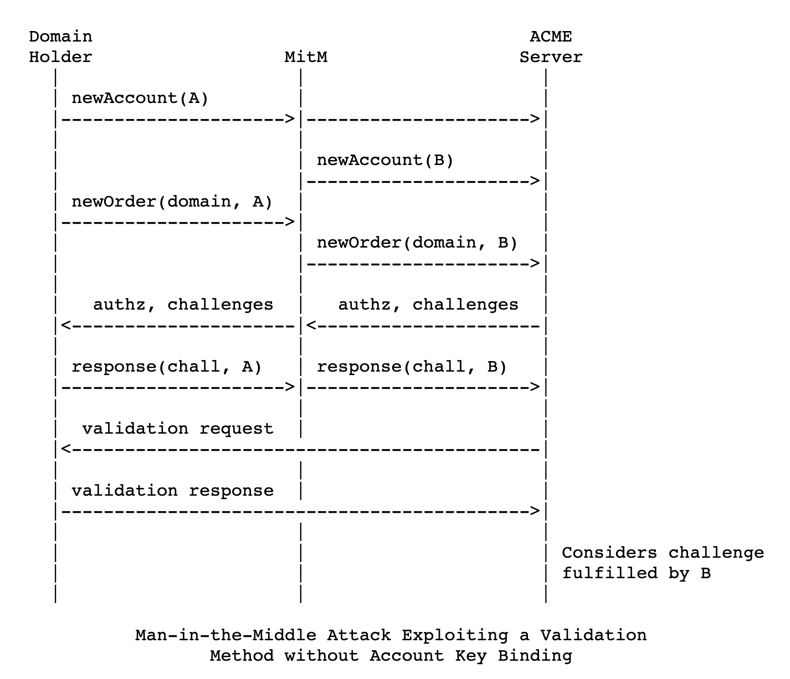

# 证书相关知识整理

[toc]

## 证书的由来

证书主要是为了保护你的网站的真实性，并且对网站通讯信息进行加密，而不被第三者篡改、截取。本节主要涉及HTTP协议的相关内容以及其安全风险、引入密码学保证信息安全的相关知识以及全方位、多层次的安全解决方案CA。

### HTTP裸奔时代

HTTP 协议（HyperText Transfer Protocol，超文本传输协议）：是客户端浏览器或其他程序与Web服务器之间的应用层通信协议 。HTTP相关的学习文档如下：

* HTTP官网 : [https://httpwg.org/specs/](https://httpwg.org/specs/)
* HTTP1.1 : [https://httpwg.org/specs/rfc9112.html](https://httpwg.org/specs/rfc9112.html)
* HTTP2 : [https://httpwg.org/specs/rfc7540.html](https://httpwg.org/specs/rfc7540.html)
* HTTP3 : [https://httpwg.org/specs/rfc9114.html](https://httpwg.org/specs/rfc9114.html)

HTTP协议的请求和响应内容都是明文，第三者可以窃听篡改传输内容，甚至冒充他人身份进行通信。比如简单的使用tcpdump抓包就能看到他人之前的通信内容。


### 密码学的诞生

为了保证信息的安全，衍生出了数学以及计算机科学的一个分支密码学，密码学是研究编制密码和破译密码的技术科学。

#### 加密体系

在密码学中，加密是将明文信息隐匿起来，使之在缺少特殊信息时不可读。加密体系包括了加密算法、数字摘要、数字签名和CA。

##### 加密算法

加密算法分为对称加密以及非对称加密两类。

* 对称加密
  概念：采用单钥密码系统的加密方法，同一个密钥可以同时用作信息的加密和解密，这种加密方法称为对称加密，也称为单密钥加密。
  常用算法：DES、3DES、TDEA、Blowfish、RC2、RC4、RC5、IDEA、SKIPJACK、AES等。不同算法的实现机制是不同的。
  优缺点：对称加密算法的优点是算法公开、计算量小、加密速度快、加密效率高。
* 非对称加密
  非对称加密算法需要两个密钥来进行加密和解密，这两个秘钥是公开密钥（public key，简称公钥）和私有密钥（private key，简称私钥）。
  常用算法：RSA(欧拉定理/费马小定理)、Elgamal、背包算法、Rabin、D-H、ECC（椭圆曲线加密算法）等。
  优缺点：非对称加密的缺点是加密和解密花费时间长、速度慢，只适合对少量数据进行加密。

##### 数字摘要

概念：数字摘要是将任意长度的消息变成固定长度的短消息，它类似于一个自变量是消息的函数，也就是Hash函数。
常见算法：MD2、MD4、MD5、HAVAL、SHA、SHA-1、HMAC、HMAC-MD5、HMAC-SHA1。
优点：

* 输出长度固定。即输出长度和输入长度无关。
* 不可逆。即由输出数据理论上不能推导出输入数据。（通常加盐值保证不可逆）
* 对输入数据敏感。当输入数据变化极小时，输出数据也会发生明显的变化。
* 防碰撞。即不同的数据数据得到相同输出数据的可能性极低。
* 摘要运算得到的数据大小通常相比于原文较小,有数据压缩的作用。

缺点：可能存在散列冲突。
使用场景：文件一致性判断(百度云妙传原理)

##### 数字签名

概念：数字签名（又称公钥数字签名、电子签章）是一种类似写在纸上的普通的物理签名，但是使用了公钥加密领域的技术实现，用于鉴别数字信息的方法。一套数字签名通常定义两种互补的运算，一个用于签名，另一个用于验证。
常用算法：密码生成算法；标记算法；验证算法。
作用：数字签名保证信息传输的完整性、发送者的身份认证、防止交易中的抵赖发生。
使用场景：分布式系统SSO(单点登陆)场景。登陆态存储常规方案有：Session(服务端保存登陆信息，不适用于分布式系统)、cookie+redis、token(数字签名)。

##### CA解决方案

 CA是为解决互联网的安全问题，世界各国信息安全业者进行了多年的研究，形成了全方位、多层次的安全解决方案。其中，目前被广泛采用的PKI技术，在安全解决方案中占据了重要位置，它可以保证信息传输的机密性、真实性、完整性和不可否认性，从而保证信息的安全传输。
 场景：HTTPS场景。

## CA

从上文介绍CA的使用场景以及现状，为了更进一步的了解CA，下文从CA的架构、CA证书详解以及CA证书申请(管理)几个方面入手对对CA进行进一步的介绍。

### CA架构

本节主要从CA的PKI体系、CA认证机构的架构和能力、国内外知名CA机构、如何成为CA机构以及CA机构如何保证根证书的安全性等几个方面来介绍CA的架构。

#### PKI体系

PKI 是 Public Key Infrastructure 的缩写，其主要功能是绑定证书持有者的身份和相关的密钥对（通过为公钥及相关的用户身份信息签发数字证书），为用户提供方便的证书申请、证书作废、证书获取、证书状态查询的途径，并利用数字证书及相关的各种服务（证书发布，黑名单发布，时间戳服务等）实现通信中各实体的身份认证、完整性、抗抵赖性和保密性。其中PKI系统由认证机构 CA、注册机构 RA、数字证书库、密钥备份及恢复系统、证书撤销系统、密钥更新机制等部分组成。

* CA 认证机构
  认证机构CA是数字证书的颁布机关，也是 PKI 体系的核心，是具有权威性、公正性的第三方机构。认证机构 CA 首先确认申请证书的申请用户身份，然后将要颁发的证书的主体与公钥捆绑在一起，生成数字证书，从而使申请用户与一对公钥和私钥建立对应关系。
* RA 证书注册审批系统（Register Authority）
  RA就是证书注册审批系统（Register Authority），该系统具有证书的申请、审批、下载、OCSP、LDAP等一系列功能，为整个机构体系提供电子认证服务。RA作为CA认证体系中的一部分，能够直接从CA提供者那里继承CA认证的合法性。能够使客户以自己的名义发放证书，便于客户开展工作。
* 数字证书库
  集中储存已经颁发的证书和公钥，用户可以方便地在证书库中查询其他证书等相关信息。数字证书库的存放方式为目录服务器、关系数据库等。通常用的是 [LDAP](https://zhuanlan.zhihu.com/p/74512921) 目录。
* CRL证书吊销列表

PKI系统几个模块的协作关系如下图。



#### CA认证机构的架构和能力

CA 是 PKI 体系的关键组成部分，向用户颁发和管理各种应用的数字证书。认证中心 CA 的主要功能包括证书的申请、审批、颁发、查询、更新和撤销，及管理撤销证书列表。
CA 的组成部分，以及各部分的主要功能：

* 证书签发系统
  用该系统的私钥和加密算法，将用户申请时提供的个人信息和用户的公钥捆绑在要颁发的数字证书内。
* 密钥管理系统
  它负责密钥的生成、存储、撤销、恢复、更新及查询。
* 注册审计系统
  当用户向认证中心提出申请颁发或恢复数字证书等请求时，注册审计系统负责注册和审核用户的相关身份信息，审核和提交用户的请求，提供证书管理统计功能。
* 证书发布系统
  证书 CRL 发布系统负责发布认证中心 CA 的信息，对外发布的时间是有固定间隔的。


#### 国内外权威的CA机构

##### 国外机构

* 一、DigiCert SSL证书/Symantec SSL证书
  DigiCert是一家老牌的CA机构，2017年全资收购了Symantec旗下所有SSL证书业务和品牌，后来将Symantec SSL证书、Geotrust SSL证书业务合并后成为新的Digicert SSL证书，在全球SSL证书市场中处于绝对领先地位。
* 二、GeoTrust SSL证书
  GeoTrust是全球第二大数字证书颁发机构(CA)，也是身份认证和信任认证领域的领导者，先进的技术使得任何大小的机构和公司都能安全，低成本地部署SSL数字证书和实现各种身份认证。
* 三、Sectigo SSL 证书/原Comodo SSL证书
  Sectigo是世界领先的证书颁发机构，服务超 150 个国家/地区，签发证书总数超过1亿张。Sectigo在提供数字证书以及其他在线安全解决方案上有超过20年的经验。Sectigo提供的解决方案能够兼容所有的主流浏览器。
* 四、Globalsign SSL证书
  GlobalSign 自1996 年起开始颁发可信赖的SSL数字证书，从一些已经广泛普及的公众根中提供公众信任。这些可信任的根能够为所有的操作系统、浏览器、服务器、e-mail 客户端以及互联网应用程序等识别。
* 五、Thawte SSL证书
  Thawte由南非Mark Shuttleworth创立，是在美国以外的第一个SSL证书颁发机构，目前在全球SSL市场中占有40%的份额Thawte服务于全球240多个国家。Thawte一直致力于为用户提供可靠的SSL证书和优质的服务。
* 六、Let's Encrypt(LE)
  一个为 2.25 亿个网站提供 TLS 证书的非盈利性证书颁发机构。

##### 国内机构

* 一、WoTrus沃通
    沃通是国内唯一一家通过Adobe认证的CA(PDF签名加密证书)，能签发全球信任的采用国产加密算法(SM2) 的SSL证书和代码签名证书的商业CA。是中国最大的国产品牌数字证书颁发机构之一，中国市场占有率超过70%！
* 二、GDCA数安时代
    GDCA数安时代成立于2003年4月，一直致力于发展成为一流的网络信任服务商，经过十余年不断开拓进取、突破创新，逐步在电子认证及相关信息安全产品、服务领域取得了行业领先地位。GDCA通过了WEBTRUST国际认证，成为国内仅有的几家具备国际化电子认证服务能力的企业之一。
* 三、CFCA中国金融认证中心
    中国金融认证中心China Financial Certification Authority，简称CFCA，是由中国人民银行于1998年牵头组建、经国家信息安全管理机构批准成立的国家级权威安全认证机构，是国家重要的金融信息安全基础设施之一。CFCA成为首批获得电子认证服务许可的电子认证服务机构。截至目前，超过2400家金融机构使用CFCA的电子认证服务，在使用数字证书的银行中占98%的份额。
* 四、安信证书
    安信证书是国内知名的国际知名品牌SSL证书代理商，专售Symantec、GeoTrust、Comodo、Thawte以及RapidSSL等多家全球权威CA机构的SSL数字证书。证书种类齐全，价格优惠，而且提供高级证书需要的邓白氏、律师意见信等服务。凡在安信证书申请Symantec、Geotrust、Comodo等国际品牌证书，均可享受免费安装SSL证书的服务。

#### 如何成为CA机构

成为CA机构的两个主要条件：

1. CA机构的根证书跟OS和浏览器预先捆绑
2. CA机构能够有足够的能力保证根证书安全性。

##### CA机构的根证书跟OS和浏览器预先捆绑

为了被有意识别，受信任的证书颁发机构 (CA) 需要将其根证书与特定的 Web 浏览器和操作系统 (OS) 预先捆绑在一起，例如 Microsoft Internet Explorer、Apple Safari、Mozilla Firefox、Google Chrome 和 Opera (et等）。受信任的根证书列表通常会定期更新以添加或删除证书。(与越多的OS和Web浏览期绑定根证书签发的证书兼容性越好)

<ul>
<li><a rel="nofollow noreferrer" href="https://social.technet.microsoft.com/wiki/contents/articles/31633.microsoft-trusted-root-program-requirements.aspx"><font><font>微软</font></font></a><font><font>：填写</font></font><a rel="nofollow noreferrer" href="http://aka.ms/rootcertapply"><font><font>申请表</font></font></a><font><font>并发送电子邮件至 msroot@microsoft.com</font></font></li>
<li><a rel="nofollow noreferrer" href="https://www.mozilla.org/en-US/about/governance/policies/security-group/certs/policy/"><font><font>Mozilla</font></font></a><font><font>：在</font><a rel="nofollow noreferrer" href="https://bugzilla.mozilla.org/enter_bug.cgi?product=mozilla.org&component=CA%20Certificates"><font>Mozilla 的 Bugzilla 中</font></a><font>提交正式请求</font></font><a rel="nofollow noreferrer" href="https://bugzilla.mozilla.org/enter_bug.cgi?product=mozilla.org&component=CA%20Certificates"><font></font></a></li>
<li><a rel="nofollow noreferrer" href="https://www.apple.com/certificateauthority/ca_program.html"><font><font>苹果</font></font></a><font><font>：发送电子邮件至 certificate-authority-program@apple.com</font></font></li>
<li><a rel="nofollow noreferrer" href="https://www.chromium.org/Home/chromium-security/root-ca-policy"><font><font>Google</font></font></a><font><font>（仅限 Android）：在</font><a rel="nofollow noreferrer" href="https://issuetracker.google.com/issues/new?component=190923"><font>Android 的问题跟踪器中</font></a><font>提交问题</font></font><a rel="nofollow noreferrer" href="https://issuetracker.google.com/issues/new?component=190923"><font></font></a></li>
<li><a rel="nofollow noreferrer" href="http://www.oracle.com/technetwork/java/javase/javasecarootcertsprogram-1876540.html"><font><font>甲骨文</font></font></a><font><font>：发送电子邮件至 JAVASE-CA-REQUEST_WW_GRP@ORACLE.COM</font></font></li>
<li><a rel="nofollow noreferrer" href="https://helpx.adobe.com/acrobat/kb/approved-trust-list2.html"><font><font>Adobe</font></font></a><font><font>：向美国 (AATL-NorthAmerica@adobe.com)、欧洲和中东 (AATL-EMEA@adobe.com) 以及世界其他地区 (AATL-ROW@adobe.com) 的 adobe 代表发送电子邮件</font></font></li>
</ul>

##### CA机构需要保证根证书的安全性

CA证书的权威性依赖于CA证书本身的权威性以及CA根证书的安全性，关于CA根证书的安全性网上并没有太多资料，唯一一篇文章主要是[根证书安全性学习资料](https://www.zhihu.com/question/22260090)，主要介绍了一下几个层次的保护。

* 第一层保护：注册机构（Registration Authority，RA）
  RA扮演的角色相当于是一个防火墙或者说签证官，所有的申请都要先交给RA。审核通过之后，申请才会被上呈到CA手里等待确认。在CA和RA之间，存在一条双向认证的保密信道。只有手握RA私钥的人，才会被当做RA来对待，才有资格向上提交申请。这就保证了CA的通信接口不会直接对外暴露，减少了防守方的工作压力。
* 第二层保护：CA物理防护机制
  1. 数据中心（操作台递交申请）
     DigiCert采用如下规格的保护措施：365天 x 24小时无间断的保安巡逻。任何出入数据中心的工作人员都必须通过双重认证（门禁卡+指纹虹膜等生物识别）每一次门禁记录和生物识别记录都会被双双登记到一个不可修改的日志系统里。另外，每个数据中心都有专人进行持续的维护，一旦有某个数据中心出现维护中断的状况，那么DigiCert将会第一时间派人前去数据中心进行四项检查：所有设备均处于正常运作状态。所有保密容器均未遭到破坏。门锁等物理安全装置均处于正常状态。整个区域没有外人非法访问。
  2. CA私钥离线存放室
     CA手里，有一台神奇的机器，被称作加密模组（Cryptomodule）。这个机器的特点在于，它把加密解密相关的所有功能全部包揽了。所有的私钥，都直接在这台机器里生成；在这台机器里存储；在这台机器里参与计算。所有的敏感数据都直接锁在这台机器里加密解密，CA私钥这个东西，从生到死，不会有任何机会离开这台机器。哪怕你把这台机器拆了，里面的存储器也有特殊的封装技术和加密保护，任何人都没法轻易把里面的内容读出来。
     DigiCert具体采取的安全措施是：将加密模组锁在一台双认证保险柜里，需要最少两名工作人员同时认证才能打开。启动加密模组需要一张操作卡和一台动态密码生成器，完成这两项认证才能启动机器。操作卡和生成器要么锁在一个贴着封条的箱子里，要么锁在另一个双认证保险柜里。出入存放室需要刷门禁，留下电子出入记录。打开封条和保险箱则要相互监督留下纸面记录。
  3. 私钥生成室与证书
     一般来讲，私钥生成与证书签发可以直接在私钥存放点进行。但是如果有特殊情况的话，也可以在另一间同等安全性的房间里完成。在私钥生成和模组激活的过程中，需要保证最少两名操作员时刻关注着设备的情况。模组激活之后，签发证书的流程则分为两种，一种是人工确认签发，一种是机器自动签发。这两种签发方式，分别对应两种不同级别的私钥：根CA私钥（Root CA Private Key）和中间CA私钥（Intermediate CA Private Key）。那么这两种CA有什么区别呢？在前文里我们提到过，所谓的CA其实就是担保人，它们的作用主要是担保其他人的身份。可是，如果我们使用同一枚私钥，直接担保所有人的身份的话，一旦这枚私钥损坏或丢失，就会造成很大的问题。所以目前比较成熟的CA机构采取的都是这样一种分层结构：根CA负责担保所有中间CA的身份，而中间CA则负责担保Google、Facebook等外部公司的身份。这样一来，一旦中间CA的私钥出现了严重的问题，如损坏、失窃等，CA机构就可以用根CA迅速创建一个新的中间CA私钥，把出问题的旧私钥换掉。由于这种情况出现的频率很低，中间CA续签证书也往往以数十年为期，所以根CA很少有派上用场的时候，属于轻易不会用上的“重器”，用它签发证书往往需要两名操作员人工确认。而中间CA的业务则相对比较繁忙，它激活后往往直接和数据中心相连，可以很方便地在线签发各类证书。另外，它的每次签发都会在日志系统中留下记录，以便之后进行安全审计。
* 第三层防护：员工管理机制
  DigiCert的CA工作人员大致可以分为三类：
  1. CA管理员（CA Administrator）
  2. 操作员（Operator），包括RA Officer、System Engineer等
  3. 内部审查员（Internal Auditor）
  任何一项操作，都必须要由一名CA管理员和一名相应的操作员共同完成。内部审查员无权做出任何操作，但是会在事后对操作记录进行审查。也就是说，CA进行任何一项操作，都要牵扯到最少三名工作人员，要收买就必须一口气买齐。
* 第四层防护：日志审计
  DigiCert的所有操作都是有日志记录的，而且日志设备只可追加不可修改，你根本没法抹消自己的操作日志。每两个月，DigiCert都会遣专人审计日志。每条操作日志都会离线保存至少七年，以便在有人东窗事发之后进行追查。更变态的是，如果攻击者通过某种手段，强行让日志系统瘫痪的话，那么整个RA、CA系统就会全部停机。换句话说，如果你的操作留不下记录，那么你就别想做任何操作。

### CA证书

上文主要介绍了CA的架构以及如何成为CA机构等内容，接下来主要介绍CA证书如何解决HTTP请求的安全性问题（包括HTTPS的请求流程以及TLS认证过程）以及介绍CA证书的结构、编码等内容。

#### 从HTTPS说起

HTTPS 即HTTP OVER SSL，SSL认证过程是CA证书的一种，SSL的认证过程可看作为CA证书的常规认证流程。

关于HTTPS原理和TLS认证流程附上流程图，不做进一步介绍，细节可以参考下面文章：
[https://segmentfault.com/a/1190000021559557](https://segmentfault.com/a/1190000021559557)
[https://zhuanlan.zhihu.com/p/440612523](https://zhuanlan.zhihu.com/p/440612523)
[https://www.rfc-editor.org/rfc/rfc2818](https://www.rfc-editor.org/rfc/rfc2818)

##### HTTPS请求流程


##### TLS认证流程


#### CA证书结构

CA数字证书(Certificate Authority)是由权威机构——CA机构发行的，是互联网通讯中标志通讯各方身份信息的一串数字，提供了一种在Internet上验证通信实体身份的方式，最简单的证书包含一个公开密钥、名称以及证书授权中心的数字签名。当前常见的证书格式[X.509标准](https://zh.wikipedia.org/wiki/X.509)和PKCS(公钥加密标准)系列(PKCS#1、PKCS#8、PKCS#12)，其中X.509是公钥证书的格式标准, 广泛用于TLS/SSL安全通信或者其他需要认证的环境中。X.509证书可以由CA颁发，也可以自签名产生。

##### X.509标准

参考: [https://cloud.tencent.com/developer/article/1589355](https://cloud.tencent.com/developer/article/1589355)

X.509证书中主要含有公钥、身份信息、签名信息和有效性信息等信息。这些信息用于构建一个验证公钥的体系，用来保证客户端得到的公钥正是它期望的公钥。

* 公钥 : 非对称密码中的公钥。公钥证书的目的就是为了在互联网上分发公钥。
* 身份信息 : 公钥对应的私钥持有者的信息，域名以及用途等。
* 签名信息 : 对公钥进行签名的信息，提供公钥的验证链。可以是CA的签名或者是自签名，不同之处在于CA证书的根证书大都内置于操作系统或者浏览器中，而自签名证书的公钥验证链则需要自己维护（手动导入到操作系统中或者再验证流程中单独提供自签名的根证书）。
* 有效性信息：证书的有效时间区间，以及CRL等相关信息。



##### 标准的数据描述 ASN.1

PKCS协议组和X.509协议均采用ASN.1来定义密钥或证书的数据结构。ASN.1是一种语言，一种标记语言，作用是描述数据结构。基于这种数据结构可以进行数据的表示、编码、传输和解码，对于PKCS协议组和X.509协议的ASN.1语法描述这里不进行描述，详见：[https://cipherious.wordpress.com/2013/05/13/constructing-an-x-509-certificate-using-asn-1/](https://cipherious.wordpress.com/2013/05/13/constructing-an-x-509-certificate-using-asn-1/)

##### ASN.1的编码方式

* DER格式 : 二进制格式。
* PEM格式 : ASCII文本格式。在DER格式或者其他二进制数据的基础上，使用base64编码为ASCII文本，以便于在仅支持ASCII的环境中使用二进制的DER编码的数据。

##### 常见的证书文件后缀

1. 带私钥的证书后缀

   * .pfx 常用于Windows上的 IIS服务器
   * .p12 常用于MAC OS、iOS中(PKCS#12由PFX进化而来的用于交换公共的和私有的对象的标准格式)
   * .jks Java Key Storage，这是Java的专利，JAVA的专属格式，一般用于 Tomcat 服务器。
2. 不带私钥的证书后缀

   * .cer/crt 编码方式不一定，可能是DER也可能是PEM
   * .pem 都是PEM编码格式
   * .der 都是DER编码格式
   * .p7b 以树状展示证书链(certificate chain)，同时也支持单个证书，不含私钥
3. csr的后缀(.csr)
   CSR 全称 “证书签名请求”(Certificate Signing Request)，CSR 通常由想要获得 X.509 证书的实体(entity) 创建，然后提交给 CA (Certificate Authority), CA 使用它来为实体创建对应的 X.509 证书。
   其中CSR 中通常包含三部分：

   * 实体的标识名(Distinguished name)
   * 实体的公钥(public key)
   * 其他有关实体的属性信息

##### 证书解析样例

这一节我们取一个EO证书库中的Le证书进行解析,了解.pem文件如何存储证书的完整信息。

```
-----BEGIN CERTIFICATE-----
MIIFLDCCBBSgAwIBAgISA8KgDHoMZRb/QB9pLsTayyydMA0GCSqGSIb3DQEBCwUA
MDIxCzAJBgNVBAYTAlVTMRYwFAYDVQQKEw1MZXQncyBFbmNyeXB0MQswCQYDVQQD
EwJSMzAeFw0yMjEwMTcwNzE4MTBaFw0yMzAxMTUwNzE4MDlaMBYxFDASBgNVBAMT
C2VkZ2VvbmUubmV0MIIBIjANBgkqhkiG9w0BAQEFAAOCAQ8AMIIBCgKCAQEA1G2G
dp3MrEM8IIGao2DxUpukjM8PHM/NB1veSQHdI3wdUZ9iw8YIQcntepTUaKZCDtFp
QJvt5a7+YqnFyxXkrANi1jqaFPHANi3k3JuSXPXLJSCVHol8kU5SzPlNfwV1mo3U
gSm9iHcQj/DWaBItNuzFFDVdlzd5LZWRZ+XPTOBycHynPUe0dLzQFR6NX/pXfyXh
k9ZozsqNov7PlY8aaEDNqyxu4SZb1ZeGuL20hd04uM6AFWAYOSqK2R4mObTa5Bk9
vhepCDilXYUoi0K4fiqZVPD/Wp/mnT4j7JZuLSQkADvvm8STlzz7uwO0Y2aN1EE/
yO+MmraivuFcJq5DxwIDAQABo4ICVjCCAlIwDgYDVR0PAQH/BAQDAgWgMB0GA1Ud
JQQWMBQGCCsGAQUFBwMBBggrBgEFBQcDAjAMBgNVHRMBAf8EAjAAMB0GA1UdDgQW
BBS5nhKAPe+8OlpcKjg9HSHiTNJI9jAfBgNVHSMEGDAWgBQULrMXt1hWy65QCUDm
H6+dixTCxjBVBggrBgEFBQcBAQRJMEcwIQYIKwYBBQUHMAGGFWh0dHA6Ly9yMy5v
LmxlbmNyLm9yZzAiBggrBgEFBQcwAoYWaHR0cDovL3IzLmkubGVuY3Iub3JnLzAl
BgNVHREEHjAcgg0qLmVkZ2VvbmUubmV0ggtlZGdlb25lLm5ldDBMBgNVHSAERTBD
MAgGBmeBDAECATA3BgsrBgEEAYLfEwEBATAoMCYGCCsGAQUFBwIBFhpodHRwOi8v
Y3BzLmxldHNlbmNyeXB0Lm9yZzCCAQUGCisGAQQB1nkCBAIEgfYEgfMA8QB3AHoy
jFTYty22IOo44FIe6YQWcDIThU070ivBOlejUutSAAABg+UFjlEAAAQDAEgwRgIh
AOnjOqyXrZEJVtc7swdqSLB3aBB/KuTDyP8kR9ns2OZqAiEAm4qL3d1g9gOFUXJd
hL5RxagN/iGc81MPsedx9sw1cJkAdgCt9776fP8QyIudPZwePhhqtGcpXc+xDCTK
hYY069yCigAAAYPlBY6EAAAEAwBHMEUCIQC69CpO0WW0sPzREEZNxin4lzFk7mIQ
B7dBOMoFyTU71QIgE/0BPCPUfTci0qEjG0kBDxgTr/xnCtR69KlwZm1DE7EwDQYJ
KoZIhvcNAQELBQADggEBAFtrSD3HkESPKMWP6Fs4XWsrKFMltCalGyZgPVfQDvuU
PxipYxpWMvoUqBen6a+AceIGgY4y2gyowGh+s2hHN9W8ekLygiRnktsz5M1tqsd9
L6FKv5tLTobmq4J7taDTKdAcR+cBSvmIGZobhLbSe9nKBD2+UY95SC5iZBqf4Wbx
cpimIgHfoIuix5MburdIV1XlDIZIdtlhVKsyq3Hj1qIA8v00Eckxwk71rA6qpC8c
mFNb/wt0cpPn2Wp9nrzTQ7l8OV7L5Wr6+ALiwXbNxVNKFc7VzQV3VyVmVafZL8f3
/SRHZon2t0I1jZSEAgGMTmNSvWgP8DZ7jBs77CA7ycw=
-----END CERTIFICATE-----
-----BEGIN CERTIFICATE-----
MIIFFjCCAv6gAwIBAgIRAJErCErPDBinU/bWLiWnX1owDQYJKoZIhvcNAQELBQAw
TzELMAkGA1UEBhMCVVMxKTAnBgNVBAoTIEludGVybmV0IFNlY3VyaXR5IFJlc2Vh
cmNoIEdyb3VwMRUwEwYDVQQDEwxJU1JHIFJvb3QgWDEwHhcNMjAwOTA0MDAwMDAw
WhcNMjUwOTE1MTYwMDAwWjAyMQswCQYDVQQGEwJVUzEWMBQGA1UEChMNTGV0J3Mg
RW5jcnlwdDELMAkGA1UEAxMCUjMwggEiMA0GCSqGSIb3DQEBAQUAA4IBDwAwggEK
AoIBAQC7AhUozPaglNMPEuyNVZLD+ILxmaZ6QoinXSaqtSu5xUyxr45r+XXIo9cP
R5QUVTVXjJ6oojkZ9YI8QqlObvU7wy7bjcCwXPNZOOftz2nwWgsbvsCUJCWH+jdx
sxPnHKzhm+/b5DtFUkWWqcFTzjTIUu61ru2P3mBw4qVUq7ZtDpelQDRrK9O8Zutm
NHz6a4uPVymZ+DAXXbpyb/uBxa3Shlg9F8fnCbvxK/eG3MHacV3URuPMrSXBiLxg
Z3Vms/EY96Jc5lP/Ooi2R6X/ExjqmAl3P51T+c8B5fWmcBcUr2Ok/5mzk53cU6cG
/kiFHaFpriV1uxPMUgP17VGhi9sVAgMBAAGjggEIMIIBBDAOBgNVHQ8BAf8EBAMC
AYYwHQYDVR0lBBYwFAYIKwYBBQUHAwIGCCsGAQUFBwMBMBIGA1UdEwEB/wQIMAYB
Af8CAQAwHQYDVR0OBBYEFBQusxe3WFbLrlAJQOYfr52LFMLGMB8GA1UdIwQYMBaA
FHm0WeZ7tuXkAXOACIjIGlj26ZtuMDIGCCsGAQUFBwEBBCYwJDAiBggrBgEFBQcw
AoYWaHR0cDovL3gxLmkubGVuY3Iub3JnLzAnBgNVHR8EIDAeMBygGqAYhhZodHRw
Oi8veDEuYy5sZW5jci5vcmcvMCIGA1UdIAQbMBkwCAYGZ4EMAQIBMA0GCysGAQQB
gt8TAQEBMA0GCSqGSIb3DQEBCwUAA4ICAQCFyk5HPqP3hUSFvNVneLKYY611TR6W
PTNlclQtgaDqw+34IL9fzLdwALduO/ZelN7kIJ+m74uyA+eitRY8kc607TkC53wl
ikfmZW4/RvTZ8M6UK+5UzhK8jCdLuMGYL6KvzXGRSgi3yLgjewQtCPkIVz6D2QQz
CkcheAmCJ8MqyJu5zlzyZMjAvnnAT45tRAxekrsu94sQ4egdRCnbWSDtY7kh+BIm
lJNXoB1lBMEKIq4QDUOXoRgffuDghje1WrG9ML+Hbisq/yFOGwXD9RiX8F6sw6W4
avAuvDszue5L3sz85K+EC4Y/wFVDNvZo4TYXao6Z0f+lQKc0t8DQYzk1OXVu8rp2
yJMC6alLbBfODALZvYH7n7do1AZls4I9d1P4jnkDrQoxB3UqQ9hVl3LEKQ73xF1O
yK5GhDDX8oVfGKF5u+decIsH4YaTw7mP3GFxJSqv3+0lUFJoi5Lc5da149p90Ids
hCExroL1+7mryIkXPeFM5TgO9r0rvZaBFOvV2z0gp35Z0+L4WPlbuEjN/lxPFin+
HlUjr8gRsI3qfJOQFy/9rKIJR0Y/8Omwt/8oTWgy1mdeHmmjk7j1nYsvC9JSQ6Zv
MldlTTKB3zhThV1+XWYp6rjd5JW1zbVWEkLNxE7GJThEUG3szgBVGP7pSWTUTsqX
nLRbwHOoq7hHwg==
-----END CERTIFICATE-----
-----BEGIN CERTIFICATE-----
MIIFYDCCBEigAwIBAgIQQAF3ITfU6UK47naqPGQKtzANBgkqhkiG9w0BAQsFADA/
MSQwIgYDVQQKExtEaWdpdGFsIFNpZ25hdHVyZSBUcnVzdCBDby4xFzAVBgNVBAMT
DkRTVCBSb290IENBIFgzMB4XDTIxMDEyMDE5MTQwM1oXDTI0MDkzMDE4MTQwM1ow
TzELMAkGA1UEBhMCVVMxKTAnBgNVBAoTIEludGVybmV0IFNlY3VyaXR5IFJlc2Vh
cmNoIEdyb3VwMRUwEwYDVQQDEwxJU1JHIFJvb3QgWDEwggIiMA0GCSqGSIb3DQEB
AQUAA4ICDwAwggIKAoICAQCt6CRz9BQ385ueK1coHIe+3LffOJCMbjzmV6B493XC
ov71am72AE8o295ohmxEk7axY/0UEmu/H9LqMZshftEzPLpI9d1537O4/xLxIZpL
wYqGcWlKZmZsj348cL+tKSIG8+TA5oCu4kuPt5l+lAOf00eXfJlII1PoOK5PCm+D
LtFJV4yAdLbaL9A4jXsDcCEbdfIwPPqPrt3aY6vrFk/CjhFLfs8L6P+1dy70sntK
4EwSJQxwjQMpoOFTJOwT2e4ZvxCzSow/iaNhUd6shweU9GNx7C7ib1uYgeGJXDR5
bHbvO5BieebbpJovJsXQEOEO3tkQjhb7t/eo98flAgeYjzYIlefiN5YNNnWe+w5y
sR2bvAP5SQXYgd0FtCrWQemsAXaVCg/Y39W9Eh81LygXbNKYwagJZHduRze6zqxZ
Xmidf3LWicUGQSk+WT7dJvUkyRGnWqNMQB9GoZm1pzpRboY7nn1ypxIFeFntPlF4
FQsDj43QLwWyPntKHEtzBRL8xurgUBN8Q5N0s8p0544fAQjQMNRbcTa0B7rBMDBc
SLeCO5imfWCKoqMpgsy6vYMEG6KDA0Gh1gXxG8K28Kh8hjtGqEgqiNx2mna/H2ql
PRmP6zjzZN7IKw0KKP/32+IVQtQi0Cdd4Xn+GOdwiK1O5tmLOsbdJ1Fu/7xk9TND
TwIDAQABo4IBRjCCAUIwDwYDVR0TAQH/BAUwAwEB/zAOBgNVHQ8BAf8EBAMCAQYw
SwYIKwYBBQUHAQEEPzA9MDsGCCsGAQUFBzAChi9odHRwOi8vYXBwcy5pZGVudHJ1
c3QuY29tL3Jvb3RzL2RzdHJvb3RjYXgzLnA3YzAfBgNVHSMEGDAWgBTEp7Gkeyxx
+tvhS5B1/8QVYIWJEDBUBgNVHSAETTBLMAgGBmeBDAECATA/BgsrBgEEAYLfEwEB
ATAwMC4GCCsGAQUFBwIBFiJodHRwOi8vY3BzLnJvb3QteDEubGV0c2VuY3J5cHQu
b3JnMDwGA1UdHwQ1MDMwMaAvoC2GK2h0dHA6Ly9jcmwuaWRlbnRydXN0LmNvbS9E
U1RST09UQ0FYM0NSTC5jcmwwHQYDVR0OBBYEFHm0WeZ7tuXkAXOACIjIGlj26Ztu
MA0GCSqGSIb3DQEBCwUAA4IBAQAKcwBslm7/DlLQrt2M51oGrS+o44+/yQoDFVDC
5WxCu2+b9LRPwkSICHXM6webFGJueN7sJ7o5XPWioW5WlHAQU7G75K/QosMrAdSW
9MUgNTP52GE24HGNtLi1qoJFlcDyqSMo59ahy2cI2qBDLKobkx/J3vWraV0T9VuG
WCLKTVXkcGdtwlfFRjlBz4pYg1htmf5X6DYO8A4jqv2Il9DjXA6USbW1FzXSLr9O
he8Y4IWS6wY7bCkjCWDcRQJMEhg76fsO3txE+FiYruq9RUWhiF1myv4Q6W+CyBFC
Dfvp7OOGAN6dEOM4+qR9sdjoSYKEBpsr6GtPAQw4dy753ec5
-----END CERTIFICATE-----
```

1. 将----BEGIN CERTIFICATE----页眉和-----END CERTIFICATE-----页脚去掉

```
MIIFYDCCBEigAwIBAgIQQAF3ITfU6UK47naqPGQKtzANBgkqhkiG9w0BAQsFADA/
MSQwIgYDVQQKExtEaWdpdGFsIFNpZ25hdHVyZSBUcnVzdCBDby4xFzAVBgNVBAMT
DkRTVCBSb290IENBIFgzMB4XDTIxMDEyMDE5MTQwM1oXDTI0MDkzMDE4MTQwM1ow
TzELMAkGA1UEBhMCVVMxKTAnBgNVBAoTIEludGVybmV0IFNlY3VyaXR5IFJlc2Vh
cmNoIEdyb3VwMRUwEwYDVQQDEwxJU1JHIFJvb3QgWDEwggIiMA0GCSqGSIb3DQEB
AQUAA4ICDwAwggIKAoICAQCt6CRz9BQ385ueK1coHIe+3LffOJCMbjzmV6B493XC
ov71am72AE8o295ohmxEk7axY/0UEmu/H9LqMZshftEzPLpI9d1537O4/xLxIZpL
wYqGcWlKZmZsj348cL+tKSIG8+TA5oCu4kuPt5l+lAOf00eXfJlII1PoOK5PCm+D
LtFJV4yAdLbaL9A4jXsDcCEbdfIwPPqPrt3aY6vrFk/CjhFLfs8L6P+1dy70sntK
4EwSJQxwjQMpoOFTJOwT2e4ZvxCzSow/iaNhUd6shweU9GNx7C7ib1uYgeGJXDR5
bHbvO5BieebbpJovJsXQEOEO3tkQjhb7t/eo98flAgeYjzYIlefiN5YNNnWe+w5y
sR2bvAP5SQXYgd0FtCrWQemsAXaVCg/Y39W9Eh81LygXbNKYwagJZHduRze6zqxZ
Xmidf3LWicUGQSk+WT7dJvUkyRGnWqNMQB9GoZm1pzpRboY7nn1ypxIFeFntPlF4
FQsDj43QLwWyPntKHEtzBRL8xurgUBN8Q5N0s8p0544fAQjQMNRbcTa0B7rBMDBc
SLeCO5imfWCKoqMpgsy6vYMEG6KDA0Gh1gXxG8K28Kh8hjtGqEgqiNx2mna/H2ql
PRmP6zjzZN7IKw0KKP/32+IVQtQi0Cdd4Xn+GOdwiK1O5tmLOsbdJ1Fu/7xk9TND
TwIDAQABo4IBRjCCAUIwDwYDVR0TAQH/BAUwAwEB/zAOBgNVHQ8BAf8EBAMCAQYw
SwYIKwYBBQUHAQEEPzA9MDsGCCsGAQUFBzAChi9odHRwOi8vYXBwcy5pZGVudHJ1
c3QuY29tL3Jvb3RzL2RzdHJvb3RjYXgzLnA3YzAfBgNVHSMEGDAWgBTEp7Gkeyxx
+tvhS5B1/8QVYIWJEDBUBgNVHSAETTBLMAgGBmeBDAECATA/BgsrBgEEAYLfEwEB
ATAwMC4GCCsGAQUFBwIBFiJodHRwOi8vY3BzLnJvb3QteDEubGV0c2VuY3J5cHQu
b3JnMDwGA1UdHwQ1MDMwMaAvoC2GK2h0dHA6Ly9jcmwuaWRlbnRydXN0LmNvbS9E
U1RST09UQ0FYM0NSTC5jcmwwHQYDVR0OBBYEFHm0WeZ7tuXkAXOACIjIGlj26Ztu
MA0GCSqGSIb3DQEBCwUAA4IBAQAKcwBslm7/DlLQrt2M51oGrS+o44+/yQoDFVDC
5WxCu2+b9LRPwkSICHXM6webFGJueN7sJ7o5XPWioW5WlHAQU7G75K/QosMrAdSW
9MUgNTP52GE24HGNtLi1qoJFlcDyqSMo59ahy2cI2qBDLKobkx/J3vWraV0T9VuG
WCLKTVXkcGdtwlfFRjlBz4pYg1htmf5X6DYO8A4jqv2Il9DjXA6USbW1FzXSLr9O
he8Y4IWS6wY7bCkjCWDcRQJMEhg76fsO3txE+FiYruq9RUWhiF1myv4Q6W+CyBFC
Dfvp7OOGAN6dEOM4+qR9sdjoSYKEBpsr6GtPAQw4dy753ec5
```

2.将 Base64 编码的字符串解码为其对应的二进制格式 DER。
3.按照ASN.1语法以及字段的位数解析出证书的完整结构,其中asn.1的结构描述如下。


##### 解析结果




### CA证书申请

介绍完证书结构、格式以及编码等内容后，后续介绍证书的申请流程，证书申请的大体流程以及细化的ACME证书流程。

#### 证书申请流程

证书申请流程主要分两种，一种是在客户端生成密钥对，然后将公钥和用户信息组成CSR发送到CA验证生成证书；另一种是直接到RA申请证书，然后CA生成证书和密钥，客户从RA下载密钥和从LDAP服务器下载证书。



1. 用户生成密钥对，并生成CSR(包含主题, 机构，国家等，并且包含了请求证书的公钥)。
2. RA负责证书申请者的信息录入、审核（DV/OV/IV/EV域名归属权校验等）。
3. CA请求加密密钥，同时发送用户证书的签名公钥。
4. 对用户的加密公钥还有用户信息用CA的密钥进行签名并生成证书。
5. CA中心获取到证书信息并下发到LDAP服务器。
6. 浏览器和客户端可以从LDAP下载证书。

#### ACME（Automatic Certificate Management Environment）

自动化证书管理环境（ACME）是用于自动验证X.509证书的域验证，安装和管理的标准协议。 ACME协议由Internet安全研究小组设计，并在[IETF RFC 8555](https://datatracker.ietf.org/doc/html/rfc8555)。 作为具有许多可用的客户端实现的文档齐全的开放标准，ACME被广泛用作企业证书自动化解决方案。

##### ACME（Automatic Certificate Management Environment）证书管理

ACME提供的证书管理功能包括：

* 帐户创建
* 订购证书
* 标识符授权
* 证书颁发
* 证书吊销

ACME是基于HTTP的应用程序，具有资源类型有：

* 帐户资源，代表有关帐户的信息
* 订单资源，代表账户发出的请求
* 授权资源，代表一个账户的授权
* 挑战资源，代表证明控制权的挑战
* 证书资源，代表颁发的证书
* 目录资源 （[https://acme-v02.api.letsencrypt.org/directory](https://acme-v02.api.letsencrypt.org/directory)）
* Nonce 标识资源（head [https://acme-v02.api.letsencrypt.org/acme/new-nonce](https://acme-v02.api.letsencrypt.org/acme/new-nonce)）



##### 申请证书API流程

其中申请证书API调用的流程图如图所示：



##### ACME中间人攻击（无用户域名控制权时EO证书申请）

ACME证书中间人攻击逻辑如下图所示。



## EO 证书申请实现

本节主要介绍EO证书申请的机构Let's Encrypt（LE）、EO的证书架构以及未来规划。

### Let's Encrypt

Let's Encrypt是一个于2015年三季度推出的数字证书认证机构，旨在以自动化流程消除手动创建和安装证书的复杂流程，并推广使万维网服务器的加密连接无所不在，为安全网站提供免费的传输层安全性协议（TLS）证书。

#### Let's Encrypt运作方式

Le证书流程[运作方式](https://letsencrypt.org/zh-cn/how-it-works/)分为两步。 首先，管理软件向证书颁发机构证明该服务器拥有域名的控制权。 之后，该管理软件就可以申请、续期或吊销该域名的证书。

#### Let's Encrypt限制

LE证书的[限制](https://letsencrypt.org/zh-cn/docs/rate-limits/)可以分为重复证书限制、失败验证限制、IP注册限制以及其他限制。

* 重复证书限制([Duplicate Certificate Limit](https://letsencrypt.org/zh-cn/docs/duplicate-certificate-limit/))
  1. 我们的主要限制为每个注册域名可签发证书数量（每周50张）
  2. 每份证书最多100个域名
  3. 同名证书有每周最多 5 张重复证书的限制
* 失败验证限制([Failed Validation Limit](https://letsencrypt.org/zh-cn/docs/failed-validation-limit/))
  1. 我们也有验证失败限制，为每账号、每主机名、每小时5次。
* 注册IP限制([Registrations Per IP Limit](https://letsencrypt.org/zh-cn/docs/too-many-registrations-for-this-ip/))
  1. 每个 IP 地址在 3 小时之内最多可以创建 10 个账户。 每个 IPv6 /48 地址段每 3 小时最多可以创建 500 个账户。 达到这两个速率限制是不常见的，我们建议大型集成商使用一个帐户为多个客户提供服务。 超过这些限制的请求，将会响应错误消息 too many registrations for this IP 或者 too many registrations for this IP range。
* 其他限制([Other Limit](https://letsencrypt.org/zh-cn/docs/too-many-registrations-for-this-ip/))
  1. API 的"new-nonce"、“new-account”、“new-order"和"revoke-cert"接口总请求数限制为每秒 20 次。 “/directory"目录和”/acme"目录及其子目录的总请求数限制为每秒 40 次。
  2. 在3小时之内最多可以创建300个 新订单。
  3. 实践发现如果说创建完token，直接调用验证le token的步骤会有一定概率会报错，sleep 30s以后能保证成功。

#### 时间驱动状态机

采用mq实现事件驱动状态机，将串行操作转成类似于nginx epoll模式的事件驱动，将各个步骤代码标准化成组件，过程值封装在上下文对象中，利用mq事件驱动急性证书申请，从而实现cpu最大化利用，这里将le的限制变成令牌桶的限制。

## 其他知识

ACME为了防止中间人攻击是用了JWS签名和https的数据传输方式，其中JWK是JWS最常用的一种，本节介绍JWK、JWT的跨域验证、以及一些工具。

### JWK 介绍

[https://self-issued.info/docs/draft-ietf-jose-json-web-key.html](https://self-issued.info/docs/draft-ietf-jose-json-web-key.html)

### JWT 跨域认证

[https://www.ruanyifeng.com/blog/2018/07/json_web_token-tutorial.html](https://www.ruanyifeng.com/blog/2018/07/json_web_token-tutorial.html)
[https://blog.csdn.net/m0_37989980/article/details/107955069](https://blog.csdn.net/m0_37989980/article/details/107955069)

### 工具

[证书查看](https://myssl.com/cert_decode.html)
[dns探测](https://www.whatsmydns.net/)
[数据转换工具](https://cryptii.com/pipes/base64-to-hex)
[jwk与publickey在线工具](https://mkjwk.org/)

加密套件相关资料：[https://www.cnblogs.com/kirito-c/p/12872119.html](https://www.cnblogs.com/kirito-c/p/12872119.html)
