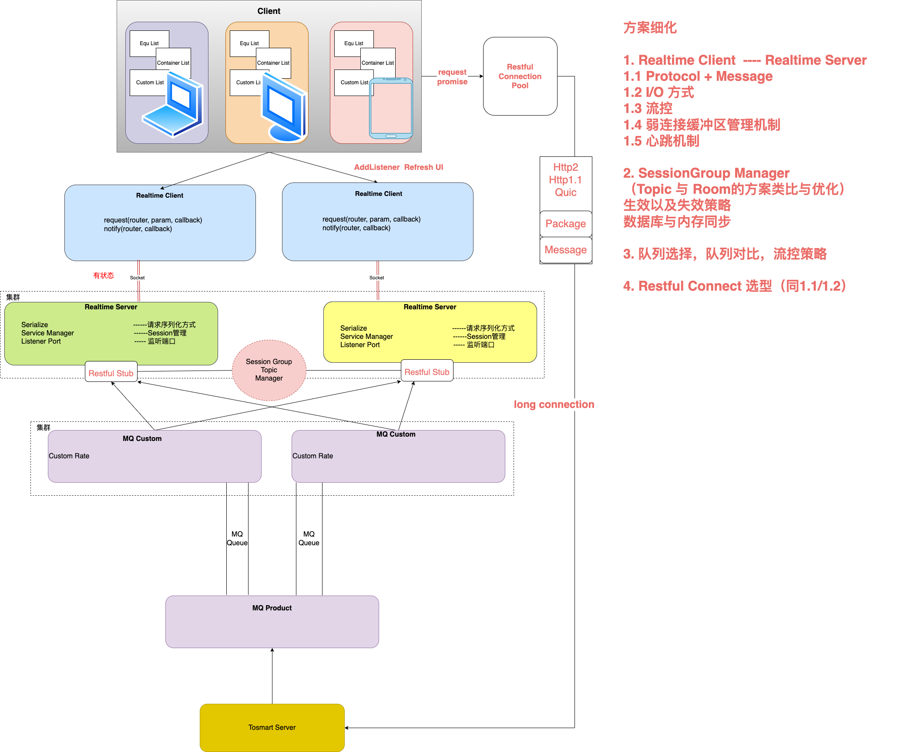

# 实时方案

## 背景

在物流仓储系统中，系统需要多端实时展示所有运输设备、物流货物、人员、操作指令及过程。因此需要设计一个实时中台进行设备、货物、人员、操作指令、操作过程的多端同步。

## 需求

### 基本需求

#### 基本流程

整体的请求过程如下图所示，客户端发起http请求到服务端，服务端收到请求后处理请求，并且变更DB，同时往同个数据源相关的页面广播变更消息，客户端根据推送到的消息。


#### 异常流程

当Boastcast消息推送时客户端因为网络问题可能收不到消息，后续需要逐条按序推送或者客户端全量刷新页面。


### 期望需求

1. 流畅性（响应时间）

- 推送时延
  - 响应时间【从接收到请求到数据推送出去的时间】
  - 端到端时间【从server端推送到客户端的时间】
- ​吞吐量（Throughput）TPS
单位时间处理的推送数

1. 稳定性（故障率）

- SLA

### 运营需求

#### 监控

1. 弱网的连接监控
2. 监控推送失败率
3. 监控服务器连接数、CPU、内存、IO
4. 请求异常告警

#### 部署需求

部署尽量简单

## 整体方案

### 业界实时方案

nano游戏方案:[github地址](https://github.com/lonng/nano.git)


todo nano详细方案文档梳理

### 方案


### 细节分析



### 详细方案

#### Connection

1. Websocket： 长连接

2. GRPC【底层http2 streamId的方式】 全双工：

详见 [websocket与grpc全双工协议](./websocket与grpc.md)

#### Protocol + Message

自定义解析协议，包括Packet的解析协议（一个包的大小，是否是整包）和Message的解析协议（一整条消息可能由几个包组成，message的长度等）

##### 示例

Nano的Package解析如下

```

Encode create a packet.Packet from  the raw bytes slice and then encode to network bytes slice
Protocol refs: https://github.com/NetEase/pomelo/wiki/Communication-Protocol

```

| **type** | **length** | **data** |
|  --------|----------|--------| 
| 1 byte packet type|  3 bytes packet data length(big end)|  data segment| 

Nano的Message解析如下

```

// Encode marshals message to binary format. Different message types is corresponding to
// different message header, message types is identified by 2-4 bit of flag field. The
// relationship between message types and message header is presented as follows:
// ------------------------------------------
// |   type   |  flag  |       other        |
// |----------|--------|--------------------|
// | request  |----000-|<message id>|<route>|
// | notify   |----001-|<route>             |
// | response |----010-|<message id>        |
// | push     |----011-|<route>             |
// ------------------------------------------
// The figure above indicates that the bit does not affect the type of message.
// See ref: https://github.com/lonnng/nano/blob/master/docs/communication_protocol.md

```

#### I/O方式

##### 阻塞式IO

阻塞式IO指的是 服务端write数据到缓冲区或者从缓冲区read数据到用户态，等到数据写入缓冲区以后才会能收到响应，如果缓冲区满了则会阻塞，知道缓冲区的数据发送出去。这样会导致应用的CPU无法执行其他计算，针对于实时场景配合协程处理即可。

其中典型例子：Nano采用的是golang协程 + 阻塞式IO的方式实现

##### 非阻塞式IO

非阻塞式IO指的是write数据到缓冲区以后立马返回，依赖主动查询或者事件通知的方式去查询接口【异步任务】，典型的是select和epoll。

##### 实时场景选型

Java 非阻塞式 I/O 框架的核心是 ​NIO（New I/O）​​ 及其扩展 ​NIO.2（AIO）​，它们通过事件驱动和多路复用机制实现高并发、低延迟的网络通信。实时服务采用的是Netty的NIO方式，Netty的异步IO采用的是Reactor 模式：BossGroup 处理连接，WorkerGroup 处理 I/O，支持自定义线程池。

#### 流控方案

流控分为单机流控和分布式流控方案；不同的场景方案不一样。

流控方案：<https://zhuanlan.zhihu.com/p/150436514>

##### 单机流控

流量控制需要统计一个时间区间的流量峰值，因此需要借助一块公共的内存，在单机流量控制中可以借助单台机器的内存进行流量控制，实时系统中采用的netty的流量整形方案。

##### 分布式流控

在多台机器都要进行流量控制的时候，就需要采用公共的存储【Redis】进行流量的统计，整体上控制流量峰值【中心化】；也可以给每台机器下发流量上限，进而控制流量的峰值【去中心化】。

#### 弱连接缓冲区方案

Netty原理以及弱缓冲区方案：·[netty原理及弱网缓冲区方案](./netty与弱网缓冲区解决方案.md)

#### SessionGroup Manager【Topic管理】

##### 存储方式

1. 订阅关系存储在Redis中（如Hash表：topic -> [subscriber_ip1, subscriber_ip2]）。
​优势​：读写快，适合低延迟场景。
​风险​：Redis单点故障可能导致订阅信息丢失（需主从复制+哨兵）。
​适用场景​：中小规模系统，对实时性要求高。

2. 订阅关系过多时根据hash值进行订阅关系分redis缓存与备库进行流量均摊

##### 数据流设计

数据流设计如图所示：

粉色的数据流为写操作，而橙色的流程为读操作。

#### 心跳机制


#### RestfulConnection选型

RestfulConnection prob采用http2的方式，使浏览器可以多个请求并发。

### 日志规范

### 运维工具

### 部署dockerfile
