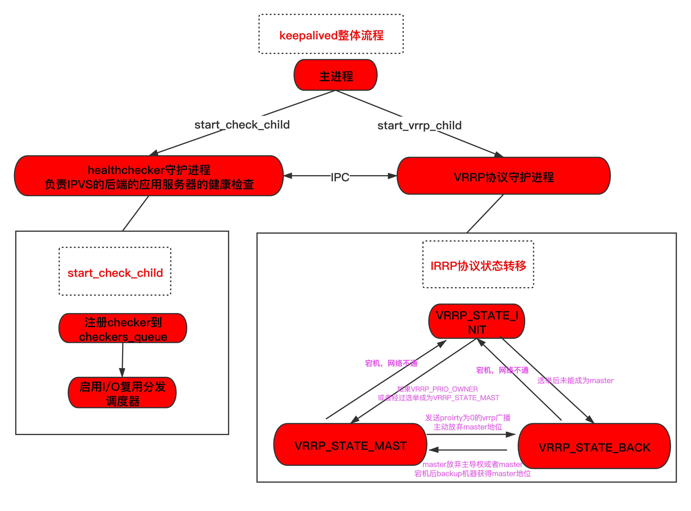
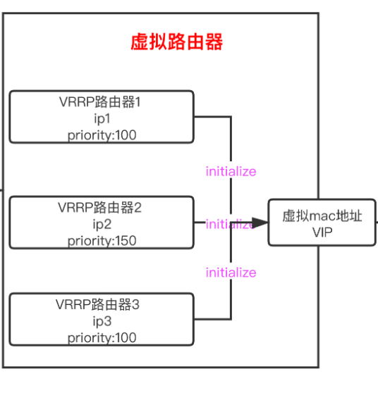
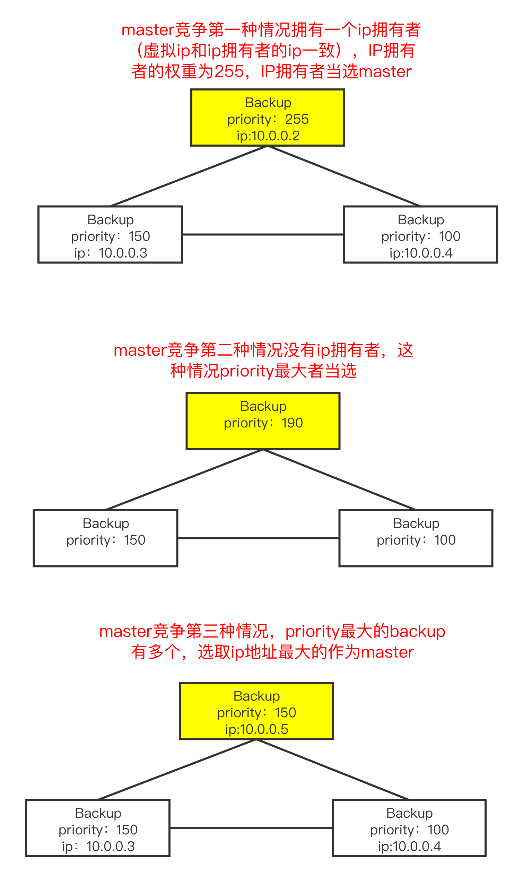

# 高可用主备集群

腾讯云 VPC 内通过高可用虚拟IP (HAVIP) + Keepalived 软件搭建高可用主备集群。

## HAVIP

### HAVIP 配置

HAVIP配置参考[腾讯云HAVIP配置](https://cloud.tencent.com/document/product/215/20186)

### HAVIP工作过程

HAVIP是根据免费ARP报文(GARP)来决定master（处于活跃状态）机器,主备机器间进行协调,谁发garp协议谁就是master。

#### HAVIP架构

#### HAVIP切换流程

> 1. Master机器发免费ARP,由于vip表interface匹配,不上送netlink
> 2. Master中的网卡down或应用层切换,停止发免费ARP,若干时间后新选举得到的Master发第一个免费ARP到mcagent
> 3. mcagent校验该ip是不是在子网内,如果不是放弃该上报,否则上送netlink,vpc_mcagent调用流程迁移IP
> 4. 新网卡继续发免费ARP,继续上送netlink,可能触发vpc_mcagent的频率控制(同设备5s内只允许一个GARP宣称),此时如果新网卡机器被迁移到新母机,则频率控制暂时失效。neigh表更新下发到母机（新IP生效）,新网卡继续发免费ARP,由于vip表interface匹配,不上送netlink

切换流程图如下

## Keepalived

### Keepalived 功能

Keepalived是基于vrrp协议的一款高可用软件。Keepailived有一台主服务器和多台备份服务器,在主服务器和备份服务器上面部署相同的服务配置,使用一个虚拟IP地址对外提供服务,当主服务器出现故障时,虚拟IP地址会自动漂移到备份服务器(发送免费ARP报文,将备份服务器的虚拟MAC地址通知给它连接的设备或者主机)。

普通手动切换和Keepalived自动切换的网络拓扑图如下:
  

### Keepalived 配置

Keepalived配置参考[Keepalived配置](https://cloud.tencent.com/document/product/215/20186)

#### linux安装Keepalived

##### yum方式安装

    yum install -y Keepalived

##### 源码方式安装

    tar zxvf Keepalived-1.2.24.tar.gz
    cd Keepalived-1.2.24
    ./configure --prefix=/
    make; make install
    chmod +x /etc/init.d/Keepalived   //防止出现 env: /etc/init.d/Keepalived: Permission denied

#### keepalive 配置文件

    global_defs{
    notification_email {
            root@localhost         # 收邮件人,可以定义多个
    }
    notification_email_from kaadmin@localhost       # 发邮件人可以伪装
    smtp_server 127.0.0.1  # 发送邮件的服务器地址
    smtp_connect_timeout 30 # 连接超时时间
    router_id LVS_DEVEL        
    }
    vrrp_instanceVI_1 {    # 每一个vrrp_instance就是定义一个虚拟路由器的
        state MASTER       # 由初始状态状态转换为master状态
        interface eth0       #  设置绑定 VIP 的网卡 例如 eth0  
        virtual_router_id 51    # 虚拟路由的id号,一般不能大于255的
        priority 100    # 初始化优先级
        advert_int 1    # 初始化通告
        nopreempt               #  设置非抢占模式
        preempt_delay 10
        authentication {   # 认证机制
            auth_type PASS
            auth_pass 1111   # 密码
        }
        unicast_src_ip 172.16.16.6  # 设置本机内网 IP 地址
        unicast_peer {
        172.16.16.5             # 对端设备的 IP 地址
        }
        virtual_ipaddress {     # 虚拟地址vip
        172.16.2.8
        }
    }

#### 重启Keepalived

    systemctl start Keepalived

### Keepalived 架构

Keepalived主要是有两部分组成,第一部分是healthchecker守护进程,该进程主要是解析配置以及负责IPVS的后端的应用服务器的健康检查。第二部分是VRRP协议实现进程,该进程主要是实现了VRRP协议,涉及VRRP实例状态的转移以及选举策略等内容。

#### 组件介绍

##### healthchecker守护进程

该进程负责IPVS的后端的应用服务器的健康检查,当检测失败就会调用IPVS规则删除后端服务器的IP地址,检测成功了再加回来。当检测后端有失败的情况可以使用SMTP通知管理员。支持http/tcp/misc等方式进行健康检查。

##### VRRP协议守护进程

关于VRRP协议可以先看VRRP协议的相关介绍。VRRP协议是被封装在IP报文中,发送到分配给VRRP的IP组播地址,在IP报文头中,源地址为发送报文接口的主IP地址（不是虚拟IP地址）,目的地址是224.0.0.18,TTL是255,协议号是112。。VRRP组成的虚拟路由器结构如下图:  
> 一个虚拟路由器由多个VRRP实例组成,拥有一个虚拟mac地址以及一个vip地址。每个VRRP实例都用各自的ip地址以及优先级。

在Keepalived框架中,VRRP实例之间通过**VRRP**协议来进行通迅(包括实例优先级等数据)以及通过**GARP**协议来宣告master实例的地址。

该协议有两个主要内容是master选举和master切换。

##### master选举

master选举主要包下面几个步骤

> 1. 在机器初始化的阶段也就是所有路由器都处于 initialize的时,所有VRRP实例都会收到Startup消息,这时如果接收到消息的路由器自身是一个ip拥有者,即实例优先级为255,该实例会直接发送VRRP通告该实例的优先级,发送garp数数据包宣告成为master。
> 2. 如果没有ip拥有者,则各路由器会接收广播的VRRP报文,如果报文中的优先级低于该路由器的优先级则会发送VRRP通过报文竞选master,否则则保持backup状态
> 3. 如果有多个优先级一致的路由器竞争master则会根据ip地址大小进行比较,ip地址较大的当选master

下图介绍三个backup机器竞争master的规则以及过程。

* 主备竞争优先级规则
    

##### master切换

master切换主要包括以下几种情况:

> 1. master如果运行正常需要规定的单位间隔(默认1s)内往外部发送vrrp通告,告诉backup机器自己运行正常。
> 2. 如果master想放弃Master地位时,则会发送优先级为0的vrrp报文进行重新选举,backup机器接收到优先级为0的vrrp报文就会进行再次的竞争选举。
> 3. 如果master宕机了,backup机器3*规定时间间隔没有收到vrrp通告协议,就会认为master 宕机,延迟1-priority/255s后发起竞争选举(等待3*规定时间和延迟1-priority/255s是为了避免由于网络波动频繁切换master)。
> 4. 在非抢占模式下只要Master存活是不会重新触发选举的,在抢占模式下,如果新加入的VRRP实例的优先级超过了Master就会触发一次重新选举,使得新加入的实例获得Master地位。

### Keepalived 调用流程

* 首先简化VRRP的结构如下

        VRRP{
            state /*VRRP_STATE_INIT 初始状态
                    VRRP_STATE_MAST master状态
                    VRRP_STATE_BACK 备用状态*/
            effective_priority //优先级
            ip                 //ip地址
        }

* Keepalived源码的主要调用流程图如下

> * main函数调用start_check_child方法和start_vrrp_child方法
> * start_check_child主要是进行健康检查和读取配置。首先调用start_check方法注册checker检查器,Keepalived提供tcp/misc等探活方式,然后调用launch_thread_scheduler初始化io复用分发器消费注册的checker。
> * start_vrrp_child方法主要是VRRP协议的实现,首先是调用launch_thread_scheduler初始化io复用分发器用于vrrp包的分发接收。其次调用start_vrrp方法,注册vrrp协议任务。
> * start_vrrp首先调用alloc_global_data\alloc_vrrp_data读取全局配置已经vrrp配置,配置文件涉及master的配置以及master切换邮件提醒等配置;在读取完配置后调用iptable_init对iptable进行初始化。
> * start_vrrp随后往处理器中注册vrrp_dispatcher_init方法vrrp协议的主要实现都在这个方法内。该方法首先调用vrrp_create_sockpool/vrrp_open_sockpool/vrrp_set_fds创建连接池以及注册vrrp实例和连接池的关系
> * vrrp_dispatcher_init方法调用vrrp_resigiter
方法注册各种vrrp协议操作分发的工作器主要包括vrrp_init_state方法(初始化master选举的数据然后通过设置master超时时间为1us触发master选举)、vrrp_init_sands方法(初始化master和backup的超时时间,该时间通过红黑树管理)、vrrp_read_dispactcher_thread方法（该方法主要开启了读写分发的任务,检查master存活、选举切换这里涉及选举策略）
> * vrrp_read_dispactcher_thread方法内部包含vrrp_dispatcher_read_timeout方法以及vrrp_dispathcer_read方法,分别处理接收到超时vrrp包以及未超时的vrrp包。
> * vrrp_dispatcher_read_timeout 遍历红黑树中超时的vrrp实例,首先判断实例的类型是否是master,如果是master则直接调用vrrp_state_master_tx方法;如果是backup实例则调用vrrp_goto_master,vrrp_goto_master方法首先是为backup实例竞争master作准备,将vrrp的wantstate设置为VRRP_STATE_MAST(表示该实例想要成为master);然后调用vrrp_state_goto_master方法,该方法设置该arrp的state为master并且通过调用vrrp_init_instance_sands方法重置arrp请求的时间。
> * vrrp_state_master_tx方法通过调用vrrp_gratuitous_arp_thread方法先等待garp_delay时间然后发送garp协议告知其他实例,该实例为master(之所以延时发是因为该实例的优先级不一定能当选master,如果存在优先级更高的实例garp协议将不再发送就算发送也会被优先级更高的实例忽略)。此外vrrp_state_master_tx方法往外发送VRRP协议告知其他协议该实例的effective_priority。
> * vrrp_dispathcer_read 方法和vrrp_dispathcer_read_timeout方法一样,首先判断该实例是的类型,如果是backup实例,则判断vrp协议中的优先级是否大于当前backup实例,如果是则保持现状,不是则发起master竞争。如果是master实例则调用vrrp_state_master_tx方法判断报文内容,如果报文的优先级为0或者报文有误则发起重新选举则调用vrrp_state_leave_master从master状态转为backup状态,否则保持为master。

### 问题定位

#### 当HAVIP不工作的时候如何定位哪里有问题？

1. 如果控制台上HAVIP没有绑定实例或者HAVIP切换有问题,先确认子机的HAVIP和Keepalived配置是否正确
2. 如果看不出问题,可以tcpdump抓包看看子机是否发送garp报文
3. 如果子机没发送garp报文问题就出现在子机上,如果发送了garp报文
4. 前往母机抓包看看是否上报了了garp报文给了mcagent（mcagent区分测试环境和现网,工业云之前由于mcagent上的是测试环境的导致HAVIP切换失败）
5. 查看mcagent是否向vpccgw更新映射关系
