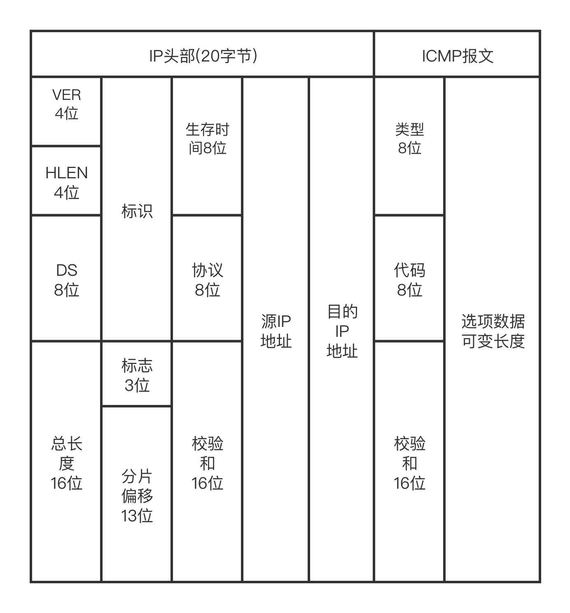
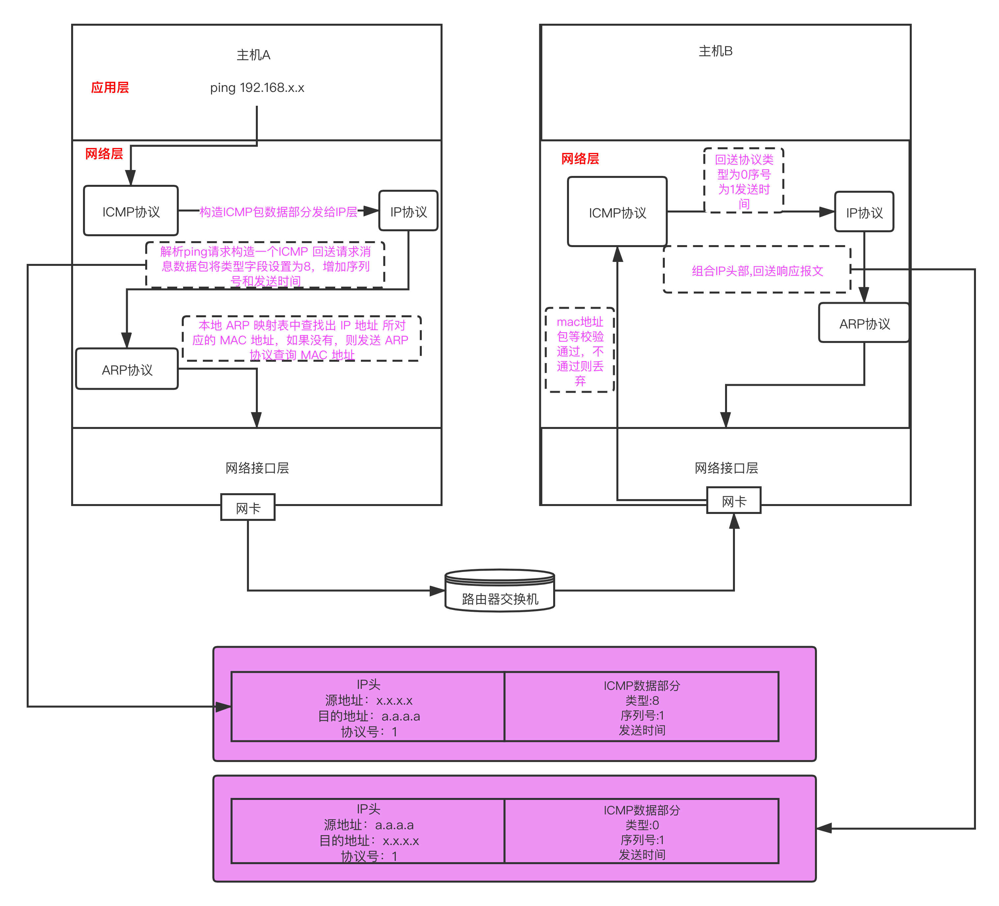

# ICMP 协议与其应用

## ICMP 协议

### 定义、作用

> ICMP协议是TCP/IP协议的一个子协议。用在IP主机、路由器之间传递控制消息，控制消息是指网络通不通、主机是否可达、路由是否可用等网络本身的消息。

### ICMP格式

字段说明:

 > * VER(版本号):标识IP协议的版本，目前V4版本地址已经枯竭，V6慢慢成为主流。
 > * HLEN:头部长度
 > * DS(服务区分符):用于为不同的IP数据包定义不同的服务质量，一般应用在QoS技术中。
 > * Total Length (总长度):标识IP头部加上上层数据的数据包大小，IP包总长度最大为65535个字节。
 > * Identification (标识符):用来实现IP分片的重组，标识分片属于哪个进程，不同进程通过不同ID区分。
 > * Flags(标志符):用来确认是否还有IP分片或是否能执行分片(MTU大小探测使用)。
 > * Fragment offset (分片偏移量):用于标识IP分片的位置，实现IP分片的重组。
 > * Time to live (生存时间):标识IP数据包还能生存多久，根据操作系统不同，TTL默认值不同，每经过一个三层设备如路由器的处理，则TTL减去1，当TTL=0时，则此数据包被丢弃。
 > * Protocol (协议号):标识IP协议上层应用。当上层协议为ICMP时，协议号为1，TCP协议号为6，UDP的协议号为17。
 > * Header checksum (头部校验):用于检验IP数据包是否完整或被修改，若校验失败则丢弃数据包。
 > * Source(源IP地址):标识发送者IP地址，占用32bit。
 > * Destination (目的IP地址):标识接收者IP地址，占用32bit。
 > * 类型:ICMP 用于通迅定义的类型，一共有15种类型
 > * 代码:和类型配合定义详细的报文类型

 可能的消息列表有:  
 

## 改变路由

改变路由是指路由器向送信方计算机指示路径改变这个功能。计算机根据自己的路由信息(路由表)来决定传送目标。不知道发给谁好的时候，就将数据包发给设为默认网关的路由器。被指定为默认网关的路由器接收到数据包，发现将数据包发给局域网内的其它路由器会比较快的时候，将这一信息通过ICMP 通知发送方。这时使用的是，类型是5，代码是1 的ICMP 改变路由报文。在选项数据部分里写着应该发送给的路由器IP地址。

## 源点抑制

数据包集中到达某一路由器后，数据包因为来不及被处理，有可能被丢弃的情况。这时候，向送信方发送的是ICMP 源点抑制报文，用来使送行方减慢发送速度。

## ping

发送和接收过程

> 1. icmp层得到应用层的请求后，首先会构建一个ICMP回送请求消息数据包。ICMP数据包内包含多个字段，最重要的是两个：第一个是类型，对于回送请求消息而言该字段为 8；另外一个是序号，主要用于区分连续 ping 的时候发出的多个数据包。每发出一个请求数据包，序号会自动加 1。为了能够计算往返时间 RTT，它会在报文的数据部分插入发送时间。
> 2. ICMP 协议将这个数据包和目的ip第一一起交给 IP 层。IP 层加上ip头部，将协议字段设置为1表示ICMP 协议。
> 3. ARP协议收到IP层的包后，需要给包加上MAC头。如果在本地ARP映射表中查找出目的IP地址对应的 MAC 地址，则可以直接使用；如果没有，则需要发送 ARP 协议查询 MAC 地址，获得 MAC 地址后，由数据链路层构建一个数据帧，目的地址是 IP 层传过来的 MAC 地址，源地址则是本机的 MAC 地址；还要附加上一些控制信息，依据以太网的介质访问规则，将它们传送出去。
> 4. 目的主机收到这个数据帧后，先检查它的目的MAC地址，并和本机的MAC地址对比，如符合，则接收，否则就丢弃。接收后检查该数据帧，将IP数据包从帧中提取出来，交给本机的IP层。同样，IP层检查后，将有用的信息提取后交给 ICMP 协议。
> 5. 目的主机会构建一个 ICMP 回送响应消息数据包，回送响应数据包的类型字段为 0，序号为接收到的请求数据包中的序号，然后再发送出去给发送端。
> 6. 在规定的时候间内，发送端如果没有接到ICMP的应答包，则说明目标主机不可达；如果接收到了 ICMP 回送响应消息，则说明目标主机可达。

## traceroute

### 定义和作用

traceroute 与ping 并列，是代表网络命令。这个traceroute 也是ICMP 的典型实现之一。

### 追踪路由

traceroute 第一个作用就是故意设置特殊的 TTL，来追踪去往目的地时沿途经过的路由器。它的原理就是利用 IP 包的生存期限 从 1 开始按照顺序递增的同时发送 UDP 包，强制接收 ICMP 超时消息的一种方法。

1. 将TTL设置为1，走到第一个路由发现跳数过多，丢弃报文，返回时间超时。
2. 将TTL设置为2，走到第二哥路由发现跳数过多，丢弃报文，返回时间超时。
3. 直到找到目的主机，类似于BFS。

### 路径MTU发现

traceroute MTU实现很简单：

1. 客户端(服务器)向通信对方送IP数据包时，先设置IP首部的分片禁止标志然后再发送ip数据包,这是路径MTU 探索的基本。
2. 当ip数据包大于路由器的MTU时，路由器会判断ip首部的分片标志是否允许分片，如果不允许则将ip数据包丢弃，并通过ICMP通知发送方路由器分片失败导致发包失败。
3. 当IP数据包小于等于路由器的MTU时，发送方会顺利接收到回包,证明mtu大于当前包大小。
