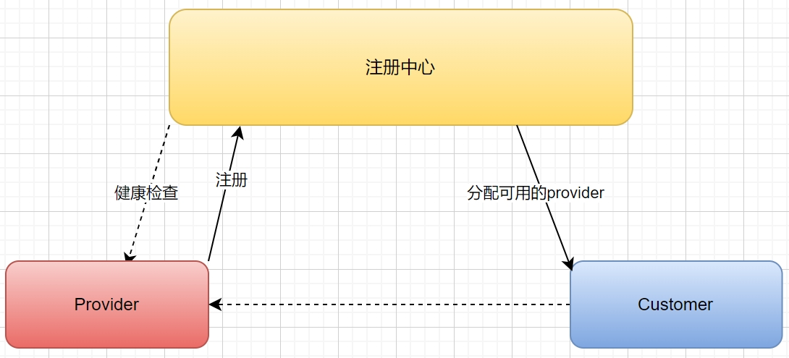
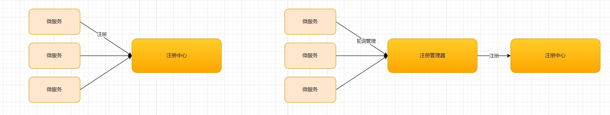
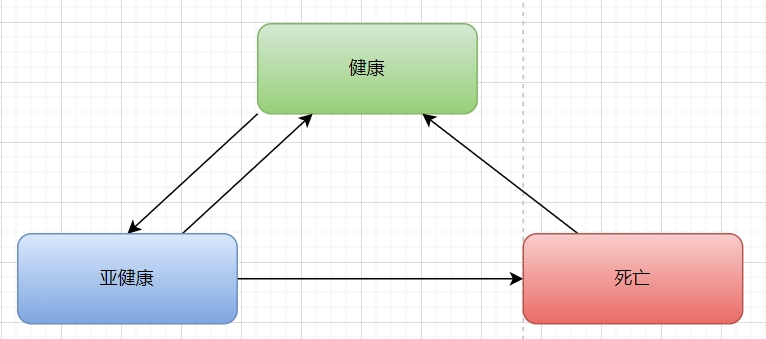
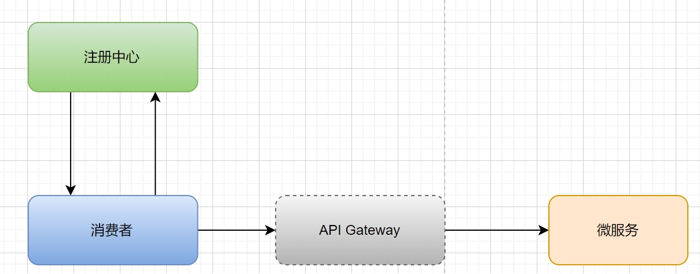
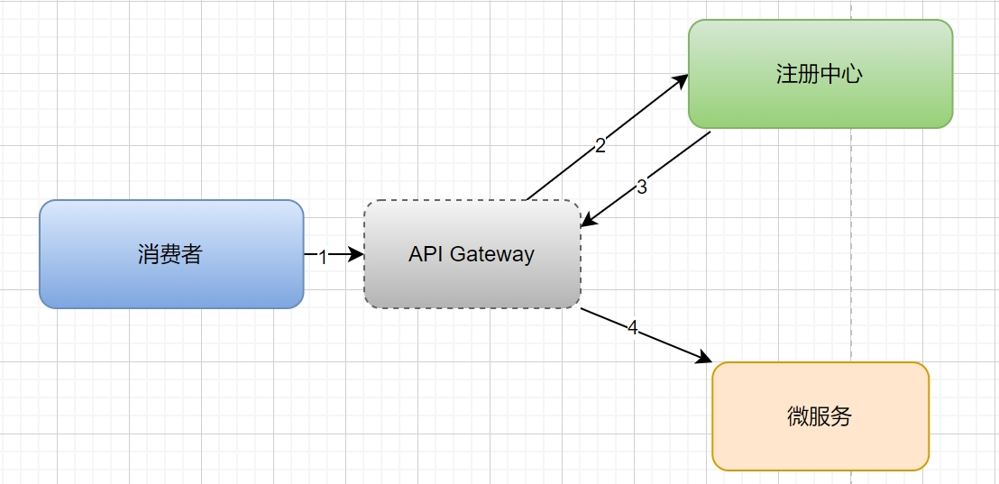
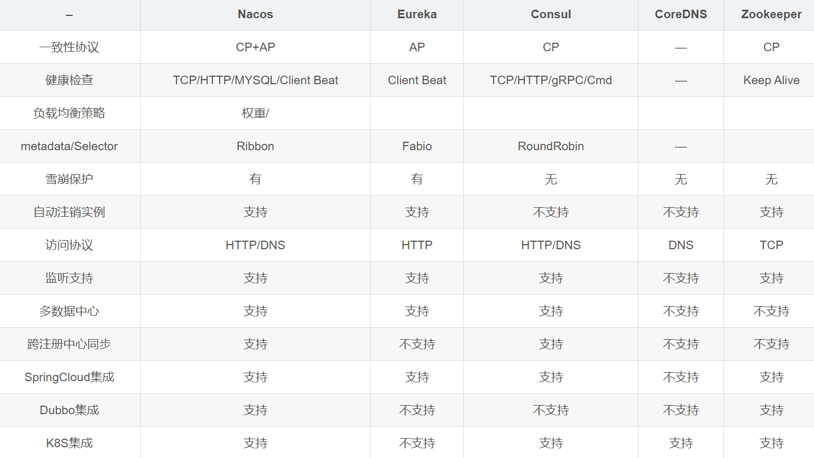

[toc]
## 服务注册与发现

在分布式架构中，由于微服务实例数量较多，其 IP 地址和端口号会经常变化，因此需要一个机制来自动维护微服务的实例信息，实现微服务之间的通讯。服务注册发现机制就是解决这个问题的机制。服务注册发现机制包括三个核心组件：
* 服务注册中心
* 服务提供者
* 服务消费者



### 服务注册以及健康检查

#### 服务注册



1. 服务直接注册
   ```
    服务直接注册就是指微服务节点在启动的时候，去服务注册中心登记注册了，将信息和状态传过去；该方式整体结构比较简单，对于注册中心而言也比较省事，
    但是对于微服务节点而言，每个微服务都得包含这么一段注册的逻辑代码，架构上看起来不是很优美，可通过插件化的方式解决该问题。
    目前tx的trpc都有相关插件，随着容器的启动自动注册ip和端口，元数据等信息。
   ```
2. 第三方注册
   ```
    第三方注册就是指通过一个服务管理器去管理所有的微服务和进程，以轮询或其它方式去检查有哪些微服务实例正在运行，会将这些微服务实例自动更新到服务注册中心。
    这也目前比较常用的方式，例如Eureka就是采用这个模式，但是该模式比较复杂而且注册管理器需要集群多活，否则会导致服务注册失效。
   ```

#### 健康检查

健康检测帮助我们从连接列表里面过滤掉一些存在问题的节点，避免在发请求的时候选择出有问题的节点而影响业务。但是在设计健康检测方案的时候，我们不能简单的判断TCP连接是否健康，心跳是否正常等简单维度考虑，因为健康检测的目的是要保证业务无损，所以在设计方案的时候，我们可以加入业务请求可用率等因素，这样自最大化地提升RPC接口可用率。而健康检查主要包括几个方面的内容，健康检查方式、检查的频率和健康状态。

##### 检查方式

1. PING、TCP

* PING
```
PING（ICMP）协议，全称Internet Control Message Protocol，是基于IP协议（网络层协议）的，但在传输层（第四层）的基础上提供一种报告错误和网络
状态的机制。它是一种用于测试网络连接是否正常的网络诊断工具。
相关总结：
1. PING命令是一种常用的网络诊断工具，它基于ICMP协议来发送Echo请求报文。
2. PING命令通过向目标主机发送ICMP Echo请求报文来测试网络连接。
3. Echo请求报文是一个ICMP数据报，其中包含一个IP地址和一个标识符。
4. 当目标主机收到Echo请求报文后，会返回一个ICMP Echo应答报文作为响应。
5. PING命令通过计算往返时间来评估网络延迟，即从发送Echo请求报文到接收到Echo应答报文所经过的时间。
6. PING命令可以检测网络连接是否正常，检查网络故障和性能问题。
7. PING命令可以通过命令行或图形界面执行，也可以与其他网络诊断工具一起使用。
8. PING命令可以配置不同的参数，如发送的Echo请求数量、超时时间和接口等。
9. PING命令可以显示统计信息，包括成功和失败的Echo请求数量、平均往返时间和最小/最大延迟等。
10. PING命令还可以与其他网络诊断工具结合使用，如traceroute和netstat等，以更深入地了解网络连接和故障排除。
```
* TCP

```
TCP探活原理特别简单，只要稍懂计算机网络就能够理解。
检测端发起tcp三次握手，建立新连接，连接建立成功代表服务活着，建立失败代表服务死了，之后发送rst包主动断开连接。
被检测端接受检测端发送的三次握手手建立连接，当接收到检测端的rst包后，被检测端断开连接，释放资源。
```

2. HTTP、Redis、Mysql、自定义应用层协议

* HTTP探活原理
```

在实际工作中，对于HTTP服务的探活通常也采取TCP探活原理，毕竟HTTP建立在TCP服务之上，所以TCP探活同样适用于HTTP服务。
很多HTTP服务实现原理和thrift大同小异，所以当TCP探活的rst包丢失后，HTTP服务同样会hang在读取连接数据。
为了避免rst包丢失，HTTP服务通常使用HTTP探活请求：探测端对被探测端发送特定的HTTP请求，并且验证被探测端的响应数据是否符合预期。
如果rst包丢失，服务端连接最差的情况下会处于TIME_WAIT状态，经过2倍超时时间后服务端会主动关闭连接释放资源，
这样服务端的工作线程不会长时间的被占用，相比于用TCP探活要好的多。
```

* Redis、Mysql以及自定义应用层协议

##### 检查频率以及健康状态


* 检查频率
```
检查的频率是provider不可用的实时性以及检查带来的机器负载的一个权衡，
针对于ARP、PING等探测方式频率可以稍微高一些，保证实时性；
而对于上层协议的探活频率可以低一些，降低探测时带来的端口等资源的占用。
```
检查频率以及检查方式可以找到单次探测失败的场景，那么provider服务的健康状态应该如何管理？业界组件一般分为几个状态：
1. 健康状态
   连接建立成功，并且心跳探活很正常；如果连续几次心跳失败则跳转至亚健康状态。
2. 亚健康状态
    连接建立成功，但是心跳偶尔会失败，如果连续几次心跳成功以后转为健康状态；否则转为死亡状态。
3. 死亡状态
    连接建立失败；重连后连接建立，并且探测正常则可以扭转为健康状态。



### 消费者向注册中心查询和调用服务

消费者向注册中心查询和调用服务主要分为以下两种场景：客户端模式以及代理模式。

#### 客户端模式

客户端模式下消费者从注册中心获取全量的provider，然后通过代理层访问实现进行负载均衡调用微服务，均摊流量，而如果不通过代理层访问也可以，这就需要在客户端实现负载均衡，如tx的L5负载均衡的组件引入本地后，在本地实现负载均衡，而且水平扩展是只需要本地管理负载均衡，不需要做全局的负载均衡，该方案天然针对于全局的限流以及精确负载均衡具有缺陷（伪诉求）。



#### 代理模式

在代理模式下，消费者只需要调用API Gateway，至于如何获取provider、如何调用微服务以及负载均衡，消费者都不需要感知，全由API Gateway实现，APIGateway实现复杂；但是在大型架构中，这种模式用的还比较多，原理就是在网关加上了网关服务注册和发现的逻辑。



### 注册中心分布式

注册中心成为整个服务注册发现的中心，可用性是必须要保证的，因此注册中心必须实现成分布式的集群服务。而涉及到分布式一致性和可靠性是一个不可避免的问题（CAP）。

#### 数据一致性

关于数据一致性目前业界有两类方案：⼀种是基于 Leader 的非对等部署的单点写⼀致性raft，⼀种是对等部署的多写⼀致性paxos。

#### 可靠性

关于服务的可用性，主要是服务多点部署，实现负载均衡以及故障节点剔除就可实现。

#### 逻辑分析

从业务场景上分析，服务注册者可以多次往注册中心注册服务，因此只需要在注册中心实现幂等的注册订阅能力即可实现最终一致性，而中间的短暂不一致并不会影响业务的可靠性，因此在注册中心使用AP的模式相对于使用CP模式会更加合适，毕竟CP保证一致性的同时需要引入很大的代价。

### 业界组件方案（网上取的图）



