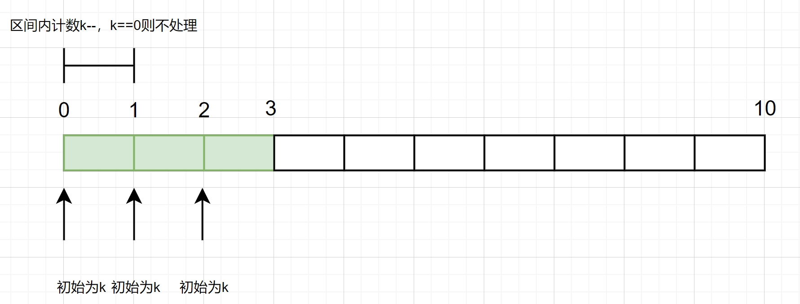
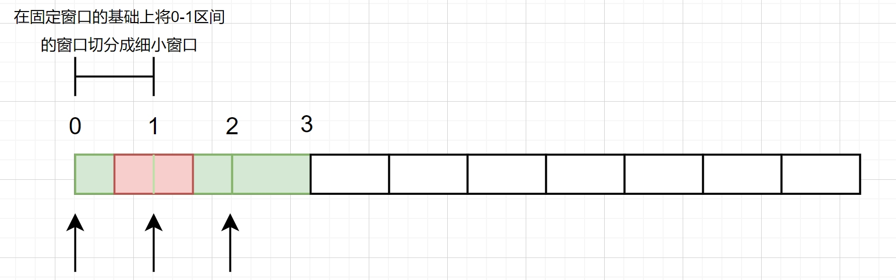
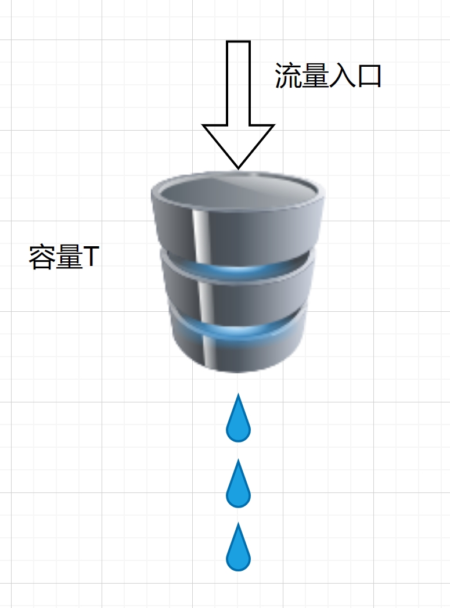
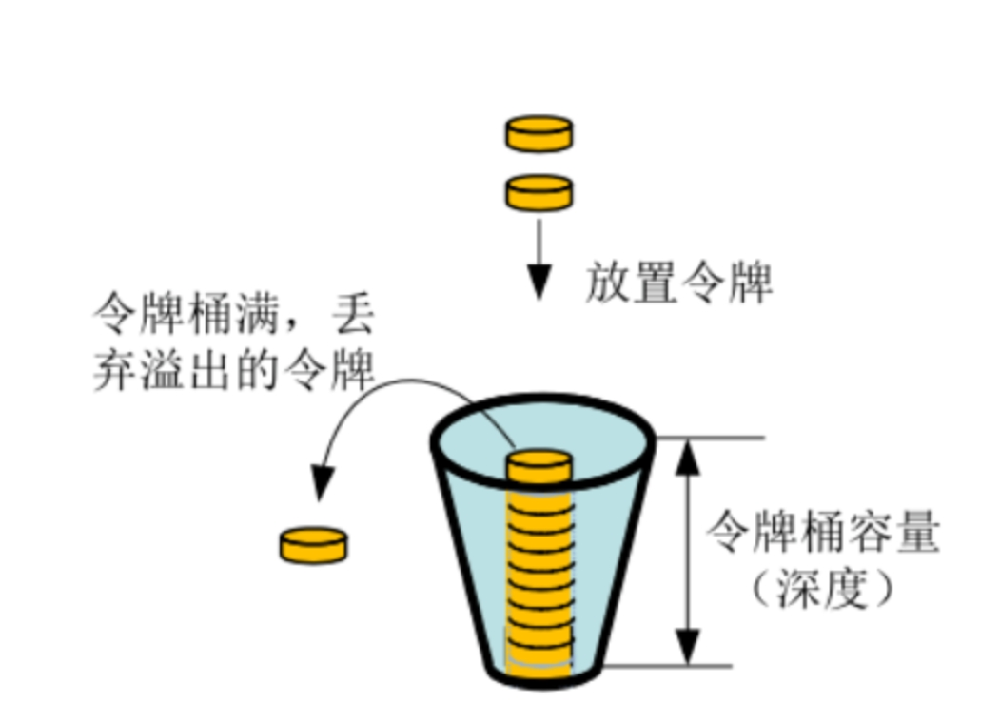
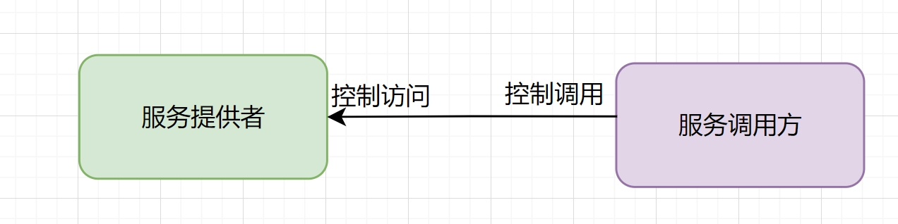
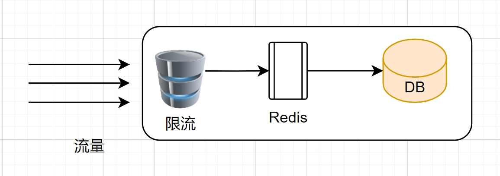
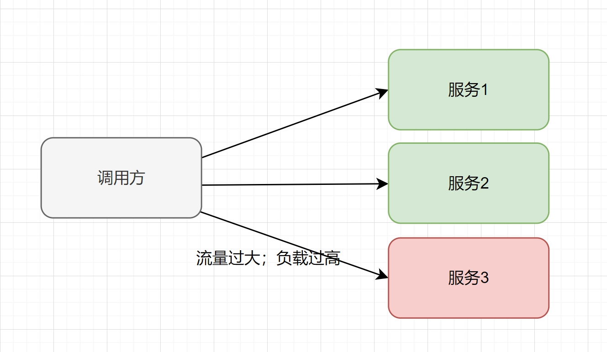
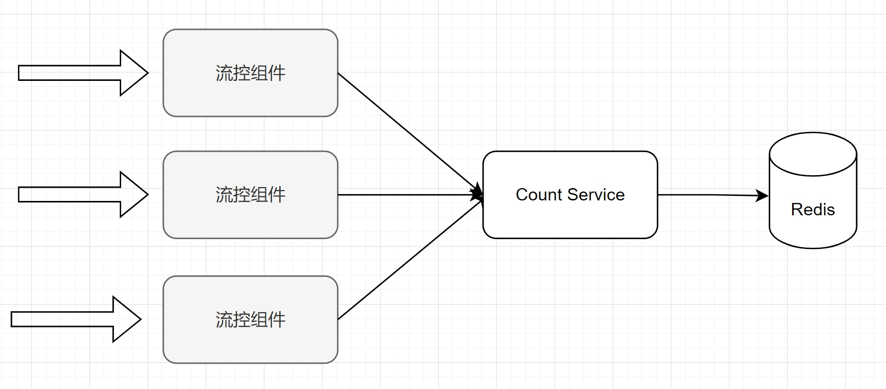

# 流控

## 为什么需要流控

在分布式系统中，RPC被广泛用于实现服务的远程调用和通信。然而，RPC在处理大量请求时可能会面临一些挑战，其中之一就是资源限制和流量控制。其中良好的流控有以下几个优点：
1. 防止服务过载：当某个RPC服务被大量请求同时调用时，可能会超出服务的处理能力，导致服务崩溃或者响应超时。通过流量控制，可以限制同时发送给服务的请求数量，从而保证服务正常运行。
2. 提高系统稳定性：通过流量控制，可以避免因单个服务出现问题而导致整个系统崩溃的情况。当某个RPC服务出现问题时，流量控制机制可以限制对该服务的请求，从而降低系统的负载，提高系统的稳定性。
3. 优化资源利用率：在分布式系统中，每个节点都有其自身的资源限制，如CPU、内存、网络带宽等。通过流量控制，可以合理地分配资源，避免某些节点资源过度消耗，而其他节点资源闲置的情况发生，从而提高整个系统的资源利用率。
4. 提供更好的用户体验：通过流量控制，可以保证每个请求都能得到及时、准确的响应，从而提高用户的满意度和系统的用户体验。

## 流控的方式

业界常规的流控方式主要分为固定窗口、滑动窗口、漏桶、令牌桶；此外还有一些类似于日志统计限流等不常见方式。

### 固定窗口（计数）

固定窗口（计数）的方式进行流量控制会导致瞬时攻击流量来了业务在很短时间内耗尽计数数据，后续流量变成了0。

### 滑动窗口

将窗口细化为小窗口，每个小窗口单独计数，通过判断最近几个小窗口的请求综合判断是否触发限流；该方案虽然缓解了瞬时流量的影响范围，但是还是无法让流量平稳下来。

### 漏桶

漏桶算法是网络世界中流量整形或速率限制时经常使用的一种算法，主要目的是控制数据注入到网络的速率，平滑网络上的突发流量。

在网络中，漏桶算法可以控制端口的流量输出速率，平滑网络上的突发流量，实现流量整形，从而为网络提供一个稳定的流量。具体来说，漏桶可以看作是一个带有常量服务时间的单服务器队列，如果漏桶（包缓存）溢出，那么数据包会被丢弃。当数据包到达时，它们被放置在漏桶中。从漏桶中漏出的数据包以一个常量速率注入网络，从而平滑了突发流量。

### 令牌桶

令牌桶（Token Bucket）是一种常用的流量控制技术，其基本原理是令牌以一定的速率放入桶中，每个令牌允许源发送一定数量的比特。当数据流到达设备时，会根据数据的大小从令牌桶中取出与数据大小相当的令牌数量用来传输数据。如果令牌数量不够，则数据会被丢弃或缓存。这就可以限制报文的流量只能小于等于令牌生成的速度，达到限制流量的目的。

令牌桶算法的优点和缺点如下：

* 优点：

1. 令牌桶算法简单易懂，实现起来较为方便，且能有效地控制网络的突发流量。
2. 令牌桶算法能够限制网络的最大流量，从而保证网络的质量。
3. 令牌桶算法具有公平性，即每个用户都受到相同的流量限制。

* 缺点：

1. 令牌桶算法对网络的实时性较差，因为令牌的生成和获取都需要时间，无法及时响应网络的变化。
2. 令牌桶算法无法处理网络中的动态流量，因为令牌的数量是固定的，无法根据实际情况进行调整。
3. 令牌桶算法对网络的丢包率较高，因为当令牌用完后，新的数据包就会被丢弃。

实现方式

* 方式一： 开启一个定时任务，由定时任务持续生成令牌

>   问题： 会极大的消耗系统资源；如：某接口需要分别对每个用户做访问频率限制，假设存在k个用户，则至多需要开启k个定时任务来维持每个桶中的令牌数，开销巨大。

* 方式二： 延迟计算

>   实现思路： 若当前时间晚于nextFreeTicketMicros，则计算该段时间内可以生成多少令牌，将生成的令牌加入令牌桶中并更新数据。这样一来，只需要在获取令牌时计算一次。

## RPC流控的两个视角

流控可以从服务方保护和调用端保护两个角度进行思考：服务端限流保证了调用的频率从而导致下游压力减少；客户端限流保证了流量的消费速度，不管前面来多少流量，客户端都以一个固定的频率消费。

### 服务方保护

服务端保护机制主要是缓存、降级和限流；而服务端限流主要是使用令牌桶或者漏桶（grpc就是个典型的例子）；降级则是在资源有限的情况下保证系统核心功能的可用性，降低一些非关键功能的可用性。

### 调用方保护

调用方保护主要包括熔断、限流；调用方在调用服务方后如果存在大量未响应的请求的时候应该关闭重试（避免雪崩），进行熔断，让流量走其他服务；此外调用方应该需要控制调用的频率，避免下游出现高负载。

## 分布式流控（网关的难点）

分布式流控主要有两个基本模型：全局计算，业务事务流控和分布式计算。

### 精确管控（业务事务流控）

该模式主要是流控组件统一箱计算组件请求获取数据，判断能否放过流量；这样优点就是数据中心化，对于流控程度可以达到一个很精准的程度，但是自然也带来了资源中心化负载的弊端，如果中心节点挂了业务的流控能力也就丧失了。

### 分布式（流量控制）

该模式则在各个组件在本地自行计算并限流，定时向中心服务上报和拉取数据，这样做可以脱离中心管控也能工作可用性更高，但是限流的精确性会有所丢失。

## 流控的维度

流控的维度主要分为几个方面：资源、用户、服务。

* 用户维度：
> 用户维度是指对不同用户进行流量控制的方法。在许多应用场景中，需要对不同的用户进行不同的流量控制，以确保网络资源的公平分配和有效利用。例如，在视频流服务中，可以根据用户的付费等级、观看历史记录等特征，为不同用户分配不同的流量配额和优先级。通过限制低优先级用户的流量，可以确保高优先级用户获得更好的服务体验。

* 服务维度：

> 服务维度是指针对不同的服务或应用进行流量控制的方法。不同的服务或应用可能需要不同的网络带宽和优先级，因此需要对它们进行单独的流量控制。例如，在数据中心网络中，可以根据不同的业务需求，为数据库、网页服务器、文件服务器等应用分配不同的带宽和优先级。通过合理的流量控制，可以确保关键业务得到足够的网络资源，同时避免网络拥塞和性能瓶颈。

* 资源维度：

> 资源维度是指针对不同的网络资源进行流量控制的方法。这些资源包括网络设备、链路、接口等，通过对它们的流量控制可以有效提高网络性能和稳定性。例如，在网络交换机中，可以对不同的端口或虚拟局域网（VLAN）进行流量整形和限速，以确保网络的稳定性和服务质量。通过合理地利用资源维度的流量控制技术，可以有效避免网络拥塞和性能瓶颈，提高网络的整体性能和稳定性。