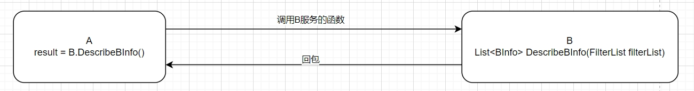
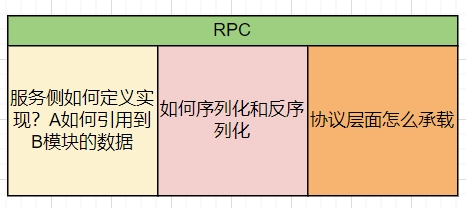
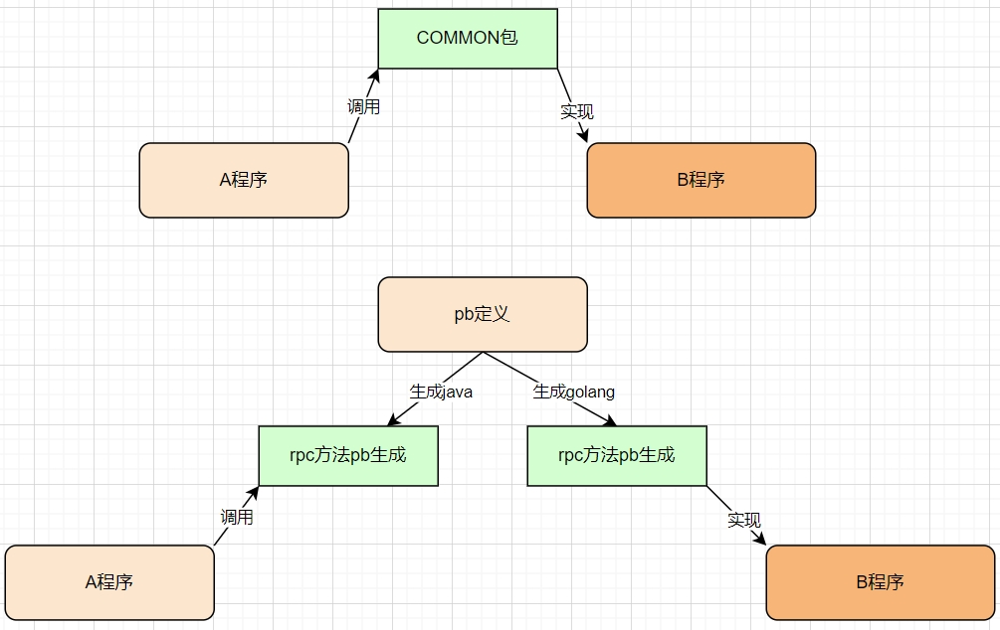
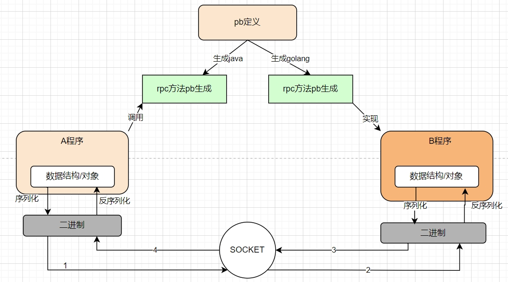

# RPC基础

## RPC是什么？

指的是对网络上另外一个计算机上的，某段特定的函数代码的调用。如下图，A服务对B服务的DescribeBInfo接口进行调用，网络协议以及逻辑调用全都对上层屏蔽，使用方无需感知底层的序列化以及网络传输方式。


## RPC的三个核心

RPC主要有三个核心，其中包括代码侧的引用以及寻址，对象的序列化以及反序列化、协议层面的承载以及传输。



### 接口的定义引用以及远程调用

这方面主要包括程序代码以及远程网络调用两个方面，其中程序语言方面主要包括接口在代码中的引入以及接口的实现，网络远程层面主要涉及在rpc网络过程中如何寻址的问题。

#### 程序代码层面
其中程序代码包括同语言调用和跨语言调用。在实现 RPC 时，需要定义接口和实现；接口定义决定远程函数的签名和参数类型，而实现则是具体的业务处理逻辑。接口的定义实现和接口的调用服务分别在不同的计算机上运行，客户端通过 RPC 协议进行通信。

1. 同语言调用 
```
同语言之间rpc调用，引用相同的公共包即可。
```
2. 跨语言调用

```
跨语言之间的调用需要引入pb之类的IDL语言，然后根据IDL生成不同语言的代码后才能引用和实现接口。
```

#### 网络远程层面
1. 方法资源的定义

```
服务寻址可以使用 Call ID 映射。在本地调用中，函数体是直接通过函数指针来指定的，但是在远程调用中，函数指针是不行的，因为两个进程的地址空间是完全不一样的。所以在 RPC 中，所有的函数都必须有自己的一个 ID。
这个 ID 在所有进程中都是唯一确定的。客户端在做远程过程调用时，必须附上这个 ID。然后我们还需要在客户端和服务端分别维护一个函数和Call ID的对应表。
当客户端需要进行远程调用时，它就查一下这个表，找出相应的 Call ID，然后把它传给服务端，服务端也通过查表，来确定客户端需要调用的函数，然后执行相应函数的代码。
```

2. 多个实现类对于同一个接口的实现如何区分

```
当一个Dubbo服务接口有多个实现时，你可以在服务提供者端使用不同的group或version来区分服务实现。
例如，对于同一接口的两个实现类，若它们使用的是同一个group和version，则只有最后一个注册的实现类会生效，
而如果使用了不同的group或version，则它们都能够成功注册并提供服务。
```

程序接入之后，就涉及到了对象的序列化以及网络的传输，其中架构图如下：


### 序列化和反序列化

#### 基本概念
在本地调用中，我们只需要把参数压到栈里，然后让函数自己去栈里读就行。但是在远程过程调用时，客户端跟服务端是不同的进程，不能通过内存来传递参数。这时候就需要客户端把参数先转成一个字节流，传给服务端后，再把字节流转成自己能读取的格式。只有二进制数据才能在网络中传输，序列化和反序列化的定义是：
* 将对象转换成二进制流的过程叫做序列化
* 将二进制流转换成对象的过程叫做反序列化
这个过程叫序列化和反序列化。同理，从服务端返回的值也需要序列化反序列化的过程。
#### 业界常见的选型
| 序列化方式 | 优点 | 缺点| 适用业务|
| ------ | ----------- | ------ | ----------- |
| java 原生序列化方式 |对于java语言来说简单易用|序列化码流太大；效率低；无法跨语言|java语言编写的，rpc频率低、请求数据小的业务|
| json序列化 |简单明了，调试简单，抓包可以直接分析业务 |JSON进行序列化的额外空间开销比较大；JSON没类型，需要序列化，性能差|rpc频率低，请求数据量小的业务|
|  Hessian   | 相对于JDk，JSON，更加高效，生成的字节数更小；有非常好的兼容性和稳定性 |官方版本对Java里面一些常见对象的类型不支持，比如LinkedHashMap、LinkedHashSet 等，但是可以通过扩展CollectionDeserializer 类修复，Locale 类，可以通过扩展 ContextSerializerFactory 类修复|适用于大数据量，但是数据结构不复杂的业务类型|
|Protobuf|高效、支持多语言、支持向前向后兼容的数据|为了提高性能，protobuf采用了二进制格式进行编码。这直接导致了可读性差、对于具有反射和动态语言来讲，用起来比较费劲，但目前已经有很好的pb生成工具，一键生成代码|适用于多语言大型服务，大数据量频繁rpc的业务，当前业界最常规的方案|


### 怎么实现网络通信？

序列化之后的字节流需要通过socket连接进行网络传输，这一块协议常用RPC框架十一类似于grpc等rpc框架常用的方案有http2协议来传输数据，腾讯的trpc框架可以通过自定义transport来实现quic协议的传输。

#### http2

HTTP/2（原名HTTP/2.0）即超文本传输协议 2.0，是下一代HTTP协议。它是由互联网工程任务组（IETF）的Hypertext Transfer Protocol Bis (httpbis)工作小组进行开发，是自1999年http1.1发布后的首个更新。HTTP 2.0在2013年8月进行首次合作共事性测试，并于2015年以RFC 7540正式发布。
HTTP/2的主要变化包括：
* 二进制分帧：HTTP/2采用二进制格式传输数据，而非HTTP 1.x的文本格式，二进制协议解析起来更高效。
* 多路复用：代替原来的序列和阻塞机制，所有请求都可以通过一个TCP连接并发完成。
总之，HTTP/2是一种更高效、更安全的Web传输协议，有助于提高网页性能和用户体验。
#### quic
```
QUIC（Quick UDP Internet Connections）是一种基于UDP协议的传输层协议，是一种快速、高效、安全的传输协议，旨在提高互联网连接的性能和安全性。
该协议在保持TCP可靠性优点的同时，借鉴了UDP的优点，如快速连接建立、丢包重传等。它还融合了HTTP/2、TLS的多路复用、安全性功效，以及TCP确认的可靠性，
并利用UDP的高效性。它通过多路复用、前向纠错、连接平滑迁移等技术，提高了传输效率，减少了网络延迟。QUIC支持0-RTT连接建立，使得在同一次会话中，客户端
和服务器可以更快速地开始数据传输。它还提供了更好的流控制和错误恢复机制，以避免网络拥塞和错误。
总之，QUIC是一种新型的传输协议，旨在提高互联网连接的性能和安全性。它通过采用多种技术和方法，减少了网络延迟，提高了传输效率，为现代互联网的发展
提供了更好的支持。
```
### 扩展

上述内容仅仅介绍了RPC的基础原理，仅仅在1：1服务请求的时候可用，不适用于现有的分布式服务。适配当前的分布式事务还需要引入连接池、服务发现以及流控、容灾等能力，后续文章会补充。