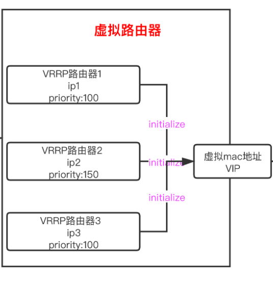
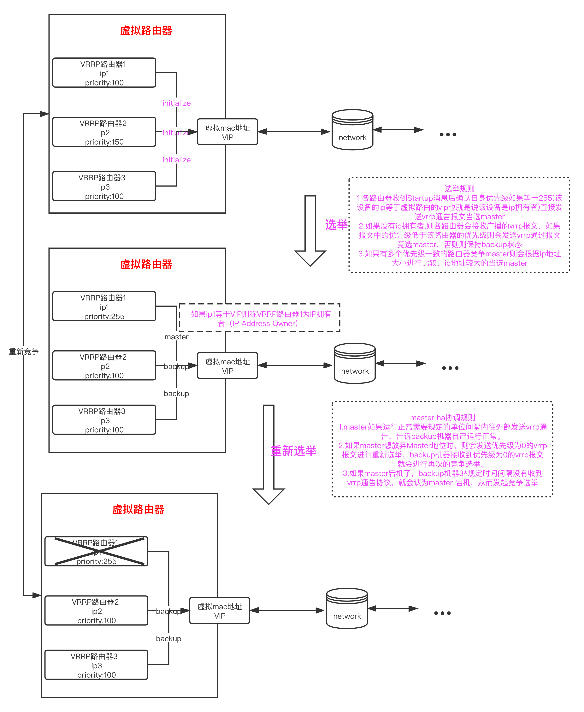

# VRRP协议

虚拟路由冗余协议VRRP（Virtual Router Redundancy Protocol）通过把几台路由设备联合组成一台虚拟的路由设备，将虚拟路由设备的IP地址作为用户的默认网关实现与外部网络通信。当网关设备发生故障时，VRRP机制能够选举新的网关设备承担数据流量，从而保障网络的可靠通信。

## 相关概念

VRRP虚拟路由器结构如下图所示,主要由虚拟mac地址、VIP、VRRP路由器等组成。

### 虚拟路由器

虚拟路由器有一个或者多个VRRP路由器组成,每一个虚拟路由器都有一个虚拟mac地址和一个vip,此外还有一个编号从0～255的VRID。

### 虚拟MAC地址

一个虚拟路由器拥有一个虚拟MAC地址，格式为：00-00-5E-00-01-{VRID}。当虚拟路由器回应ARP请求时，使用虚拟MAC地址，而不是接口的真实MAC地址。

### VRRP路由器

每一个VRRP路由器都有一个prority优先级属性、一个vip地址一个mac地址。一个VRRP路由器可以属于多个虚拟路由器。

### IP拥有者

当VRRP路由器的vip和该路由器归属的虚拟路由器的vip一致时，该路由器就成为IP拥有者，优先级为255。

## 工作过程

vrrp主要包括下面两个部分：

一. 选举

> 1. 在机器初始化的阶段也就是所有路由器都处于 initialize的时，所有VRRP路由器都会都到Startup消息,这时候，如果接收到消息的路由器自身是一个ip拥有者,优先级为255时直接发送vrrp通告当选master。
> 2. 如果没有ip拥有者,则各路由器会接收广播的vrrp报文，如果报文中的优先级低于该路由器的优先级则会发送vrrp通过报文竞选master，否则则保持backup状态
> 3. 如果有多个优先级一致的路由器竞争master则会根据ip地址大小进行比较，ip地址较大的当选master

二. master ha协调

> 1. master如果运行正常需要规定的单位间隔(默认1s)内往外部发送vrrp通告，告诉backup机器自己运行正常。
> 2. 如果master想放弃Master地位时，则会发送优先级为0的vrrp报文进行重新选举，backup机器接收到优先级为0的vrrp报文就会进行再次的竞争选举。
> 3. 如果master宕机了，backup机器3*规定时间间隔没有收到vrrp通告协议，就会认为master 宕机，从而发起竞争选举。

下图介绍由三个VRRP路由器组成一个虚拟路由器的过程：

## VRRP负载分担

VRRP负载分担指的是使用多个虚拟路由器构成一个虚拟路由集群，使用hash或者其他散列算法将请求分发到多个虚拟路由器中。

### 结构

负载分担是指多个VRRP备份组同时承担业务，VRRP负载分担与VRRP主备备份的基本原理和报文协商过程都是相同的。同样对于每一个VRRP备份组，都包含一个Master设备和若干Backup设备。与主备备份方式不同点在于：负载分担方式需要建立多个VRRP备份组，各备份组的Master设备可以不同；同一台VRRP设备可以加入多个备份组，在不同的备份组中具有不同的优先级。

## VRRP报文版本区别以及认证方式

### 报文版本区别

* 支持的网络类型不同。VRRPv3适用于IPv4和IPv6两种网络，而VRRPv2仅适用于IPv4网络。
* 认证功能不同。VRRPv3不支持认证功能，而VRRPv2支持认证功能。VRRPv2版本保留报文的认证字段，是为了兼容早期版本（RFC2338），VRRP认证并不能提高安全性。
* 发送通告报文的时间间隔的单位不同。VRRPv3支持的是厘秒级，而VRRPv2支持的是秒级。

### 认证方式

* 无认证方式：设备对要发送的VRRP通告报文不进行任何认证处理，收到通告报文的设备也不进行任何认证，认为收到的都是真实的、合法的VRRP报文。
* 简单字符（Simple）认证方式：发送VRRP通告报文的设备将认证方式和认证字填充到通告报文中，而收到通告报文的设备则会将报文中的认证方式和认证字与本端配置的认证方式和认证字进行匹配。如果相同，则认为接收到的报文是合法的VRRP通告报文；否则认为接收到的报文是一个非法报文，并丢弃这个报文。
* MD5认证方式：发送VRRP通告报文的设备利用MD5算法对认证字进行加密，加密后保存在Authentication Data字段中。收到通告报文的设备会对报文中的认证方式和解密后的认证字进行匹配，检查该报文的合法性。
